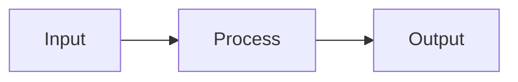

---
id:
type: spec
title:
status: draft
spec_state: draft
trust: draft
summary:
read_when:
implements: proj.
owner:
created:
verified:
tags: []
---

# [Title]

> [One-line synopsis — what this system does and why it exists]

### Key References

|             |                                               |                          |
| ----------- | --------------------------------------------- | ------------------------ |
| **Project** | [proj.name](../../work/projects/proj.name.md) | Roadmap and planning     |
| **Guide**   | [Guide Name](../guides/guide.md)              | Developer setup / how-to |

## Design

<!-- Lead with visuals. Show how the system works before explaining rules. -->

<!-- Or annotated ASCII for simpler flows -->

## Goal

One paragraph: what this spec enables when implemented.

## Non-Goals

- Explicitly out of scope item 1
- Explicitly out of scope item 2

## Invariants

<!-- Short, scannable rules. SCREAMING_SNAKE IDs are stable — never rename. -->

| Rule           | Constraint                            |
| -------------- | ------------------------------------- |
| INVARIANT_NAME | What must always be true, in one line |

### Schema

<!-- Optional: database tables, API shapes, config schemas. Delete if not applicable. -->

**Table:** `table_name`

| Column       | Type | Constraints      | Description       |
| ------------ | ---- | ---------------- | ----------------- |
| `column_one` | type | NOT NULL, UNIQUE | Brief description |

### File Pointers

| File                  | Purpose           |
| --------------------- | ----------------- |
| `src/path/to/file.ts` | Brief description |

## Open Questions

<!-- Must be empty when spec_state is "active" -->

- [ ] Question?

## Related

- [Related Spec](./related.md)
