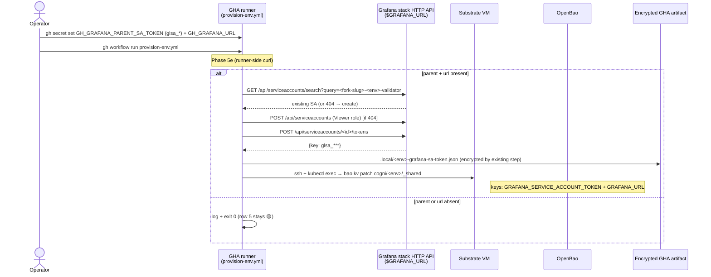

# Grafana child-SA auto-mint at bootstrap (Phase 5e)

> One operator-pasted root SA token; bootstrap mints a per-env scoped child SA. No 6-key paste; no manual scope-widening; no laptop credential path. Implements `work/handoffs/handoff-grafana-auto-mint.md` with the OpenBao path corrected to spec Invariant 1.

## Outcome

A fork operator who pastes `GH_GRAFANA_PARENT_SA_TOKEN` (a `glsa_*` stack-admin SA token) + `GH_GRAFANA_URL` into GH-env-secrets gets observability auto-wired across every env they provision. Phase 5e calls `POST /api/serviceaccounts` + `POST /api/serviceaccounts/<id>/tokens` on the Grafana instance HTTP API, lands the minted Viewer-role token at `cogni/<env>/_shared` (keys `GRAFANA_SERVICE_ACCOUNT_TOKEN` + `GRAFANA_URL`) and in `.local/<env>-grafana-sa-token.json` (encrypted by the existing init-artifact step). Scorecard row 5 graduates from vNext → gating using a `GET /api/datasources` probe. Re-running bootstrap is idempotent (find-or-create SA by deterministic name); skipping the parent token is graceful (row 5 = 🟡, bootstrap = 🟢).

## Problem

The handoff (`work/handoffs/handoff-grafana-auto-mint.md`) made four binding decisions that I twice drifted from before recovering:

1. **Token type**: parent MUST be a **Grafana stack service-account token** (`glsa_*`), NOT a Grafana Cloud access-policy token (`glc_*`). Only `glsa_*` authorizes the Grafana instance HTTP API endpoints (`/api/serviceaccounts`, `/api/datasources`, `/api/ds/query`) the auto-mint and the validator self-trace both need.
2. **Per-env child scoping**: child SA name `<fork-slug>-<env>-validator`, role Viewer, scoped to read-only via the role itself (datasource read + query, no write).
3. **Token storage**: encrypted artifact bundle (operator laptop) + OpenBao (in-cluster + validator).
4. **Failure mode**: graceful skip if `GRAFANA_PARENT_SA_TOKEN`/`GRAFANA_URL` are unset.

A `glc_*` access-policy token + direct Loki/Prom endpoints (the path I detoured through in PR #54 v2) does NOT cover the validator's actual self-trace flow, which authenticates against the Grafana instance API. It also expands the credential floor from 2 derived keys to 6 manually pasted keys — the opposite of "1 root in, all derived."

## Principle Alignment

### Identity-model (`docs/spec/identity-model.md`)

- Parent SA = operator-system actor (one credential, one trust boundary). Lives only in GH-env-secrets + runner env for Phase 5e duration.
- Child SA = per-env node-system actor with deterministic name `<fork-slug>-<env>-validator`. Each `(node_id, env)` pair gets its own SA — clean attribution surface.

### Secrets-management spec (`docs/spec/secrets-management.md`)

- **Invariant 1** (PATH_CONVENTION_PER_SERVICE_PER_ENV): child token lands at `cogni/<env>/_shared` keys `GRAFANA_SERVICE_ACCOUNT_TOKEN` + `GRAFANA_URL` (cross-service consumption: node-template pods, scheduler-worker, validator, laptop scripts). The handoff's proposed `secret/services/grafana/<env>/sa-token-read` path violated this — the design corrects it.
- **Invariant 2** (ONE_EXTERNAL_SECRET_PER_SERVICE_ENV): existing `_shared-<env>-reader` policy + ESO `dataFrom: extract` already wires consumers; no new policy / ExternalSecret manifests required.
- **Invariant 8** (EVERY_ACCESS_AUDITED): mint emits one Grafana audit-log entry pair (`serviceAccount.create` + `serviceAccountToken.create`) + one OpenBao audit entry (`KV patch cogni/<env>/_shared`).
- **Invariant 11** (ROTATION_DOES_NOT_EDIT_GIT): rotation is a re-run of Phase 5e (find SA, mint fresh token, patch `_shared`). Zero git PRs.
- **Invariant 13** (NO_OPERATOR_ROOT_TOKEN_ON_LAPTOP): parent SA token never written to OpenBao, never propagated to pods, never reaches the VM. Runner env only.

### SOC2 controls

| TSC   | Control                 | How this design satisfies it                                                                                                                |
| ----- | ----------------------- | ------------------------------------------------------------------------------------------------------------------------------------------- |
| CC6.1 | Logical Access          | Child token is Viewer role only (read + query). Reads served by existing `_shared-<env>-reader` policy. No write capability on child.       |
| CC6.6 | Confidentiality at Rest | OpenBao at rest + GHA artifact age-encrypted with operator passphrase. Plaintext shredded post-encrypt by the existing always() cleanup.    |
| CC7.2 | Anomaly Detection       | Grafana + OpenBao audit logs feed Loki via Alloy (Invariant 8). Alert rules for off-hours mint / unexpected actors.                         |
| CC8.1 | Change Management       | Versioned KV per Invariant 7; rotation = `bao kv patch`; rollback = `bao kv rollback`. Audit-trail correlation via deterministic SA naming. |

Audit-trail attribution caveat: the Grafana audit log shows the parent SA as the actor on child creation, not the operator's OIDC identity. Mitigated by deterministic naming (`<fork-slug>-<env>-validator`) + mint-time tag in token name (`<env>-bootstrap-<ts>-<rand4>`).

### Decentralized agentic alignment (`docs/spec/agentic-fork-bootstrap.md`)

- **FORK_FREEDOM preserved**: Phase 5e is optional. Forks without a Grafana stack skip it; bootstrap completes 🟢 with row 5 🟡.
- **No new cross-fork dependencies**: each fork operator brings their own Grafana stack + parent token. Cogni-DAO is not the minting authority.
- **§6.2 doctrine compliance**: parent token is a GH-env-secret, nowhere else. No `.env.bootstrap`, no laptop path.

## Design

## Goal

Walk-tier row 82 ("Grafana child-SA auto-mint at bootstrap") of `proj.agentic-fork-bootstrap.md`. After this PR lands:

- Scorecard row 5 graduates vNext → gating; defaults to 🟢 on first cold-start when parent token is set.
- Credential floor at Step 6.2 grows 7 → 9 (both new secrets optional).
- Re-running bootstrap is idempotent (same parent never duplicates child SAs).
- The flow is principle-aligned with secrets-management invariants 1, 2, 6, 7, 8, 11, 13.

## Non-Goals

- **Engineer-as-actor / per-engineer Grafana scoping.** Lives in the cogni operator-app, not node-template. Requires multi-org Grafana + a user→SA delegation surface.
- **Vault Transit for the parent token.** Walk+ row (`Vault Transit for recoverable secrets`). Parent stays a GH-env-secret in v1.
- **Auto-rotation of the child token.** Manual rotation via re-run is sufficient for v1.
- **Auto-revoke on fork decommission.** Filed as `revoke-grafana-child-sa.sh` follow-up.
- **Direct Loki/Prom endpoint creds for Alloy push.** Out of scope; Alloy push is a separate concern handled by the existing Step 6.6 `pnpm secrets:set` path. This design is read-path only.

## Invariants

| Rule                              | Constraint                                                                                                                                                             |
| --------------------------------- | ---------------------------------------------------------------------------------------------------------------------------------------------------------------------- |
| GRAFANA_AUTOMINT_GRACEFUL_SKIP    | Empty parent token or URL → log + exit 0. Bootstrap never fails on observability absence.                                                                              |
| GRAFANA_AUTOMINT_IDEMPOTENT       | Find-or-create child SA by deterministic name `<fork-slug>-<env>-validator`. Re-runs reuse the SA; the token is always fresh.                                          |
| GRAFANA_AUTOMINT_PARENT_TYPE      | Parent MUST be `glsa_*` (stack SA). `glc_*` (Cloud access-policy) rejected at preflight with a clear error.                                                            |
| GRAFANA_AUTOMINT_LEAST_PRIVILEGE  | Child role = Viewer. Read + query on all datasources the stack exposes; zero write capability.                                                                         |
| GRAFANA_AUTOMINT_NO_PARENT_IN_BAO | Parent token NEVER written to OpenBao, NEVER reaches the VM, NEVER persists past Phase 5e exit. Runner env only.                                                       |
| GRAFANA_AUTOMINT_PATH_SHARED      | Child token lands at `cogni/<env>/_shared` keys `GRAFANA_SERVICE_ACCOUNT_TOKEN` + `GRAFANA_URL` (spec Invariant 1 cross-service path), NOT a per-service grafana path. |
| GRAFANA_AUTOMINT_NAMING           | Child SA name: `<fork-slug>-<env>-validator`. Token name: `<env>-bootstrap-<unix-ts>-<rand4>`. The naming pair is the audit-trail correlation key.                     |

### Schema

**OpenBao path:** `cogni/<env>/_shared` (KV-v2) — keys added by this work:

| Key                             | Type   | Constraints      | Description                                                                                                            |
| ------------------------------- | ------ | ---------------- | ---------------------------------------------------------------------------------------------------------------------- |
| `GRAFANA_SERVICE_ACCOUNT_TOKEN` | string | `glsa_*` prefix  | Child SA token (Viewer role). Already declared in `scripts/setup-secrets.ts`; consumed by `scripts/loki-query.sh` etc. |
| `GRAFANA_URL`                   | string | URL, no trailing | Grafana stack URL. Same value as the parent's URL; pods + validator hit the instance API at this base.                 |

**Artifact (one-shot bootstrap snapshot):** `.local/<env>-grafana-sa-token.json`, age-encrypted by `provision-env.yml`'s existing `Encrypt init artifacts` step.

| Field        | Description                                           |
| ------------ | ----------------------------------------------------- |
| `url`        | `$GRAFANA_URL`                                        |
| `token`      | child glsa\_                                          |
| `sa_id`      | Grafana service-account ID (integer; for break-glass) |
| `sa_name`    | `<fork-slug>-<env>-validator`                         |
| `token_name` | `<env>-bootstrap-<ts>-<rand4>` (audit correlation)    |
| `minted_at`  | UTC ISO-8601                                          |

### File Pointers

| File                                                | Change                                                                                                                                                                                                                                     |
| --------------------------------------------------- | ------------------------------------------------------------------------------------------------------------------------------------------------------------------------------------------------------------------------------------------ |
| `scripts/setup/provision-grafana-child-sa.sh` (NEW) | Preflight (glsa\_ check) + find-or-create SA + mint fresh token + write artifact + emit `KEY=VALUE` to stdout for the wrapper.                                                                                                             |
| `scripts/setup/provision-env-vm.sh` Phase 5e        | Calls the mint script on the runner. Reads stdout `KEY=VALUE` and calls `seed_kv _shared` for the 2 keys. ROOT_TOKEN guard + graceful skip on empty parent/URL.                                                                            |
| `.github/workflows/provision-env.yml` env block     | Surfaces `GH_GRAFANA_PARENT_SA_TOKEN` + `GH_GRAFANA_URL`. Encrypt-artifacts glob picks up `<env>-grafana-sa-token.json`.                                                                                                                   |
| `scripts/setup-secrets.ts`                          | Declares `GRAFANA_PARENT_SA_TOKEN` (`source: human`, glsa\_-only). Existing `GRAFANA_SERVICE_ACCOUNT_TOKEN` declaration stays as the break-glass manual-override target.                                                                   |
| `docs/runbooks/fork-quickstart.md`                  | Step 6.2 grows 7 → 9 secrets with a 2-row walkthrough table (exact URL + scopes + paste). Step 6.5 mentions the 4th decrypted file. Step 6.6 drops Grafana from the manual list. Step 8 row 5 graduates with the `/api/datasources` probe. |

## Implementation Cut

| PR        | Scope                                | Ships                                                                                                                                                              |
| --------- | ------------------------------------ | ------------------------------------------------------------------------------------------------------------------------------------------------------------------ |
| 1 (this)  | Mint + storage + runbook walkthrough | `provision-grafana-child-sa.sh`; Phase 5e wiring; workflow env + encrypt glob; runbook 6.2 walkthrough + 8 row 5 gating; design doc; setup-secrets.ts declaration. |
| 2 (Walk+) | Decommission                         | `revoke-grafana-child-sa.sh` for fork wind-down + cleanup runbook section.                                                                                         |
| 3 (Walk+) | Auto-rotation                        | Periodic child token rotation driven by validator heartbeat. Requires the Walk-tier scheduler row to land first.                                                   |
| 4 (Walk+) | Vault Transit for the parent         | `GRAFANA_PARENT_SA_TOKEN` migrates from GH-env-secret → OpenBao Transit-encrypted. Lands with the broader Transit migration row.                                   |

## Open Questions

- [ ] Should we revoke prior child tokens on re-mint, or accept token sprawl in Grafana? Lean: PR 2 problem. v1 accepts sprawl; the SA itself is reused so sprawl is bounded to N tokens for N provisions of the same env.
- [ ] Probe payload semantics: `[]` (auth ok, no datasources) → 🟡 (`grafana-auth-ok-no-datasources`) is honest; resolves once `provision-grafana-postgres-datasources.sh` seeds the first datasource. Acceptable as gating?

## Risks / Gotchas

- **Stack-global vs per-env data isolation.** Viewer-role child can read every datasource the stack exposes, not just env-tagged ones. For strict per-env isolation: separate Grafana orgs per env (v2+). Document the trust boundary; do not over-engineer.
- **Parent rotation doesn't cascade.** Rotating `GRAFANA_PARENT_SA_TOKEN` doesn't invalidate existing children (Grafana keeps them independent). Re-running bootstrap with the new parent finds the existing child SA + rotates its token — desired.
- **`glc_*` confusion.** Operators are tempted to paste a `glc_*` access-policy token. Phase 5e preflight rejects with a clear error message pointing at the right mint URL.
- **Audit-log attribution caveat.** Grafana audit log shows the parent SA as the child-creation actor, not the operator's OIDC. Acceptable for SOC2 (parent is operator-controlled); mitigated by deterministic naming + mint-time correlation.

## Related

- `work/handoffs/handoff-grafana-auto-mint.md` — the binding handoff this design implements.
- `docs/spec/secrets-management.md` — Invariants 1, 2, 6, 7, 8, 11, 13.
- `docs/spec/identity-model.md` — actor primitives + actor-kind=system precedent.
- `work/projects/proj.agentic-fork-bootstrap.md` — Walk-tier row 82.
- `docs/runbooks/fork-quickstart.md` — Step 6.2 (9-secret floor) + Step 8 row 5 (gating probe).
