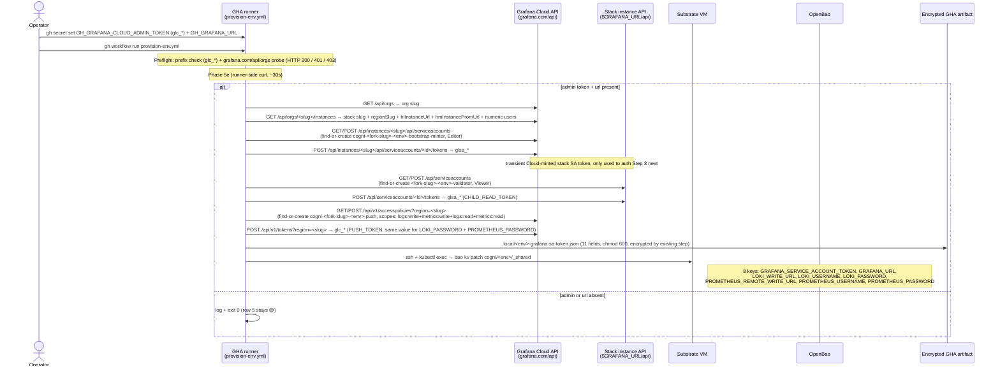

# Grafana Cloud single-root auto-mint at bootstrap (Phase 5e)

> One operator-pasted Cloud admin token; bootstrap derives both read and write paths. No 6-key paste; no manual scope-widening; no laptop credential path. Replaces the earlier glsa\_-parent design — that variant could only cover reads.

## Outcome

A fork operator who pastes `GH_GRAFANA_CLOUD_ADMIN_TOKEN` (a `glc_*` Grafana Cloud access-policy admin token with scopes `stacks:read`, `stack-service-accounts:write`, `accesspolicies:read`, `accesspolicies:write`) + `GH_GRAFANA_URL` into GH-env-secrets gets observability auto-wired across every env they provision. Phase 5e walks the Cloud API + the stack instance API to mint two scoped credentials from that one root:

- a **Viewer-role child SA** on the stack (`<fork-slug>-<env>-validator`) + a fresh `glsa_*` read token (used by the validator scorecard, `scripts/loki-query.sh`, and pods that query `$GRAFANA_URL/api/...`),
- a **Cloud access-policy** (`cogni-<fork-slug>-<env>-push`, scopes `logs:write` + `metrics:write` + `logs:read` + `metrics:read`) + a fresh `glc_*` push token (used by Alloy to remote-write Loki + Prometheus, fed by deploy-infra from the same `_shared` path).

All 8 derived keys land at `cogni/<env>/_shared` (Invariant 1) and in `.local/<env>-grafana-sa-token.json` (11-field snapshot, encrypted by the existing init-artifact step). Scorecard row 5 graduates from vNext → gating using a `GET /api/datasources` probe. Re-running bootstrap is idempotent (find-or-create child SA + access-policy by deterministic name; tokens always fresh). Skipping the admin token is graceful (row 5 = 🟡, bootstrap = 🟢).

## Problem

The earlier `glsa_*`-parent design (PR #54 v1, superseded by this PR) only covered the read path. Write tokens for Alloy push to Loki + Prometheus remote-write live on a different Grafana Cloud surface — the `grafana.com/api/v1/accesspolicies` API — which **only authorizes `glc_*` Cloud access-policy tokens, not `glsa_*` stack SA tokens**. Sticking with the single-root philosophy required swapping the parent type from `glsa_*` (stack-side admin) to `glc_*` (Cloud-side admin with the four scopes above), because:

- Only `glc_*` with `stacks:read` can list orgs + stacks + push endpoints (`hlInstanceUrl`, `hmInstancePromUrl`, numeric users).
- Only `glc_*` with `stack-service-accounts:write` can create the stack-side Viewer child SA + mint its `glsa_*` token.
- Only `glc_*` with `accesspolicies:write` can create the push policy + mint the `glc_*` push token.

The previous design also forced operators to manually paste 6 push-path keys (`GRAFANA_CLOUD_LOKI_*` ×3, `GRAFANA_CLOUD_PROM_*` ×3) at Step 6.6 — the opposite of "one root in, all derived." This PR replaces both designs: one Cloud admin in, all 8 keys out, both read and write.

## Principle alignment

### Identity-model (`docs/spec/identity-model.md`)

- **Cloud admin (glc\_)** = operator-system actor (one credential, one trust boundary). Lives only in GH-env-secrets + the runner env for the ~30s of Phase 5e. Never written to OpenBao, never reaches the VM.
- **Child SA (glsa\_, Viewer) + push token (glc\_, scoped)** = per-env node-system actors. Deterministic naming (`<fork-slug>-<env>-validator` + `cogni-<fork-slug>-<env>-push`) — each `(node_id, env)` pair gets its own pair of derived identities. Clean audit-attribution surface.

### Secrets-management spec (`docs/spec/secrets-management.md`)

- **Invariant 1** (PATH_CONVENTION_PER_SERVICE_PER_ENV): 8 derived keys land at `cogni/<env>/_shared` (cross-service consumption: node-template pods, scheduler-worker, validator, Alloy, laptop scripts).
- **Invariant 2** (ONE_EXTERNAL_SECRET_PER_SERVICE_ENV): existing `_shared-<env>-reader` policy + ESO `dataFrom: extract` already wires consumers; no new policy / ExternalSecret manifests required.
- **Invariant 8** (EVERY_ACCESS_AUDITED): mint emits Grafana audit-log entries on **both** Cloud (org SA + access-policy create + token issue) **and** stack (child SA + child-token create) sides + one OpenBao audit entry (`KV patch cogni/<env>/_shared`).
- **Invariant 11** (ROTATION_DOES_NOT_EDIT_GIT): rotation is a re-run of Phase 5e (find SA + policy by name, mint fresh tokens, patch `_shared`). Zero git PRs.
- **Invariant 13** (NO_OPERATOR_ROOT_TOKEN_ON_LAPTOP): Cloud admin root never written to OpenBao, never propagated to pods, never reaches the VM. Runner env only.

### SOC2 controls

| TSC   | Control                 | How this design satisfies it                                                                                                                                                                                                                                                                                                            |
| ----- | ----------------------- | --------------------------------------------------------------------------------------------------------------------------------------------------------------------------------------------------------------------------------------------------------------------------------------------------------------------------------------- |
| CC6.1 | Logical Access          | Cloud admin root has 4 specific scopes (no broader Cloud powers). GitHub env-secret encrypted at rest, gated by branch + environment protection rules. Child SA is Viewer-only; push policy is the minimal 4-scope set. Reads served by existing `_shared-<env>-reader` policy.                                                         |
| CC6.6 | Confidentiality at Rest | OpenBao at rest + GHA artifact age-encrypted with operator passphrase. Plaintext shredded post-encrypt by the existing `always()` cleanup. Cloud admin only ever exists in the runner env + GitHub secret store.                                                                                                                        |
| CC7.2 | Anomaly Detection       | Grafana audit logs (Cloud + stack, both sides) + OpenBao audit logs feed Loki via Alloy (Invariant 8). GitHub audit log records every read of the env-secret. Alert rules for off-hours mint / unexpected actors.                                                                                                                       |
| CC8.1 | Change Management       | Versioned KV per Invariant 7; rotation = re-run `provision-env.yml` (mint script is find-or-create + always-fresh-token); rollback = `bao kv rollback`. Audit-trail correlation via deterministic SA + policy naming. Cloud admin rotation = re-mint in Cloud UI + `gh secret set GH_GRAFANA_CLOUD_ADMIN_TOKEN` — no PR, no infra edit. |

**Audit-trail attribution caveat**: the Grafana Cloud audit log shows the admin access-policy as the actor on access-policy + stack-SA creation. The stack audit log shows the transient Cloud-minted bootstrap SA (`cogni-<fork-slug>-<env>-bootstrap-minter`) as the actor on child-SA creation. The OpenBao audit log shows the runner-bound service-account token as the actor on the `_shared` patch. Operator's OIDC identity is captured only at the upstream layer (GitHub workflow trigger). Mitigated by deterministic naming + mint-time-tagged token names (`<env>-bootstrap-<ts>-<rand4>`, `<env>-push-<ts>-<rand4>`).

### Decentralized agentic alignment (`docs/spec/agentic-fork-bootstrap.md`)

- **FORK_FREEDOM preserved**: Phase 5e is optional. Forks without a Grafana Cloud stack skip it; bootstrap completes 🟢 with row 5 🟡.
- **No new cross-fork dependencies**: each fork operator brings their own Grafana Cloud stack + admin token. Cogni-DAO is not the minting authority.
- **§6.2 doctrine compliance**: Cloud admin lives as a GH-env-secret, nowhere else. No `.env.bootstrap`, no laptop path.

## Design

Five-step mint flow (sequence above, in plain prose for grep-ability):

1. **Cloud lookup** — `GET grafana.com/api/orgs` → org slug. `GET grafana.com/api/orgs/<slug>/instances` → stack metadata (slug, regionSlug, push endpoints, numeric users). The instance whose `url` matches `$GRAFANA_URL` is selected (with first-stack fallback for single-stack orgs).
2. **Cloud-side bootstrap minter SA** — `GET/POST grafana.com/api/instances/<slug>/api/serviceaccounts` to find-or-create `cogni-<fork-slug>-<env>-bootstrap-minter` (Editor role on the stack), then `POST .../tokens` to mint a transient `glsa_*`. This token authorizes Step 3 (the Cloud admin root cannot directly call stack `/api/serviceaccounts` because the stack instance API only takes `glsa_*`).
3. **Stack-side Viewer child SA** — `GET/POST $GRAFANA_URL/api/serviceaccounts` to find-or-create `<fork-slug>-<env>-validator` (Viewer role), then `POST .../tokens` to mint the `glsa_*` read token (CHILD_READ_TOKEN → `GRAFANA_SERVICE_ACCOUNT_TOKEN`).
4. **Cloud access-policy for push** — `GET/POST grafana.com/api/v1/accesspolicies?region=<slug>` to find-or-create `cogni-<fork-slug>-<env>-push` with `realms: [{type:"stack", identifier:<stack-slug>}]` and `scopes: ["logs:write","metrics:write","logs:read","metrics:read"]`.
5. **Cloud push token** — `POST grafana.com/api/v1/tokens?region=<slug>` to mint a fresh `glc_*` bound to that policy (PUSH_TOKEN → `LOKI_PASSWORD` = `PROMETHEUS_PASSWORD`; the single 4-scope policy covers both write paths).

The mint script (`scripts/setup/provision-grafana-cloud-mint.sh`) emits 8 `KEY=VALUE` lines on stdout; `provision-env-vm.sh` Phase 5e parses them into `seed_kv _shared` calls.

## Goal

Walk-tier observability auto-mint of `proj.agentic-fork-bootstrap.md`. After this PR lands:

- Scorecard row 5 graduates vNext → gating; defaults to 🟢 on first cold-start when Cloud admin token is set (both read and write paths flow from `_shared`).
- Credential floor at Step 6.2 grows 7 → 9 (URL + Cloud admin, both optional). The prior glsa\_-parent design's Step 6.6 manual 6-key paste is eliminated.
- Re-running bootstrap is idempotent (Cloud bootstrap-minter SA, child SA, and push access-policy all find-or-create by deterministic name; only tokens rotate).
- Aligned with secrets-management Invariants 1, 2, 6, 7, 8, 11, 13.

## Non-Goals

- **Engineer-as-actor / per-engineer Grafana scoping.** Lives in the cogni operator-app, not node-template. Requires multi-org Grafana + a user→SA delegation surface.
- **Vault Transit for the Cloud admin root.** Future PR — admin stays a GH-env-secret in v1. The token has only the four scopes needed; rotation is a Cloud-UI mint + one `gh secret set`.
- **Auto-rotation of derived tokens.** Manual rotation via re-running `provision-env.yml` is sufficient for v1 (each re-run mints fresh `glsa_*` + `glc_*` derived tokens).
- **Auto-revoke on fork decommission.** Filed as `revoke-grafana-derived.sh` follow-up (revokes both child SA tokens + push tokens; the parent admin survives at the Cloud layer).
- **Token-sprawl GC.** Re-mints accumulate `<env>-bootstrap-<ts>` + `<env>-push-<ts>` tokens on the same SA + policy; operator revokes prior tokens via Cloud UI when needed. Names are timestamp-suffixed so the most recent is always identifiable.

## Invariants

| Rule                              | Constraint                                                                                                                                                                                                                                                                                                                                                 |
| --------------------------------- | ---------------------------------------------------------------------------------------------------------------------------------------------------------------------------------------------------------------------------------------------------------------------------------------------------------------------------------------------------------- |
| GRAFANA_AUTOMINT_GRACEFUL_SKIP    | Empty admin token or URL → log + exit 0. Bootstrap never fails on observability absence.                                                                                                                                                                                                                                                                   |
| GRAFANA_AUTOMINT_IDEMPOTENT       | Find-or-create Cloud bootstrap-minter SA, child SA, and push access-policy by deterministic names. Re-runs reuse all three; only tokens (always fresh) rotate.                                                                                                                                                                                             |
| GRAFANA_AUTOMINT_PARENT_TYPE      | Cloud admin MUST be `glc_*`. `glsa_*` (stack SA) and `glb_*` (Cloud bearer) rejected at workflow preflight + mint-script preflight with clear errors before any VM spend.                                                                                                                                                                                  |
| GRAFANA_AUTOMINT_SINGLE_ROOT      | One `glc_*` Cloud admin derives all 8 keys at `cogni/<env>/_shared`. No other root tokens accepted; no manual paste of per-path Loki/Prom creds.                                                                                                                                                                                                           |
| GRAFANA_AUTOMINT_LEAST_PRIVILEGE  | Child SA role = Viewer (read + query on all datasources, zero write). Push policy scopes = `logs:write` + `metrics:write` + `logs:read` + `metrics:read` only (no admin, no access-policy management). Cloud admin scopes = the four required (`stacks:read`, `stack-service-accounts:write`, `accesspolicies:read`, `accesspolicies:write`) — no broader. |
| GRAFANA_AUTOMINT_NO_PARENT_IN_BAO | Cloud admin token NEVER written to OpenBao, NEVER reaches the VM, NEVER persists past Phase 5e exit. Runner env only.                                                                                                                                                                                                                                      |
| GRAFANA_AUTOMINT_PATH_SHARED      | All 8 derived keys land at `cogni/<env>/_shared` (spec Invariant 1 cross-service path), NOT a per-service grafana path.                                                                                                                                                                                                                                    |
| GRAFANA_AUTOMINT_NAMING           | Cloud bootstrap-minter SA: `cogni-<fork-slug>-<env>-bootstrap-minter`. Stack child SA: `<fork-slug>-<env>-validator`. Push access-policy: `cogni-<fork-slug>-<env>-push`. Token names: `<env>-bootstrap-<ts>-<rand4>` (read) + `<env>-push-<ts>-<rand4>` (write). These names are the audit-trail correlation keys.                                        |

### Schema

**OpenBao path:** `cogni/<env>/_shared` (KV-v2) — keys added/owned by this work:

| Key                             | Type   | Constraints      | Description                                                                                                                                                |
| ------------------------------- | ------ | ---------------- | ---------------------------------------------------------------------------------------------------------------------------------------------------------- |
| `GRAFANA_SERVICE_ACCOUNT_TOKEN` | string | `glsa_*` prefix  | Viewer child SA token (read path). Consumed by `scripts/loki-query.sh`, validator scorecard, `/logs` slash command, any pod querying `$GRAFANA_URL/api/*`. |
| `GRAFANA_URL`                   | string | URL, no trailing | Stack URL. Same value the operator pasted at Step 6.2.                                                                                                     |
| `LOKI_WRITE_URL`                | string | URL              | Hosted-Loki push URL (`<hlInstanceUrl>/loki/api/v1/push`). Consumed by Alloy via deploy-infra.                                                             |
| `LOKI_USERNAME`                 | string | numeric          | Loki numeric user (`hlInstanceId`). Basic-auth username for the push.                                                                                      |
| `LOKI_PASSWORD`                 | string | `glc_*` prefix   | `glc_*` push token (same value as `PROMETHEUS_PASSWORD` — single 4-scope policy covers both surfaces).                                                     |
| `PROMETHEUS_REMOTE_WRITE_URL`   | string | URL              | Hosted-Mimir push URL (`<hmInstancePromUrl>/api/prom/push`). Consumed by Alloy.                                                                            |
| `PROMETHEUS_USERNAME`           | string | numeric          | Prom numeric user (`hmInstancePromId`).                                                                                                                    |
| `PROMETHEUS_PASSWORD`           | string | `glc_*` prefix   | Same `glc_*` push token as `LOKI_PASSWORD`.                                                                                                                |

**Artifact (one-shot bootstrap snapshot):** `.local/<env>-grafana-sa-token.json`, age-encrypted by `provision-env.yml`'s existing `Encrypt init artifacts` step. 11 fields (6 read-side + 5 write-side):

| Field                         | Description                                                                          |
| ----------------------------- | ------------------------------------------------------------------------------------ |
| `url`                         | `$GRAFANA_URL`                                                                       |
| `token`                       | child `glsa_*` (read path; same value as `GRAFANA_SERVICE_ACCOUNT_TOKEN`)            |
| `sa_id`                       | stack-side child SA integer ID (for break-glass)                                     |
| `sa_name`                     | `<fork-slug>-<env>-validator`                                                        |
| `token_name`                  | `<env>-bootstrap-<ts>-<rand4>` (read-token audit correlation)                        |
| `minted_at`                   | UTC ISO-8601                                                                         |
| `loki_write_url`              | hosted-Loki push URL                                                                 |
| `loki_username`               | Loki numeric user                                                                    |
| `prometheus_remote_write_url` | hosted-Mimir push URL                                                                |
| `prometheus_username`         | Prom numeric user                                                                    |
| `push_token`                  | `glc_*` push token (write path; same value as `LOKI_PASSWORD`/`PROMETHEUS_PASSWORD`) |

### File Pointers

| File                                                   | Change                                                                                                                                                                                                                                                                           |
| ------------------------------------------------------ | -------------------------------------------------------------------------------------------------------------------------------------------------------------------------------------------------------------------------------------------------------------------------------- |
| `scripts/setup/provision-grafana-cloud-mint.sh`        | The mint script. 5-step flow (Cloud lookup → bootstrap minter SA → Viewer child SA → push policy → push token). Preflight rejects `glsa_*` / `glb_*` / non-`glc_*` with clear errors. Idempotent (find-or-create by name). Replaces the prior `provision-grafana-child-sa.sh`.   |
| `scripts/setup/provision-env-vm.sh` Phase 5e           | Wraps the mint script. Reads its 8 stdout `KEY=VALUE` lines + calls `seed_kv _shared` for each. ROOT_TOKEN guard + graceful skip on empty admin/URL.                                                                                                                             |
| `.github/workflows/provision-env.yml`                  | Env block surfaces `GH_GRAFANA_CLOUD_ADMIN_TOKEN` + `GH_GRAFANA_URL`. Preflight step probes `grafana.com/api/orgs` BEFORE Cherry VM spend (HTTP 200 = pass; 401/403 = clear errors with mint-token instructions). Encrypt-artifacts glob picks up `<env>-grafana-sa-token.json`. |
| `scripts/setup-secrets.ts`                             | Declares `GRAFANA_CLOUD_ADMIN_TOKEN` (`source: human`, `glc_*`-only, the 4-scope policy). Existing `GRAFANA_SERVICE_ACCOUNT_TOKEN` + the per-path `LOKI_*`/`PROMETHEUS_*` declarations stay as break-glass manual-override targets.                                              |
| `scripts/ci/deploy-infra.sh`                           | (Subagent B) Reads the 6 push-path keys from `cogni/<env>/_shared` and feeds Alloy's helm release at install time. Read path stays the existing ESO → k8s Secret path.                                                                                                           |
| `scripts/ci/provision-grafana-postgres-datasources.sh` | (Subagent B) Auto-registers the Postgres datasource against `$GRAFANA_URL/api/datasources` post-Alloy. Resolves the `grafana-auth-ok-no-datasources` 🟡 case unless PDC credentials are missing.                                                                                 |
| `docs/runbooks/fork-quickstart.md`                     | Step 6.2 row 9 (literal Cloud admin mint walkthrough). Step 6.5 (11-field artifact). Step 6.6 (auto-mint covers 8 keys, no manual paste). Step 6.7 (Alloy ships at cold-start; drop the Walk-tier caveat). Step 8 row 5 (tightened gating contract).                             |

## Implementation Cut

| PR        | Scope                             | Ships                                                                                                                                                                                      |
| --------- | --------------------------------- | ------------------------------------------------------------------------------------------------------------------------------------------------------------------------------------------ |
| 1 (this)  | Single-root mint + storage + docs | `provision-grafana-cloud-mint.sh`; Phase 5e wiring; workflow env + preflight + encrypt glob; runbook 6.2 walkthrough + 6.5/6.6/6.7 updates + 8 row 5 gating; design doc; setup-secrets.ts. |
| 2 (Walk+) | Decommission                      | `revoke-grafana-derived.sh` for fork wind-down (revokes derived tokens + child SA + push policy; admin survives at the Cloud layer).                                                       |
| 3 (Walk+) | Auto-rotation                     | Periodic derived-token rotation driven by validator heartbeat. Requires the Walk-tier scheduler row to land first.                                                                         |
| 4 (Walk+) | Vault Transit for the Cloud admin | `GRAFANA_CLOUD_ADMIN_TOKEN` migrates from GH-env-secret → OpenBao Transit-encrypted. Lands with the broader Transit migration row.                                                         |

## Open Questions

- [ ] Should `revoke-grafana-derived.sh` (PR 2) also delete the Cloud bootstrap-minter SA, or accept it as a stable per-env identity? Lean: keep, since it's deterministic by name and re-creating it on every re-mint is wasted Cloud-audit-log noise.
- [ ] Token-sprawl on re-mints: each re-run leaves a stale `glsa_*` (read) + `glc_*` (push) token on its parent SA/policy. v1 accepts sprawl; PR 2 ties revocation into wind-down. Operator can also revoke via Cloud UI between runs.

## Risks / Gotchas

- **`glsa_*` vs `glc_*` confusion.** Operators familiar with stack-side admin SAs will paste a `glsa_*`. Caught by **two** preflight layers before any VM spend: the workflow `Pre-flight — Grafana Cloud admin token` step (`.github/workflows/provision-env.yml`, lines 135-200) and the mint script's own prefix check (`scripts/setup/provision-grafana-cloud-mint.sh`, lines 78-100). Both surface the mint URL + the four required scopes.
- **Cloud admin root in a GH-env-secret.** SOC2 controls already cover this surface: CC6.1 (GH secret encrypted at rest + branch/environment protection rules gate read); CC7.2 (GH audit log records every secret read); CC8.1 (rotation = re-mint in Cloud UI + `gh secret set`, no PR). Future Vault Transit row tightens further.
- **Push-policy token tracking.** The access-policy is named `cogni-<fork-slug>-<env>-push` and is idempotent (find-or-create by name). Tokens accumulate across re-mints (one fresh `glc_*` per run; names are timestamp-suffixed so the most recent is identifiable). Operator can revoke prior tokens via Cloud UI between runs; PR 2 ties revocation into automated wind-down.
- **Stack-global vs per-env data isolation.** Viewer-role child reads every datasource the stack exposes, not just env-tagged ones; push policy's realm is `type:"stack"` (whole-stack write). For strict per-env isolation: separate Grafana orgs per env (v2+). Document the trust boundary; do not over-engineer.
- **Admin rotation doesn't cascade.** Rotating `GH_GRAFANA_CLOUD_ADMIN_TOKEN` doesn't invalidate existing derived tokens (Grafana keeps them independent). Re-running `provision-env.yml` with the new admin finds the existing SAs + policy + rotates their tokens — desired.
- **Audit-log attribution caveat.** See SOC2 table above. The Cloud audit log shows the admin policy as actor on policy/stack-SA create; the stack audit log shows the bootstrap-minter SA as actor on child-SA create. Operator OIDC is captured only at the GitHub-workflow-trigger layer. Mitigated by deterministic naming + timestamp-suffixed token names.

## Related

- `scripts/setup/provision-grafana-cloud-mint.sh` — the canonical implementation.
- `docs/spec/secrets-management.md` — Invariants 1, 2, 6, 7, 8, 11, 13.
- `docs/spec/identity-model.md` — actor primitives + `actor-kind=system` precedent.
- `work/projects/proj.agentic-fork-bootstrap.md` — observability auto-mint row.
- `docs/runbooks/fork-quickstart.md` — Step 6.2 (9-secret floor) + Step 6.7 (verify) + Step 8 row 5 (gating probe).
