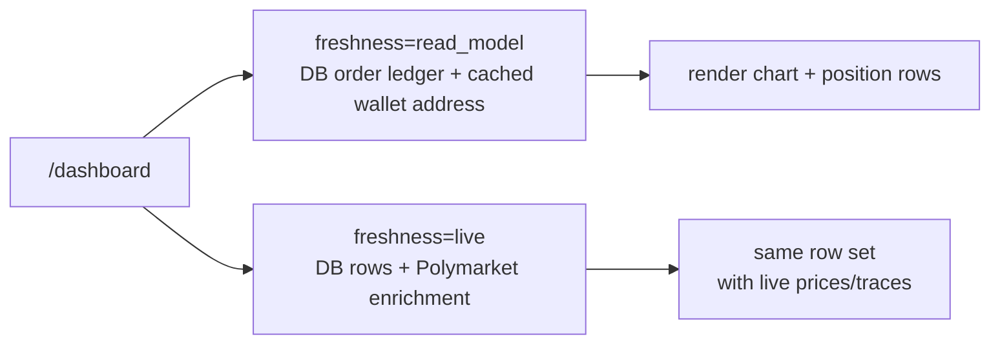

# Poly Dashboard — Balance History + Position Visuals

## Current inventory

Snapshot taken from fresh `origin/main` at commit `d4cd4db09` on 2026-04-22.

- `/dashboard` top fold currently renders `OperatorWalletCard`, `OrderActivityCard`, `WalletQuickJump`, and `CopyTradedWalletsCard`.
- There is **no** existing "trade volume over the time frame" card on current `main`. The closest reusable chart molecules today are `TradesPerDayChart` in `features/wallet-analysis` and `ActivityChart` in `components/kit/data-display`.
- The reusable wallet-analysis surface already owns `BalanceBar`, `TradesPerDayChart`, `WalletDetailDrawer`, and `WalletAnalysisView`.
- The chart stack is already standardized on `recharts` plus `components/vendor/shadcn/chart.tsx`.
- Polymarket data channels are already split in the codebase:
  - Data API = leaderboard, `/trades`, `/positions`, `/activity`
  - CLOB public = market resolution only
  - Signed CLOB = operator open orders, locked balance, and execution

## Library decision

Do **not** add Tremor for this work.

- We already ship `recharts` + shadcn chart wrappers on `main`.
- The new dashboard visuals need custom lifecycle markers, dense row-level sparklines, and palette continuity with the existing app.
- Tremor would add a second charting abstraction and another opinionated styling layer without solving the hard part, which is the wallet/position data model.

Use this split instead:

- Card-scale charts: `recharts` through `components/vendor/shadcn/chart.tsx`
- Row-scale micro-visuals: inline SVG components
- Shared shells: existing `Card`, `Table`, `ToggleGroup`, `Badge`

## First-class position

A "position" must stop meaning "whatever `/positions` happens to return today."

For dashboard and wallet-analysis UI, a position is:

- keyed by `(conditionId, asset)`
- opened by the first net-positive exposure
- mutated by later adds / reductions on the same outcome token
- still `open` while net size is positive
- `closed` once net size returns to zero or the market resolves / redeems out

This gives us one honest row model for open, exiting, and closed positions.

## Immediately needed component

### Position table upgrade

Do **not** mutate `Active Orders` into `Positions`. Orders and positions are different entities.

Instead add:

- `PositionTimelineChart` molecule
- `PositionsTable` organism

`PositionTimelineChart` responsibilities:

- normalize one row's lifecycle into a compact price trace
- draw an entry basis as a horizontal reference
- draw an entry marker as a vertical bar
- draw a close marker only when the position is actually closed
- support hover/cursor on the same chart stack as the larger dashboard charts

`PositionsTable` responsibilities:

- market / outcome / side labeling
- sparkline cell
- current value column (default variant) or Closed timestamp (history variant)
- `P/L` dollar column
- `P/L %` column
- `Held` column formatted as `holding (x hr) N min` or `held (x hr) N min`
- Action column (default) or omitted (history variant — read-only, no Close/Redeem buttons)

Accepts `variant?: "default" | "history"`. The dashboard "Position History" tab passes `variant="history"` to render closed positions without action controls.

## Data mapping

### Balance history

Do not ship a synthetic balance curve on the execution card.

- Source of truth for a future balance card: Data API trades + current positions + operator cash/locked history
- Until that history is deterministic, the execution surface should stay positions-first and omit the chart

### Positions

Build positions from a joined view, not a single endpoint.

- Data API `/trades`: lifecycle, entry/exit timestamps, per-trade marker events
- Data API `/positions`: current size, current value, `cashPnl`, `percentPnl`
- CLOB public: optional resolution help when a market has settled but the row still needs final outcome labeling

Important constraint on current `main`:

- `packages/market-provider/src/adapters/polymarket/polymarket.data-api.types.ts` explicitly treats `/positions` as **open positions only**
- so close markers and held duration for closed rows must be derived from the trade feed

## Current direction

- Use Data API `positions` + `trades` for lifecycle semantics.
- Use CLOB public `prices-history` for the actual row trace (open/redeemable positions only; closed rows rely on trade-derived timelines).
- Execution card tabs: "Open" from `live_positions`, "Position History" from `closed_positions`. History tab is read-only (`variant="history"` on `PositionsTable`).
- Revisit a balance card only after we have deterministic cash + locked + MTM history.

## Dashboard load flow

Use a stale-while-revalidate read path: first paint comes from the local read
model, then live Polymarket/on-chain enrichment replaces it when available.
This is the dashboard equivalent of the wallet-watch websocket design in PR
#1172: a fast local signal drives UI responsiveness, while canonical external
data remains a second pass.

Contract rules:

- `freshness=read_model` must not call Polymarket live position or P/L history
  reads.
- `freshness=live` may call Polymarket/Data API and may fall back to the read
  model on upstream failure.
- The DB read model owns row cardinality and ordering for dashboard positions.
  Live Polymarket data enriches matching rows and may append new upstream-only
  rows, but must not replace the table with a capped upstream slice.
- `warnings[]` means degraded data, not intentional progressive loading.
- Dashboard hooks choose between read-model and live route responses;
  presentational wallet-analysis components stay pure-prop.

## Reuse rules

- Keep all Polymarket reads in `packages/market-provider` clients plus feature services. No route-local `fetch`.
- Keep all wallet-analysis UI pure-prop and slice-driven. No component fetches.
- Keep row sparklines SVG-based. A full chart instance per table row is wasted work.
- Keep the dashboard on the existing chart stack. No Tremor unless we decide to replace the app-wide chart primitives, which this work does not justify.
