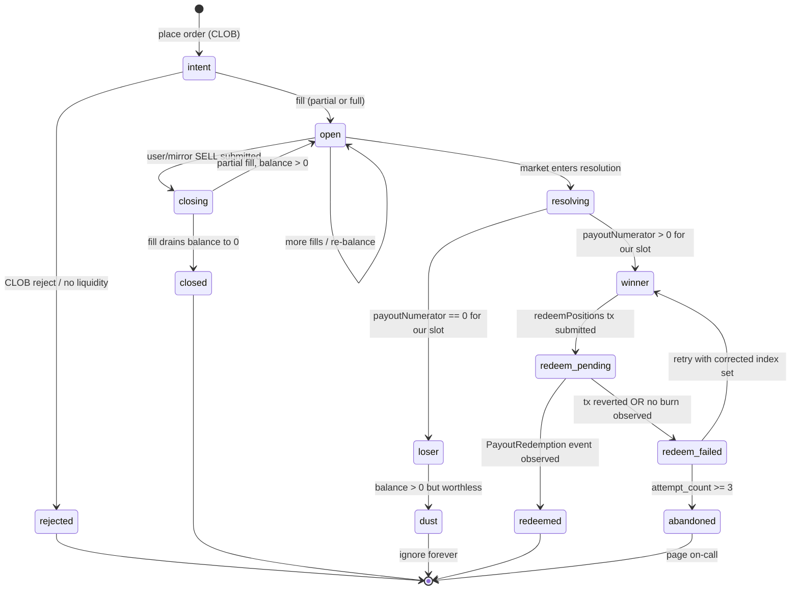

# Poly Positions — object model + lifecycle

> A position has one identity, four authorities, and seven states. Today the code conflates them, and that's why we burn POL in a loop. This doc is the picture we should have drawn before bug.0384.

## Why this exists

Bug.0384 (sweep race + POL bleed) is the third "authority confusion" incident in this surface (bug.0376 runaway-gas, bug.0383 losing-outcome, now 0384). The earlier two were patched in `poly-trade-executor.ts` with in-process guards. Each fix added local state without ever drawing the actual lifecycle. The result: the predicate fires `redeemPositions` against a position that has already been redeemed (or holds the wrong index set), the tx "succeeds" with zero burn, and the loop re-fires until the wallet is empty.

The fix is not another guard. The fix is to agree, in writing, on what a position **is**, who owns each state transition, and which authority decides each transition. Then the implementation falls out.

## What is a position?

One sentence: **A position is a non-fungible holding of one outcome share of one Polymarket condition by one wallet.**

Four equivalent identities, all of which our code has used at various points to "look up the same thing":

| Identity                           | Where it lives                       | When it's stable                |
| ---------------------------------- | ------------------------------------ | ------------------------------- |
| `(wallet, conditionId, outcomeIndex)` | Domain key — what the user thinks of | Forever                         |
| `tokenId` (ERC-1155 id, decimal)   | Polymarket Data API `position.asset` | Forever                         |
| `positionId` (ERC-1155 id, BigInt) | CTF contract balance lookup          | Forever (same number, base 10)  |
| `(funderAddress, positionId)` slot | Polygon CTF `balanceOf(addr, id)`    | The actual on-chain truth       |

These are the **same position**. The bug.0384 code path treats `position.redeemable` (Data API field on identity #2) as authority for "should we redeem", then fires a tx against identity #4 — and the two disagree for a window that lasts *longer than our 30 s sweep tick*.

### Position object — the fields that matter

The `PolymarketUserPosition` shape from the Data API carries ~20 fields. Only seven are load-bearing for the lifecycle:

- `conditionId` — the market
- `asset` (= `tokenId` = `positionId`) — the specific outcome share
- `outcomeIndex` — which slot in the condition's outcome array we hold
- `size` — share count (Data API view, lags chain)
- `curPrice` — current mid (drives "current value")
- `redeemable` — Data API's hint that the market has resolved in our favor
- `negativeRisk` — true for neg-risk markets (different redeem path; not yet handled correctly)

Everything else is presentation (`title`, `icon`, `slug`, P&L numbers).

## Prior art

Surveyed before drafting (per Derek's "don't reinvent the wheel" prompt). All Python; we port patterns, not code.

| Project                                         | License | What we take                                                                                | What we don't                                              |
| ----------------------------------------------- | ------- | ------------------------------------------------------------------------------------------- | ---------------------------------------------------------- |
| **GiordanoSouza/polymarket-copy-trading-bot**   | MIT     | API → DB → loop → sizing → `py-clob-client`. Closest 1:1 architectural match. Mirror flow.  | Their position model is one flat table with mutable `status`; we split by authority (live/closed/pending). |
| **Polymarket/agents** (official)                | MIT     | Canonical Data API field shapes; first-party `redeemable` semantics; neg-risk handling hints. | Runtime mismatch — Python; we re-derive in TS.            |
| **warproxxx/poly-maker**                        | MIT     | Adapter quirks, `/balance-allowance` cache drift behavior, rate-limit envelope.              | Maker-side strategy; not relevant to copy/exit.            |
| **leolopez007/polymarket-trade-tracker**        | (read-only) | Tier-1 wallet-ranking heuristics; `/trades` polling cadence trade-offs.                  | No redeem path at all — they only watch fills.            |

**Where we deviate from all of them:** none survey treats redemption as a first-class job-queue state machine with chain-event observation as the completion signal. They all treat `redeemPositions` as fire-and-forget against a Data-API hint — the same shape that produced bug.0384 here. The 7-state lifecycle + Capability B below is **net-new**, and we should expect to find quirks they haven't documented.

**Postgres-as-queue prior art (non-Polymarket):** river-queue, graphile-worker, oban (Elixir). Pick one in `/implement`; do not reinvent dedup-by-`(funder, conditionId)`.

## The four authorities

A position transition is decided by exactly one of these. Mixing them is the root class of all three bugs.

| #   | Authority                              | Latency       | Decides                                                              |
| --- | -------------------------------------- | ------------- | -------------------------------------------------------------------- |
| 1   | **Polygon chain** (CTF + ERC-1155 + ERC-20) | seconds (finality) | Truth for balance, payout numerators, redemption, allowance         |
| 2   | **Polymarket CLOB write path**         | seconds       | Truth for order acceptance, fills                                    |
| 3   | **Polymarket Data API** (`/positions`, `/balance-allowance`) | 5–60 s lag | Discovery + UI hints. **Never** authority for a write decision      |
| 4   | **Local DB** (`poly_*` tables)         | as-of-last-write | App-owned write intent + cached read. Never authority for chain truth |

Hard rule (carry-over from `poly-position-exit.md`): **a write decision must consult either #1 or #2. #3 is a hint, #4 is a cache.**

Bug.0384's predicate read #3 (`position.redeemable` for enumeration), then read #1 (multicall `balanceOf` + `payoutNumerators`), then *also* read #1 to decide. That part is correct in isolation. The bleed comes from a fifth implicit authority the code never names: **the in-process cooldown Map**, which is supposed to stand in for "is there a pending tx I just sent?" — a question only #1 can answer, and only after finality. The Map is a *wrong* answer that survives 60 s and dies on pod restart.

## The lifecycle — visual

### State definitions and authority per transition

| State            | Means                                                | Authority for *entry*                                             |
| ---------------- | ---------------------------------------------------- | ----------------------------------------------------------------- |
| `intent`         | We submitted a CLOB order; no fill yet               | #2 CLOB write ack                                                 |
| `open`           | Wallet has > 0 ERC-1155 balance for the position     | #1 chain `balanceOf` (Data API #3 used for *enumeration only*)    |
| `closing`        | A SELL is in flight against an open position         | #2 CLOB write ack                                                 |
| `closed`         | Open → Closing → balance reaches 0 via SELL          | #1 chain `balanceOf == 0` after fill                              |
| `rejected`       | CLOB refused the order                               | #2 CLOB error response                                            |
| `resolving`      | Market entered resolution (UMA window or admin)      | #1 CTF `ConditionResolution` event OR #3 hint with #1 confirmation |
| `winner`         | Resolved AND `payoutNumerator(condId, ourIdx) > 0`   | #1 CTF `payoutNumerators` view                                    |
| `loser`          | Resolved AND `payoutNumerator(condId, ourIdx) == 0`  | #1 CTF `payoutNumerators` view                                    |
| `dust`           | Loser with non-zero ERC-1155 balance                 | #1 chain (terminal — never write against this)                    |
| `redeem_pending` | `redeemPositions` tx submitted, awaiting receipt     | #2 chain submit ack (tx hash) + local job row                     |
| `redeemed`       | `PayoutRedemption(redeemer=funder, ...)` observed    | #1 chain event (the only authority that closes the loop)          |
| `redeem_failed`  | Tx receipt status=success but no `PayoutRedemption` from our funder, OR receipt status=failure | #1 chain event absence + receipt status |
| `abandoned`      | Three failed redeem attempts                         | Local DB attempt counter — page a human                           |

### What bug.0384 actually did

Walk the diagram with the buggy code:

1. Sweep tick 1 reads `/positions` (#3). Three positions show `redeemable: true`.
2. Multicall reads `balanceOf` + `payoutNumerators` (#1). All three pass `decideRedeem`.
3. For each: submit `redeemPositions` (#2 chain). Set in-process cooldown (Map).
4. **The tx "succeeds" but produces no `TransferSingle` from funder** — the position is in a state our predicate doesn't model: probably already-redeemed in a prior tx, or a neg-risk market where `BINARY_REDEEM_INDEX_SETS = [1, 2]` is the wrong index set, or both.
5. Cooldown expires after 60 s. Tick fires again. Predicate still says ok (because chain `balanceOf` *is* still > 0 — the burn never happened). Same three txs go out. POL drains. Forever.

The diagram makes it obvious: there is no edge from `redeem_pending` back to `winner` *unless* we observe `PayoutRedemption`. The current code has no concept of `PayoutRedemption`. It only knows `tx submitted → wait 60 s → check predicate again`. The predicate, by design, can't see "we already tried."

## What we need to build (capabilities, not files)

The redesign is two capabilities and one event subscription. No code in this doc — file paths and signatures come at `/implement` time.

### Before /implement — load-bearing prerequisites

These are not optional; the design relies on them.

- [ ] **Loki audit of historical redeem txs + coverage matrix.** Pull every `poly.ctf.redeem.ok` event from Loki for the last 30 days. For each `tx_hash`, call `eth_getTransactionReceipt` and check for `TransferSingle(from=funder, value>0)` (binary CTF) OR the neg-risk adapter's burn event. Any tx with success status and **no burn from our funder** is a malformed-decision fixture. **Coverage requirement:** Capability A's fixture corpus must include at least one example of *each* of `{binary-winner, binary-loser, binary-already-redeemed, neg-risk-parent, neg-risk-adapter, multi-outcome-winner, multi-outcome-loser}`. Any class the Loki audit doesn't cover **must** be backfilled synthetically from contract source (CTF + neg-risk adapter ABIs + a deterministic state generator) before Capability A ships. A predicate validated against 30 days of pure binary-winner traffic is a predicate that ships with the same blind spot bug.0384 had.
- [ ] **Confirm neg-risk adapter contract address + event ABI** on Polygon mainnet. Identify the `PayoutRedemption`-equivalent event name and topic hash. Capability B's subscription set is wrong without this.
- [ ] **Pick finality depth N.** v0 default: **N=10 on Polygon (~25 s)**. This is a *choice with no published Polygon-team finality guidance to cite as of 2026-04-26* — Polygon docs talk about ~256-block heimdall checkpoints but observed reorg depth on mainnet is overwhelmingly ≤3. N=10 is a 3× margin against the empirical tail. **Revisit after the first 30 days of `PayoutRedemption` observation:** if zero confirmed→submitted reverts occur, ratchet down to N=5 to halve confirmation latency. If even one occurs, hold at N=10 and log the reorg. Value lives next to RPC config, not hardcoded in two places.

### Capability A — Pure redeem policy

A pure function (or small module) with no I/O:

- Inputs: chain reads (balance, payoutNumerator, payoutDenominator), `negativeRisk` flag, our `outcomeIndex`, market's outcome cardinality.
- Output: a discriminated decision: `redeem(indexSet, expectedShares, expectedPayoutUsdc) | skip(reason) | malformed(reason)`.
- Tested against a fixture matrix derived from **real failing tx hashes** (audit step: pull all `poly.ctf.redeem.ok` events from Loki for last 30 days, cross-reference each `tx_hash` against `eth_getTransactionReceipt` for `TransferSingle(from=funder, value>0)`; any tx with no burn is a fixture we are missing).
- Lives in `packages/market-provider/policy/` so it can be imported by the executor, the worker, and tests without dragging viem.

This capability is the answer to bug.0383 done right — it does not call the chain, it judges chain reads.

### Capability B — Redeem job queue

A persistent, idempotent state machine for the `winner → redeem_pending → redeemed | redeem_failed | abandoned` slice.

- Backing store: one Postgres table in poly's local DB. Status enum mirrors the diagram. Unique key on `(funder_address, condition_id)` so a duplicate enqueue is a no-op.
- Producer: the event subscription below (and a manual API for the user-facing redeem button).
- Consumer: one worker per process draining `WHERE status = 'pending' FOR UPDATE SKIP LOCKED`.
- Transitions:
  - `pending → submitted` on tx hash returned, store hash + nonce + attempt count.
  - `submitted → confirmed` on observed `PayoutRedemption(funder, conditionId, ...)` event with matching tx_hash, **at N-block finality**.
  - `submitted → failed` on receipt status=failure (transient class — RPC timeout, gas underpriced, reorg-during-submit) OR receipt status=success-but-no-PayoutRedemption-from-funder within N blocks (**malformed class — escalate, do not retry the same decision**).
  - `failed(transient) → pending` if attempt_count < 3 (exponential backoff). Retries are for *transient* classes only — Capability A is pure, so retrying a malformed decision against the same chain state produces the same failure and burns POL.
  - `failed(malformed) → abandoned` immediately (alert via Loki `poly.ctf.redeem.abandoned` — same channel as bug.0376 paging).
  - `failed → abandoned` if attempt_count >= 3 (alert).
- Cooldown is a SQL `WHERE` clause, not a Map. Dead on restart? It's in Postgres. Multi-pod safe? `FOR UPDATE SKIP LOCKED`. The whole `sweepInFlight` mutex and `redeemCooldownByConditionId` Map disappear.
- Postgres-as-queue is a known pattern (river-queue, graphile-worker, oban). Pick one or write the ~30 lines yourself — but don't reinvent dedup keyed by condition id.

### Subscription — chain events drive everything

Subscribe to **both** the CTF contract and the neg-risk adapter contract. Filtering only the CTF address would silently drop neg-risk redemption confirmations and the worker would retry forever — bug.0384 in a new dress.

- CTF `ConditionResolution(conditionId, oracle, questionId, outcomeSlotCount, payoutNumerators[])` → for each of our funder's positions in that condition, evaluate Capability A. If `redeem`, INSERT into the job table.
- CTF `PayoutRedemption(redeemer, collateralToken, parentCollectionId, conditionId, indexSets[], payout)` → if `redeemer == funder` AND a job exists for `(funder, conditionId)`, mark `confirmed` after **N-block finality** (Polygon: N=10 default; tunable, lives next to RPC config).
- Neg-risk adapter equivalent redemption event → same matching rule, marks neg-risk jobs `confirmed`.

A reorg observed within N blocks reverts `confirmed → submitted`; the worker re-checks at next finality. This is what `REDEEM_COMPLETION_IS_EVENT_OBSERVED` means in practice.

**Catch-up backstop.** If the pod is down when an event fires, the position never enters `winner` and the wallet sits on an unredeemed payout forever. On startup (and once per cron tick — daily is plenty), scan historical events from `last_processed_block` to `head` and replay through Capability A. This is the **only** legitimate sweep in the system; it is bounded by chain history, not by a periodic predicate.

Polling sweep over Data API dies. Capability A is consulted once per resolution event per position, plus once per retry, plus once per startup-catch-up replay. Steady-state RPC load is ~zero between resolutions.

### What stays

- The `closing` half of the lifecycle (CLOB SELL flow) is already correctly modeled by `poly-position-exit.md`'s "trust write ack, treat reads as lagging" rule. No change.
- `decideRedeem` *as a name* is fine; the implementation moves and grows.
- The user-facing manual redeem button still works, but it inserts a job row instead of firing a tx directly. UI polls job status. One write path = one failure mode.

### What gets ripped (v0, no users to migrate)

From `nodes/poly/app/src/bootstrap/capabilities/poly-trade-executor.ts`:

- `sweepInFlight` mutex
- `redeemCooldownByConditionId` Map and helpers (`pendingRedeemMsRemaining`, `markRedeemPending`, `_resetRedeemCooldownForTests`, `_resetSweepMutexForTests`)
- `REDEEM_COOLDOWN_MS` constant
- `redeemAllRedeemableResolvedPositions` and `runRedeemSweep`
- The mirror-pipeline tick that calls them
- `BINARY_REDEEM_INDEX_SETS` as a hardcoded constant (replaced by Capability A's index-set output)

All `SINGLE_POD_ASSUMPTION` doc-strings go with them. Replicas can scale.

## Neg-risk markets — the wrinkle Capability A must handle

Polymarket's neg-risk markets are not standard CTF binary markets. The buggy `BINARY_REDEEM_INDEX_SETS = [1, 2]` is wrong for them. A neg-risk position lives under a *parent* condition, and redemption either:

- Calls `redeemPositions` against the parent collection (not `PARENT_COLLECTION_ID_ZERO`), with a single-element index set for the winning child, OR
- Goes through the neg-risk adapter contract, which has its own redeem entrypoint.

Capability A must take `negativeRisk` from the position and emit the *correct* `(parentCollectionId, indexSet)` tuple. Treating all redeems as binary is the secondary cause of bug.0384 — the predicate's index set was wrong even when the rest was right.

## Invariants

- `POSITION_IDENTITY_IS_CHAIN_KEYED` — the canonical key is `(funder, positionId)`. Data API rows are projections, never identity.
- `WRITE_AUTHORITY_IS_CHAIN_OR_CLOB` — no write decision (place, close, redeem) consults Data API or local DB as primary authority.
- `REDEEM_COMPLETION_IS_EVENT_OBSERVED` — a redeem is "done" only when `PayoutRedemption` (CTF) or the neg-risk adapter equivalent, emitted by our funder, is observed on chain at N-block finality. Tx receipt success is necessary, not sufficient. A reorg within N reverts confirmation.
- `REDEEM_DEDUP_IS_PERSISTED` — duplicate-redeem prevention lives in a durable store keyed by `(funder, conditionId)`. No in-process Maps, no module-scope mutexes.
- `REDEEM_HAS_CIRCUIT_BREAKER` — a position that fails redemption 3× transitions to `abandoned` and pages a human. The system must not re-fire a known-failing tx forever.
- `NEG_RISK_REDEEM_IS_DISTINCT` — neg-risk positions use the neg-risk redeem path (parent collection or adapter), not binary CTF redeem. Capability A is the single decider.
- `SWEEP_IS_NOT_AN_ARCHITECTURE` — periodic enumerate-and-fire over a Data-API predicate is forbidden as the **steady-state** loop. Resolution events drive enqueue; the worker drives drain. The one carve-out: a startup + daily-cron catch-up replay over historical chain events from `last_processed_block` to `head`, bounded by chain history rather than by a recurring predicate, is allowed and required.
- `REDEEM_RETRY_IS_TRANSIENT_ONLY` — retries are gated on transient failure class (RPC timeout, gas underpriced, reorg). A malformed decision (tx success, no burn) escalates to `abandoned` immediately; `attempt_count` exists to bound transient retries, not to mask predicate bugs.

## Abandoned-position runbook

`abandoned` is not "the system gives up" — it is "the system has detected a Capability A blind spot it cannot fix on its own." Without a runbook, abandoned rows accumulate forever and the page becomes theater. The on-call procedure:

1. **Page fires** on `poly.ctf.redeem.abandoned` Loki event. Payload: `condition_id`, `funder`, `negativeRisk`, `outcomeIndex`, last `tx_hash`, observed receipt, observed event topics.
2. **Inspect the failed tx** on Polygonscan (decoded receipt + event log). Confirm: tx succeeded, no `TransferSingle` from funder, no `PayoutRedemption` from funder.
3. **Diagnose Capability A's blind spot.** The decision was structurally wrong — wrong index set, wrong parent collection, wrong contract (binary path used on a neg-risk position, etc.). The chain state did not change between the decision and now; another automated retry will reproduce the same failure.
4. **Add the failing case as a fixture.** New row in Capability A's test corpus with the input chain reads + the *correct* expected output. Tests must fail against current Capability A.
5. **Fix Capability A** until the new fixture passes plus all existing fixtures still pass.
6. **Ship + deploy** through the normal lifecycle (PR → candidate-a → flight → deploy_verified).
7. **Re-enqueue the abandoned position** by inserting a fresh job row (manual SQL or admin endpoint) with `attempt_count = 0`. The new Capability A then evaluates correctly and the worker drains it.

Without steps 4–6, every position resolved with the same shape will hit the same wall and abandon. The runbook is the loop that converts a one-off page into a permanent fix.

## What this doc is not

- It is not a task. No status flips, no `/implement` until we agree on the picture.
- It is not a replacement for `poly-position-exit.md` — that spec owns the close half and the four-authority contract. This doc extends it with the resolved/redeem half and adds the visual.
- It does not specify the Postgres schema, the worker's exact backoff curve, or the viem subscription's reorg handling. Those land at `/implement` time, constrained by the invariants above.

## Resolved during review

1. **Cooldown Map + sweep mutex come out wholesale.** Belt-and-suspenders means two truths, which is the bug.
2. **Single Capability A function with discriminated output** `kind: 'binary' | 'neg-risk-parent' | 'neg-risk-adapter'`. Don't fork the policy; fork the output shape.
3. **Worker is in-process, v0.** Scale to a separate container only if multi-pod load forces it.
4. **Manual redeem button — v0 holds HTTP, v1 returns 202.** Re-litigated on review2: for a single-user dashboard with sub-30 s confirmation latency (worker drains the row immediately, finality is N=10 ≈ 25 s), holding the HTTP connection with a 45 s timeout is simpler than building a polling client around `job_id`. The job row still exists (worker writes it; that's the dedup mechanism), the route just `await`s the worker outcome instead of returning 202. Promote to 202 + poll **the moment** any of: (a) we onboard a second tenant with concurrent redeems, (b) average confirm latency drifts above 30 s, (c) we add background-job UI (notifications). v0 single-user does not pay for plumbing it doesn't use.

## Still open (deferred, not blocking /implement)

5. Where does `closing → closed` actually land? Today it's inferred from a Data API reread — the same authority confusion in miniature. Out of scope for this doc; tracked as a follow-on note in `poly-position-exit.md`.
