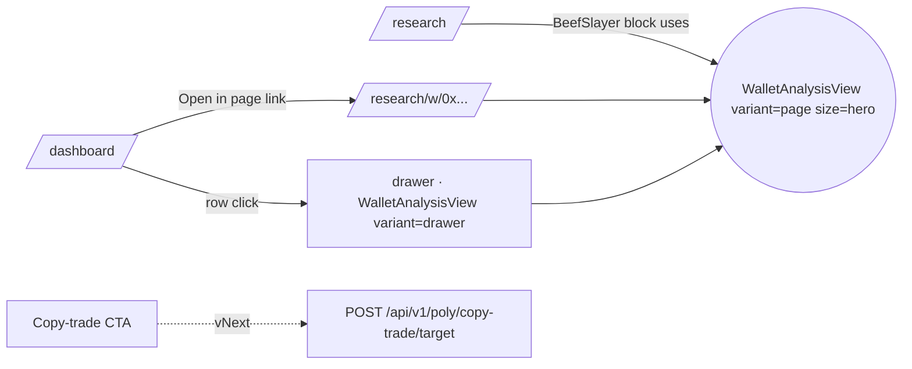

# Wallet Analysis — Reusable Components + Live Data Plane

> Extract the BeefSlayer hero from `/research` + the Operator Wallet balance bar into a reusable `WalletAnalysisView` that any **roster wallet** can render, with live data where it matters and snapshot data where it doesn't. Then wire selection from `Monitored Wallets` → view.

## Problem

- `/research` renders **BeefSlayer** as a bespoke hero — hardcoded stats, hardcoded trades, no other wallet can render like this.
- `OperatorWalletCard` on `/dashboard` renders the **balance bar** (Available / Locked / Positions) only for the operator.
- `TopWalletsCard` ("Monitored Wallets") lists wallets but has no drill-in.

Goal: click any roster wallet → full analysis view, composed of pieces we've already drawn, with data loaded efficiently.

## Component decomposition

Three variants. Same molecules.

```
WalletAnalysisView(address, variant)
│
├─ WalletIdentityHeader   ─ name · wallet · Polymarket / Polygonscan · category chip
├─ StatGrid               ─ 1–6 metric tiles (WR · ROI · PnL · DD · hold · avg/day) [snapshot]
├─ BalanceBar             ─ Available · Locked · Positions stacked bar              [live · 15s]
├─ TradesPerDayChart      ─ last 14 d bars                                          [live · 30s] · lazy
├─ RecentTradesTable      ─ last N trades                                           [live · 30s] · lazy
├─ TopMarketsList         ─ top 4 derived from trades                               [derived]
├─ EdgeHypothesis         ─ analyst text from snapshot row (hypothesis_md column)
└─ CopyTradeCTA           ─ vNext · set-as-mirror-target button
```

| variant   | where                                                    | shows                                                 |
| --------- | -------------------------------------------------------- | ----------------------------------------------------- |
| `page`    | `/research/w/[addr]` AND hero on `/research` (size prop) | all molecules; `size="hero"` enlarges typography only |
| `drawer`  | dashboard slide-over                                     | identity + stats + balance + last 5 trades            |
| `compact` | row-inline (vNext)                                       | identity + WR + ROI + DD                              |

`compact` ships only when there's a caller for it. v1 ships `page` + `drawer`.

All molecules accept `{ data, isLoading }` and render their own skeleton. **No sub-component fetches on its own.**

## Data plane

Two sources, two freshness classes.

| Slice                               | Source                                                                                                                 | Freshness                                                            | Cache                                                                   |
| ----------------------------------- | ---------------------------------------------------------------------------------------------------------------------- | -------------------------------------------------------------------- | ----------------------------------------------------------------------- |
| Snapshot metrics + hypothesis       | `poly_wallet_screen_snapshots` table (seeded from `docs/research/fixtures/poly-wallet-screen-v3-*.json`)               | snapshot-versioned; UI shows `taken_at`; muted pill if >120 days old | DB row, no cache layer needed                                           |
| Live (balance · trades · positions) | existing `PolymarketDataApiClient` in `packages/market-provider/src/adapters/polymarket/polymarket.data-api.client.ts` | 30 s                                                                 | server-side `unstable_cache` keyed by `wallet:{slice}:{addr}`, TTL 30 s |

**Reuse mandate.** All Data-API calls go through the existing `PolymarketDataApiClient`. The app's API route is a thin HTTP handler around it. **Do not add a second Data-API client** in `nodes/poly/app/`.

**Coalescing.** Server-side `unstable_cache` (Next.js) sits between the route handler and the adapter. Ten simultaneous requests for the same `addr` collapse to one upstream Data-API call (Next dedup of the underlying `fetch`).

**Lazy code-split.** `TradesPerDayChart` + `RecentTradesTable` are `next/dynamic` imports — only pulled when `variant === "page"`.

**Prefetch.** `TopWalletsCard` row → `onPointerEnter`, `onFocus`, `onTouchStart` (debounced 50 ms) → `queryClient.prefetchQuery` for snapshot + trades. Drawer opens already-warmed on every input modality.

### Address policy — any 0x wallet

Any 0x address is accepted. Snapshot data is `null` for unscreened wallets; live `trades` + `balance` always populated (Data-API + RPC are public). Three guardrails replace the roster gate:

- **Auth.** Route requires an authenticated session.
- **Validation.** Zod regex `^0x[a-f0-9]{40}$` (lowercased) before any handler logic.
- **Coalescing.** Server-side `unstable_cache` per `(slice, addr)`, 30 s TTL → at most one upstream Data-API call per (slice, addr) per 30 s, regardless of concurrent users.

A future per-IP rate-limit middleware tightens this further if the surface gets abused.

### API surface (contract owns the shape)

One route, three slices selected via `?include=`:

```
GET /api/v1/poly/wallets/{addr}?include=snapshot,trades,balance
```

Request + response shapes are defined in **`nodes/poly/app/src/contracts/http/poly.wallet-analysis.v1.contract.ts`** (Zod), not here. Invariants the contract enforces:

- `addr` validated `^0x[a-f0-9]{40}$` (lowercased) before any handler logic.
- `include` is a comma-separated subset of `{snapshot, trades, balance}`; default = `snapshot,trades`.
- Each slice is independently optional in the response — the route never throws on a partial-failure of one slice.
- `404` if `addr ∉ roster`.

### Snapshot table — DDL only in migration; data via seed script

- Migration `nodes/poly/packages/db-schema/migrations/0XXX_wallet_screen_snapshots.sql` ships table DDL **only** — `wallet`, `screen_version`, `taken_at`, `category`, `n`, `wr`, `roi`, `pnl_usd`, `dd_pct`, `median_dur_min`, `hypothesis_md`, primary key `(wallet, screen_version)`.
- Seeding via `pnpm --filter @cogni/poly-app run seed:wallet-screen` — idempotent script that imports the v3 fixture. Migration rollbacks do not touch data; seed re-runs are no-ops.
- UI surfaces `taken_at`; rows older than 120 days render with a muted "stale snapshot" pill. Refresh is a manual rescreen + re-seed (matches research doc's quarterly cadence).

## Routes & UX flow



- `/research` keeps its dossier shape (intro · categories · no-fly zone) but its BeefSlayer block becomes `<WalletAnalysisView address=BEEF variant="page" size="hero" />`.
- `/research/w/[addr]` — dynamic Next.js route, auth-gated server shell, client `WalletAnalysisView`.
- Dashboard drawer — `Sheet` from `nodes/poly/app/src/components/vendor/shadcn/sheet.tsx` (already vendored). Deep-link via `?w=0x…`. Esc / click-out closes.

## Rollout — one PR with checkpoints

Single work item, single PR, three commits ([task.0329](../../work/items/task.0329.wallet-analysis-component-extraction.md)):

- **A · Extract** — molecules + `WalletAnalysisView` (page variant); `/research` re-renders BeefSlayer through it with hardcoded props. Gate: Playwright visual diff vs main ≤ 0.5 %.
- **B · Data plane** — snapshot DDL + seed script + Zod contract + `GET /api/v1/poly/wallets/[addr]` (any 0x wallet) routed through `PolymarketDataApiClient` with `unstable_cache` + `useWalletAnalysis` hook + `/research/w/[addr]` page. Gate: BeefSlayer numbers via API match Checkpoint-A baseline; cache-stampede test passes; 401 when unauthenticated.
- **C · Drawer** — `Sheet` from Monitored Wallets row + pointer/focus/touch prefetch + `?w=…` deep-link. Gate: drawer interactive ≤ 200 ms on prefetched row.

### vNext — Copy-trade CTA (parked, not designed)

Two unresolved questions block design:

1. **Where does the Harvard-flagged dataset live?** 210k (wallet, market) pairs — inline JSON bloats the bundle, DB table needs an importer, external service needs an SLA. **Decision required before any vNext design.**
2. **What is "admin"?** Today every authed poly user is operator-aligned. Multi-tenant (task.0318 RLS) makes this a per-tenant operator-role check. vNext design depends on RLS landing.

When both are resolved, file `task.NNNN.wallet-copy-trade-cta.md` and run `/design`.

## Invariants

- One `useWalletAnalysis(addr)` hook owns the cache for a wallet. Molecules consume; molecules never fetch.
- Each slice renders independently with its own skeleton. The page never blocks on the slowest slice.
- Address validation lives in the **contract** (Zod regex), not in the handler.
- `addr ∉ roster ⇒ 404`. No exceptions, no escape hatches.
- Server-side `unstable_cache` enforces ≤ 1 upstream Data-API call per (slice, addr) per 30 s, regardless of concurrent requesters.
- Snapshot rows are immutable per `(wallet, screen_version)`; freshness is a UI affordance via `taken_at`, never a TTL.
- All Polymarket Data-API calls go through `packages/market-provider`. Adding a second client in the app layer is a review-blocking violation.

## Open questions (logged, not blocking)

1. **Snapshot rescreen automation.** Quarterly fixture re-seed in v1; nightly job graduates after the v3 rate-limit story (research doc §D.5) is resolved.
2. **What does "off-roster" lookup look like for ops?** A read-only ad-hoc CLI script using the same `PolymarketDataApiClient` covers ops needs without exposing it to the web.
3. **Drawer variant on mobile narrow viewports.** Sheet vs full-screen modal? Decide in Part-3 implementation; not a design concern.

## Pointers

- Extract source: [`/research/view.tsx`](<../../nodes/poly/app/src/app/(app)/research/view.tsx>)
- Balance bar to generalize: [`OperatorWalletCard.tsx`](<../../nodes/poly/app/src/app/(app)/dashboard/_components/OperatorWalletCard.tsx>)
- Selection source: [`TopWalletsCard.tsx`](<../../nodes/poly/app/src/app/(app)/dashboard/_components/TopWalletsCard.tsx>)
- Data adapter (mandatory): [`polymarket.data-api.client.ts`](../../packages/market-provider/src/adapters/polymarket/polymarket.data-api.client.ts)
- Drawer primitive: [`vendor/shadcn/sheet.tsx`](../../nodes/poly/app/src/components/vendor/shadcn/sheet.tsx)
- Snapshot input: [`poly-wallet-screen-v3-ranking.md`](../research/fixtures/poly-wallet-screen-v3-ranking.md)
- Research source-of-truth: [`polymarket-copy-trade-candidates.md`](../research/polymarket-copy-trade-candidates.md)
- Project: [`proj.poly-prediction-bot.md`](../../work/projects/proj.poly-prediction-bot.md)
