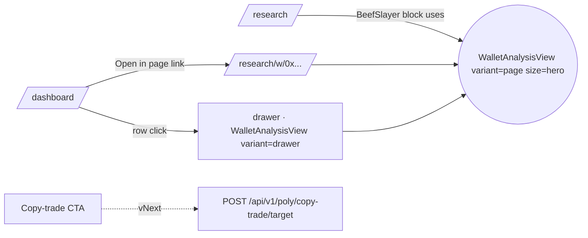

# Wallet Analysis — Reusable Components + Live Data Plane

> Extract the BeefSlayer hero from `/research` + the Operator Wallet balance bar into a reusable `WalletAnalysisView` that any **roster wallet** can render, with live data where it matters and snapshot data where it doesn't. Then wire selection from `Monitored Wallets` → view.

## Problem

- `/research` renders **BeefSlayer** as a bespoke hero — hardcoded stats, hardcoded trades, no other wallet can render like this.
- `OperatorWalletCard` on `/dashboard` renders the **balance bar** (Available / Locked / Positions) only for the operator.
- `TopWalletsCard` ("Monitored Wallets") lists wallets but has no drill-in.

Goal: click any roster wallet → full analysis view, composed of pieces we've already drawn, with data loaded efficiently.

## Component decomposition

Three variants. Same molecules.

```
WalletAnalysisView(address, variant)
│
├─ WalletIdentityHeader   ─ name · wallet · Polymarket / Polygonscan · category chip
├─ StatGrid               ─ 1–6 metric tiles (WR · ROI · PnL · DD · hold · avg/day) [snapshot]
├─ BalanceBar             ─ Available · Locked · Positions stacked bar              [live · 15s]
├─ TradesPerDayChart      ─ last 14 d bars                                          [live · 30s] · lazy
├─ RecentTradesTable      ─ last N trades                                           [live · 30s] · lazy
├─ TopMarketsList         ─ top 4 derived from trades                               [derived]
├─ EdgeHypothesis         ─ analyst text from snapshot row (hypothesis_md column)
└─ CopyTradeCTA           ─ vNext · set-as-mirror-target button
```

| variant   | where                                                    | shows                                                 |
| --------- | -------------------------------------------------------- | ----------------------------------------------------- |
| `page`    | `/research/w/[addr]` AND hero on `/research` (size prop) | all molecules; `size="hero"` enlarges typography only |
| `drawer`  | dashboard slide-over                                     | identity + stats + balance + last 5 trades            |
| `compact` | row-inline (vNext)                                       | identity + WR + ROI + DD                              |

`compact` ships only when there's a caller for it. v1 ships `page` + `drawer`.

All molecules accept `{ data, isLoading }` and render their own skeleton. **No sub-component fetches on its own.**

> **2026-04-20 revision (pending Checkpoint B implementation).** The Postgres `poly_wallet_screen_snapshots` table described below is **superseded** by [task.0333](../../work/items/task.0333.wallet-analyst-agent-and-dolt-store.md):
>
> - **Numbers** (WR / ROI / DD / median hold / trades-per-day) are deterministic `f(trades × resolutions)` from public Polymarket Data-API + CLOB — compute-on-fetch with a module-scoped TTL cache, **no table, no migration, no seed script**.
> - **Qualitative analysis** (edge hypothesis, category specialty, risk flags, verdict) goes into a **Dolt** `poly_wallet_analyses` table written by a DAO-funded `poly-brain::wallet-analyst` graph run, triggered by an "Analyze" button on the wallet page. Dolt gives authorship, confidence scores, diffable refinements.
>
> Checkpoint B still describes the API route + hook + dynamic page shape; ignore every reference to the Postgres snapshot table and seed script.

## Data plane

Three slices, three independent fetches, one shared coalescing layer.

| Slice      | Source                                                                                                                | Availability                               | Freshness                                                                                |
| ---------- | --------------------------------------------------------------------------------------------------------------------- | ------------------------------------------ | ---------------------------------------------------------------------------------------- |
| `snapshot` | `poly_wallet_screen_snapshots` table (seeded from `docs/research/fixtures/poly-wallet-screen-v3-*.json`)              | any addr (returns null if unscreened)      | snapshot-versioned; UI shows `taken_at`; muted pill if >100 days old (1 quarter + grace) |
| `trades`   | existing `PolymarketDataApiClient` `/trades?user=`                                                                    | any addr                                   | 30 s                                                                                     |
| `balance`  | existing `PolymarketDataApiClient` `/positions?user=` (any addr) **plus** USDC available/locked via operator CLOB key | **operator addr only — omitted otherwise** | 30 s                                                                                     |

**Reuse mandate.** All Data-API calls go through the existing `PolymarketDataApiClient`. **Do not add a second Data-API client** in `nodes/poly/app/`. Adding one is a review-blocking violation.

**Coalescing.** Module-scoped `Map<string, { value, expiresAt }>` in the route handler — 30 s TTL keyed by `(slice, addr)`. Ten simultaneous requests for the same key resolve to one upstream call. Chosen over Next.js `unstable_cache` because: (a) the underlying API is experimental; (b) the cache is request-scoped in App Router; (c) a 30-line in-process map is testable and obvious. Single-replica deployment per the SINGLE_WRITER invariant — cache is effectively pod-global. Revisit (Redis / KV) if/when replicas > 1.

**Per-slice fetching.** `useWalletAnalysis(addr)` fans out to **three independent React Query calls**, one per slice (`["wallet", addr, "snapshot"]`, `…trades`, `…balance`). Each call hits the API route with `?include=<slice>` so each slice has its own coalesce key, its own loading state, and renders its own skeleton independently. The molecule sees the slice arrive when it arrives.

**Lazy code-split.** `TradesPerDayChart` + `RecentTradesTable` are `next/dynamic` imports — only pulled when `variant === "page"`.

**Prefetch.** `TopWalletsCard` row → `onPointerEnter`, `onFocus`, `onTouchStart` (debounced 50 ms) → `queryClient.prefetchQuery` for `snapshot` + `trades` (skip `balance` — operator-only). Drawer opens already-warmed on every input modality.

### Address policy — any 0x wallet

Any 0x address is accepted. Snapshot data is `null` for unscreened wallets; live `trades` + `balance` always populated (Data-API + RPC are public). Three guardrails replace the roster gate:

- **Auth.** Route requires an authenticated session.
- **Validation.** Zod regex `^0x[a-f0-9]{40}$` (lowercased) before any handler logic.
- **Coalescing.** Server-side `unstable_cache` per `(slice, addr)`, 30 s TTL → at most one upstream Data-API call per (slice, addr) per 30 s, regardless of concurrent users.

A future per-IP rate-limit middleware tightens this further if the surface gets abused.

### API surface (contract owns the shape)

One route, one slice per call:

```
GET /api/v1/poly/wallets/{addr}?include=snapshot
GET /api/v1/poly/wallets/{addr}?include=trades
GET /api/v1/poly/wallets/{addr}?include=balance
```

Request + response shapes are defined in **`nodes/poly/app/src/contracts/http/poly.wallet-analysis.v1.contract.ts`** (Zod), not here. Invariants the contract enforces:

- `addr` validated `^0x[a-f0-9]{40}$` then lowercased before any handler logic.
- `include` accepted as repeated query params (`?include=snapshot&include=trades`) parsed via Zod array; subset of `{snapshot, trades, balance}`; default = `snapshot`.
- Each slice is independently optional in the response. A `warnings: { slice, code, message }[]` field surfaces partial failures so the UI can render "trades unavailable, retrying" rather than silently empty.
- `balance` slice is omitted when `addr !== POLY_PROTO_WALLET_ADDRESS` (the operator). The contract response shape declares `balance` optional.
- `addr` always returns 200 with whatever slices are available. Snapshot is `null` for unscreened wallets; trades empty array for never-traded wallets.

**Auth.** Verified at the route handler with `await getServerSessionUser()` — explicit, not delegated to middleware. Acceptance test asserts `401` for an unauthenticated request to `/api/v1/poly/wallets/0x…`.

### Snapshot table — DDL only in migration; data via seed script

- Drizzle schema in `nodes/poly/packages/db-schema/src/wallet-screen-snapshots.ts`; migration generated by `drizzle-kit generate` and committed under `nodes/poly/packages/db-schema/migrations/`.
- Columns: `wallet text`, `screen_version text`, `taken_at timestamptz`, `category text`, `n integer`, `wr_pct numeric(5,2)`, `roi_pct numeric(7,2)`, `pnl_usd numeric(14,2)`, `dd_pct numeric(5,2)`, `median_dur_min numeric(8,2)`. Primary key `(wallet, screen_version)`. **No hypothesis column.**
- **Edge hypothesis lives as markdown files**, not a DB column. Path: `docs/research/wallet-hypotheses/<address>.md`. Read at request time by the route handler (cached in same TTL map as the live slices) and merged into the `snapshot` slice. Rationale: analyst prose wants git diffs, authorship, PR review — none of which a nullable text column gives you. Files key on lowercased address. Missing file → no hypothesis rendered.
- Seeding via `pnpm --filter @cogni/poly-app run seed:wallet-screen` — script that reads `docs/research/fixtures/poly-wallet-screen-v3-*.json`, parses messy money strings (`"+$2,137k"` → `2137000.00`; `"$5k"` → `5000.00`; supports `+`, `$`, `,`, `k`, `M`; raises on unknown shapes), and inserts via `INSERT … ON CONFLICT (wallet, screen_version) DO NOTHING` (immutable snapshot rows). Re-runs are no-ops.
- Migration rollbacks do not touch data. Seed re-runs are no-ops. **Verify before adding the migration:** the existing per-node migrator image picks up new SQL files automatically (per `database-expert`); confirm via the `pnpm db:migrate:poly` invocation path before opening the PR.
- UI surfaces `taken_at`; rows older than **100 days** render with a muted "stale snapshot" pill (1 quarter + grace, matches the research doc's quarterly cadence).

## Routes & UX flow



- `/research` keeps its dossier shape (intro · categories · no-fly zone) but its BeefSlayer block becomes `<WalletAnalysisView address=BEEF variant="page" size="hero" />`.
- `/research/w/[addr]` — dynamic Next.js route, auth-gated server shell, client `WalletAnalysisView`.
- Dashboard drawer — `Sheet` from `nodes/poly/app/src/components/vendor/shadcn/sheet.tsx` (already vendored). Deep-link via `?w=0x…`. Esc / click-out closes.

## Rollout — one PR with checkpoints

Single work item, single PR, three commits ([task.0329](../../work/items/task.0329.wallet-analysis-component-extraction.md)):

- **A · Extract** — molecules + `WalletAnalysisView` (page variant); `/research` re-renders BeefSlayer through it with hardcoded props. Gate: Playwright visual diff vs main ≤ 0.5 %.
- **B · Data plane** — snapshot DDL + seed script + Zod contract + `GET /api/v1/poly/wallets/[addr]` (any 0x wallet, one slice per call) routed through `PolymarketDataApiClient` with module-scoped TTL coalesce + three-key `useWalletAnalysis` hook + `/research/w/[addr]` page. Gate: BeefSlayer numbers via API match Checkpoint-A baseline; cache-stampede test passes; 401 when unauthenticated; non-operator addr response omits `balance`.
- **C · Drawer** — `Sheet` from Monitored Wallets row + pointer/focus/touch prefetch + `?w=…` deep-link. Gate: drawer interactive ≤ 200 ms on prefetched row.

### vNext — Copy-trade CTA (parked, not designed)

Two unresolved questions block design:

1. **Where does the Harvard-flagged dataset live?** 210k (wallet, market) pairs — inline JSON bloats the bundle, DB table needs an importer, external service needs an SLA. **Decision required before any vNext design.**
2. **What is "admin"?** Today every authed poly user is operator-aligned. Multi-tenant (task.0318 RLS) makes this a per-tenant operator-role check. vNext design depends on RLS landing.

When both are resolved, file `task.NNNN.wallet-copy-trade-cta.md` and run `/design`.

## Invariants

- One `useWalletAnalysis(addr)` hook fans out to three React Query calls (one per slice). Each slice exposes `{ data, isLoading, error }` (not just data + isLoading) so molecules can render "trades unavailable, retrying" instead of silently empty.
- Molecules consume props; molecules never fetch.
- Address validation lives in the **contract** (Zod regex), not in the handler.
- Any 0x address is accepted (200 OK with whatever slices apply); auth is enforced explicitly at the route via `getServerSessionUser()`.
- Module-scoped TTL map enforces ≤ 1 upstream Data-API call per (slice, addr) per 30 s, regardless of concurrent requesters.
- **Concurrency cap.** A `p-limit(4)` shared across all `PolymarketDataApiClient` calls inside the route handler caps in-flight upstream requests independent of the per-(slice,addr) coalesce. Coalesce dedups same key; `p-limit` caps fan-out across different keys (3 slices × N wallets visible in a Monitored-Wallets prefetch).
- **Single-replica assert at boot.** `instrumentation.ts` checks a `POLY_REPLICA_INDEX=0` env or pod-name suffix; throws on startup if a second replica boots. The module-Map cache silently corrupts under replica >1, so this is a hard fail not a comment.
- `balance` slice is operator-only and omitted from non-operator responses.
- Snapshot rows are immutable per `(wallet, screen_version)`; freshness is a UI affordance via `taken_at`, never a TTL.
- Edge hypothesis lives in `docs/research/wallet-hypotheses/<address>.md`, not the DB. Git owns authorship + diffs.
- All Polymarket Data-API calls go through `packages/market-provider`. Adding a second client in the app layer is a review-blocking violation.

## Open questions (logged, not blocking)

1. **Snapshot rescreen automation.** Quarterly fixture re-seed in v1; nightly job graduates after the v3 rate-limit story (research doc §D.5) is resolved.
2. **What does "off-roster" lookup look like for ops?** A read-only ad-hoc CLI script using the same `PolymarketDataApiClient` covers ops needs without exposing it to the web.
3. **Drawer variant on mobile narrow viewports.** Sheet vs full-screen modal? Decide in Part-3 implementation; not a design concern.

## Pointers

- Extract source: [`/research/view.tsx`](<../../nodes/poly/app/src/app/(app)/research/view.tsx>)
- Balance bar to generalize: [`OperatorWalletCard.tsx`](<../../nodes/poly/app/src/app/(app)/dashboard/_components/OperatorWalletCard.tsx>)
- Selection source: [`TopWalletsCard.tsx`](<../../nodes/poly/app/src/app/(app)/dashboard/_components/TopWalletsCard.tsx>)
- Data adapter (mandatory): [`polymarket.data-api.client.ts`](../../packages/market-provider/src/adapters/polymarket/polymarket.data-api.client.ts)
- Drawer primitive: [`vendor/shadcn/sheet.tsx`](../../nodes/poly/app/src/components/vendor/shadcn/sheet.tsx)
- Snapshot input: [`poly-wallet-screen-v3-ranking.md`](../research/fixtures/poly-wallet-screen-v3-ranking.md)
- Research source-of-truth: [`polymarket-copy-trade-candidates.md`](../research/polymarket-copy-trade-candidates.md)
- Project: [`proj.poly-prediction-bot.md`](../../work/projects/proj.poly-prediction-bot.md)
