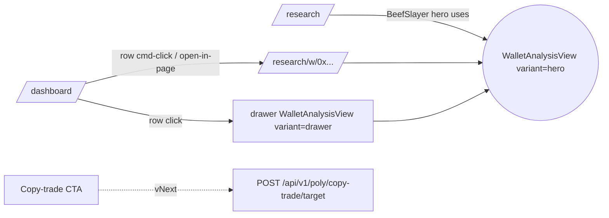

# Wallet Analysis — Reusable Components + Live Data Plane

> Extract the BeefSlayer hero from `/research` + the Operator Wallet balance bar into a reusable `WalletAnalysisView` that any wallet address can render, with live data where it matters and static research data where it doesn't. Then wire selection from `Monitored Wallets` → view.

## Problem

Today:

- `/research` renders **BeefSlayer** as a bespoke hero — hardcoded stats, hardcoded trades, no other wallet can render like this.
- `OperatorWalletCard` on `/dashboard` renders the **balance bar** (Available / Locked / Positions) only for the operator.
- `TopWalletsCard` ("Monitored Wallets") lists wallets but has no drill-in — clicking a row does nothing analytic.

We want: click any wallet → full analysis view, composed of pieces we've already drawn, with data loaded efficiently.

## Component decomposition

Pull `/research/view.tsx` apart into pieces. Same pieces render on the dossier page, the dashboard drawer, and the per-wallet page.

```
WalletAnalysisView(address, variant)
│
├─ WalletIdentityHeader   ─ name · wallet · Polymarket/Polygonscan · category chip
├─ StatGrid               ─ 1–6 metric tiles (WR / ROI / PnL / DD / hold / avg/day)
├─ BalanceBar             ─ Available · Locked · Positions stacked bar   [live]
├─ TradesPerDayChart      ─ last 14 d bars                                [live]
├─ RecentTradesTable      ─ last N trades                                 [live]
├─ TopMarketsList         ─ top 4 derived from trades                     [live]
├─ EdgeHypothesis         ─ analyst text (only for screened wallets)
└─ CopyTradeCTA           ─ vNext · set-as-mirror-target button
```

`variant`:

| variant   | where                           | shows                                                 |
| --------- | ------------------------------- | ----------------------------------------------------- |
| `full`    | `/research/w/[addr]`            | all molecules                                         |
| `hero`    | `/research` (BeefSlayer)        | all molecules, oversized typography, decorative index |
| `drawer`  | dashboard slide-over            | identity + stats + balance + last trades              |
| `compact` | row-inline on `TopWalletsCard`  | identity + 3 stats                                    |

All molecules accept `{ data, isLoading }` and render their own skeleton. No sub-component fetches on its own.

## Data plane

Three sources, three freshness classes.

| Slice                    | Source                                                          | Freshness     | Cache key                  | TTL  |
| ------------------------ | --------------------------------------------------------------- | ------------- | -------------------------- | ---- |
| Screen metrics           | `docs/research/fixtures/poly-wallet-screen-v3-*.json` → DB seed | static        | `wallet:screen:{addr}`     | ∞    |
| Edge hypothesis + avoid  | hand-authored research doc                                      | static        | bundled JSON               | ∞    |
| Balance + positions      | Alchemy RPC + Data-API `/positions?user={addr}`                 | 15 s          | `wallet:balance:{addr}`    | 15 s |
| Trades + trades/day chart| Data-API `/trades?user={addr}&limit=500`                        | 30 s          | `wallet:trades:{addr}`     | 30 s |
| Top markets              | derived from trades (no fetch)                                  | —             | —                          | —    |

**Loading strategy:** one React Query hook `useWalletAnalysis(addr)` fans out to three concurrent queries (screen / balance / trades) and exposes three independent `isLoading`s. Molecules render the moment their slice arrives — no global Suspense boundary.

**Lazy code-split:** `TradesPerDayChart` + `RecentTradesTable` are `next/dynamic` imports — only pulled when `variant !== "compact"`.

**Prefetch:** `TopWalletsCard` row hover → `queryClient.prefetchQuery` for screen + trades. Drawer opens already-warmed.

### API shape

One route; clients ask for what they want via `?include=`:

```
GET /api/v1/poly/wallets/{addr}?include=screen,trades,balance,positions

200 {
  address: "0x...",
  screen:    { n, wr, roi, pnl, dd, medianDur, category, source: "v3-2026-04-18" } | null,
  trades:    { last: Trade[50], dailyCounts: DailyCount[14], topMarkets: string[4] },
  balance:   { available, locked, positionsValue, total },   // operator-or-tracked only
  positions: { count, totalValue, byMarket: [...] },
  freshness: { screen: iso, live: iso }
}
```

- `screen` is `null` for unscreened addresses — UI shows "unscreened wallet" banner and hides the screen tiles.
- `balance` is populated only if `addr ∈ {operator_wallet, currently_tracked_wallet}` — we don't turn the node into a free RPC/Data-API proxy for arbitrary addresses.
- `trades` is always populated (Data-API is public) but rate-limited per-user-session.

### Screen snapshot storage

Part 2 ships a `poly_wallet_screen_snapshots` table keyed by (wallet, screen_version). Seed-import from `poly-wallet-screen-v3-*.json` on migration run; re-seed via a manual script until a rescreen job lands. Quarterly cadence per research doc's freshness note.

## Routes & UX flow



- Current `/research` stays as the curated dossier (intro + categories + no-fly zone) but its BeefSlayer block becomes `<WalletAnalysisView address={BEEF} variant="hero" />`.
- New `/research/w/[addr]` — dynamic server shell, auth-gated, client `WalletAnalysisView` in `full` variant.
- New drawer from `TopWalletsCard` — row click opens a `Sheet` with `variant="drawer"`, shareable via `?w=0x…` query param. Esc or click-out closes.

## Rollout — 3 parts + vNext

### Part 1 · Static extraction (no backend, ships in days)

- Extract 7 molecules from `/research/view.tsx` into `src/features/wallet-analysis/`.
- `WalletAnalysisView` accepts `{ address, data, variant }` — pure props.
- `/research` page feeds it the hardcoded BeefSlayer object. Visual parity with today's page.
- Adds `src/features/wallet-analysis/AGENTS.md` + unit tests.

Gate to merge: byte-level screenshot match on `/research`.

### Part 2 · Data plane + dynamic page (1–2 PRs)

- `GET /api/v1/poly/wallets/[addr]` route + contract.
- `poly_wallet_screen_snapshots` table + seed script from fixture.
- `useWalletAnalysis` React Query hook with the three-slice fan-out.
- `/research/w/[addr]` dynamic page — the first route that loads any address.
- Mark BeefSlayer on `/research` as "live-data-backed" via the same hook.

Gate to merge: BeefSlayer on `/research` renders identical numbers served from API; unknown address loads `trades` only and shows "unscreened" banner.

### Part 3 · Selection flow from Monitored Wallets

- `TopWalletsCard` row onClick opens `<Sheet>` with drawer variant.
- Row hover → prefetch screen + trades.
- `?w=0x…` query param opens the drawer on mount; closing clears it. Deep-link friendly.
- Optional "Open in page →" link in drawer header.

Gate to merge: drawer opens <200 ms on a prefetched row; no layout shift.

### vNext · Copy-trade CTA (separate PR)

- `CopyTradeCTA` in `full` + `drawer` variants, admin-gated.
- Modal shows: current target (`poly_copy_trade_config.target_wallet`), proposed target, caps ($1/trade · $10/day · 5 fills/hr), Harvard-flagged-dataset check result.
- `POST /api/v1/poly/copy-trade/target` → updates config row + redeploys env via existing scaffolding path (task.0318-aware).
- Does **not** auto-enable the kill switch; surfaces a second toggle for that.

## Invariants

- **One hook, one cache per address.** No molecule fetches on its own.
- **Slices render independently.** Each molecule has a skeleton; the page never blocks on the slowest slice.
- **Balance endpoint is allowlisted.** Only operator + currently-tracked wallets; prevents the node becoming a free balance-lookup API.
- **Screen data is a snapshot, not a ledger.** Every tile shows the snapshot date; stale snapshots render with a muted freshness pill.
- **Copy-trade target flip is two-click minimum.** One for the modal, one for the confirm — and the confirm is disabled until the Harvard-flagged check has returned.

## Open questions

1. **Drawer vs page for v1 selection flow?** Recommend drawer first — lower friction, deep-linkable via `?w=…`. Full page ships in Part 2 regardless; it's what `/research/w/[addr]` is.
2. **Screen snapshot automation?** Ship Part 2 with a manual seed script + quarterly cadence (matches doc); graduate to a nightly job only when the v3 rate-limit story is resolved.
3. **Arbitrary-address lookup?** Yes — unscreened wallets get the trades slice only. No screen tiles, no balance, no CTA. Keeps the surface useful for ad-hoc forensics.
4. **Admin gate for Copy-trade CTA?** Currently every authed user of the poly node is effectively operator-aligned. In multi-tenant (task.0318 RLS) this becomes a per-tenant operator-role check.

## Pointers

- Extract source: [`/research/view.tsx`](../../nodes/poly/app/src/app/(app)/research/view.tsx)
- Balance bar to generalize: [`OperatorWalletCard.tsx`](../../nodes/poly/app/src/app/(app)/dashboard/_components/OperatorWalletCard.tsx)
- Selection source: [`TopWalletsCard.tsx`](../../nodes/poly/app/src/app/(app)/dashboard/_components/TopWalletsCard.tsx)
- Data inputs frozen: [`poly-wallet-screen-v3-ranking.md`](../research/fixtures/poly-wallet-screen-v3-ranking.md)
- Research source-of-truth: [`polymarket-copy-trade-candidates.md`](../research/polymarket-copy-trade-candidates.md)
