# Authentication

## Context

The platform supports multiple authentication methods: SIWE wallet login (via RainbowKit) and OAuth providers (GitHub, Discord, Google). All providers resolve to a canonical `user_id` (UUID) via the `user_bindings` table. Wallet-session coherence is enforced for SIWE users. OAuth-only users have `walletAddress: null` and cannot access wallet-gated operations (payments, ledger approval).

## Goal

Provide multi-provider authentication on NextAuth v4 with JWT strategy. SIWE wallet users retain strict disconnect-on-switch behavior. OAuth users get clean onboarding. Account linking allows authenticated users to bind additional providers to their existing identity.

## Non-Goals

- Email/password authentication
- Apple OAuth (P2 — requires team ID, key ID, private key file)
- Custom SIWE message creation (uses RainbowKit SIWE adapter)
- Auth.js v5 migration (RainbowKit SIWE incompatible — defer until supported)
- DrizzleAdapter (JWT strategy + user_bindings is sufficient)
- Merge/conflict resolution for duplicate identities (P1)

## Core Invariants

1. **WALLET_SESSION_COHERENCE**: Disconnecting or switching the wallet invalidates the SIWE session. If the wallet disconnects, the session is signed out. If the wallet switches to a different address, the session is signed out. (SIWE users only.)

2. **CANONICAL_IS_USER_ID**: `user_id` (UUID) is the canonical identity for all attribution, billing, and session operations. `walletAddress` is an optional attribute (`string | null`), not the identity.

3. **RAINBOWKIT_ADAPTER_ONLY**: SIWE authentication uses the stock RainbowKit SIWE adapter. No bespoke SIWE message creation or custom signature flows.

4. **IDENTITIES_ARE_BINDINGS**: Every login method resolves via `user_bindings(provider, external_id)`. SIWE = `provider="wallet"`, GitHub = `provider="github"`, Discord = `provider="discord"`, Google = `provider="google"`.

5. **LINKING_IS_EXPLICIT**: Account linking requires an active session. New OAuth login with unknown `external_id` creates a new user. `UNIQUE(provider, external_id)` prevents same account bound to two users (NO_AUTO_MERGE).

6. **WALLET_GATED_OPS**: Payment creation and ledger approval require `walletAddress`. OAuth-only users (`walletAddress: null`) receive clean 403 responses.

## Design

### Auth Flows

```mermaid
graph TD
    subgraph "SIWE Wallet Login (unchanged)"
        W1[RainbowKit Connect] --> W2[SIWE Verify]
        W2 --> W3[users lookup by wallet_address]
        W3 --> W4[createBinding 'wallet', address]
        W4 --> W5["JWT { id, walletAddress }"]
    end

    subgraph "OAuth Login (GitHub/Discord/Google)"
        O1[NextAuth OAuth redirect] --> O2[signIn callback]
        O2 --> O3{user_bindings lookup}
        O3 -->|binding exists| O4[Return existing user.id]
        O3 -->|no binding| O5[Atomic tx: user + binding + event]
        O4 --> O6["JWT { id, walletAddress: null }"]
        O5 --> O6
    end

    subgraph "Account Linking"
        L1[Authenticated user] --> L2["GET /api/auth/link/{provider}"]
        L2 --> L3[Set signed link_intent cookie]
        L3 --> L4[Redirect to OAuth flow]
        L4 --> L5[signIn reads linkIntentStore]
        L5 --> L6["createBinding(provider, externalId) for existing user"]
    end
```



**SIWE login** uses the stock RainbowKit SIWE adapter with 2-step UX (wallet connect + SIWE signature). Unchanged from pre-OAuth.

**OAuth login** resolves users via `user_bindings(provider, external_id)`. Returning users get their existing `user_id`. New users get an atomic transaction creating `users` + `user_bindings` + `identity_events` rows. Race-safe: concurrent first-logins for the same external_id roll back the losing transaction and re-fetch the winner.

**Account linking** uses `AsyncLocalStorage` to propagate a signed `link_intent` cookie from the route handler to the `signIn` callback (NextAuth v4 callbacks have no access to `req`/cookies). The cookie is a JWT containing `{ userId, sessionTokenHash, purpose: "link_intent" }` with 5-minute TTL. Session binding prevents replay by different sessions.

### SessionUser Type

```typescript
interface SessionUser {
  id: string; // users.id (UUID) — canonical identity
  walletAddress: string | null; // null for OAuth-only users
  displayName: string | null; // from user_profiles (loaded into JWT on sign-in)
  avatarColor: string | null; // from user_profiles (loaded into JWT on sign-in)
}
```

`displayName` and `avatarColor` are loaded from `user_profiles` into the JWT on initial sign-in and on explicit `session.update()` calls. They are not re-fetched on every request.

### Post-Auth Redirect

The `redirect` callback in `src/auth.ts` routes authenticated users:

- Default post-sign-in (`/`) → `/chat`
- Relative URLs → allowed (prefixed with `baseUrl`)
- Same-origin URLs → allowed
- Cross-origin URLs → blocked (returns `baseUrl`)

For SIWE, RainbowKit uses `signIn("credentials", { redirect: false })`, so this callback does not fire. SIWE post-auth redirect is handled client-side (see task.0112).

### Sign-In Routing

NextAuth `pages.signIn` points to `/sign-in` (custom page). Unauthenticated users are redirected to `/sign-in` via Next.js middleware. Authenticated users are redirected off `/sign-in` to `/chat`.

### OAuth Provider Registration

Providers register conditionally — only when both `CLIENT_ID` and `CLIENT_SECRET` env vars are non-empty. Missing credentials = provider not shown on sign-in page.

### Known UX Limitations (MVP-Tolerated)

**SIWE sign-in has two steps:** MetaMask "Connect this website" + RainbowKit "Verify your account" modal. Planned fix: Custom ConnectButton that auto-triggers SIWE after connection.

**No session-only sign-out:** "Disconnect" removes wallet permission entirely. Planned fix: Separate "Sign out" (clears NextAuth session) and "Disconnect wallet" actions.

### File Pointers

| File                                        | Purpose                                                        |
| ------------------------------------------- | -------------------------------------------------------------- |
| `src/auth.ts`                               | NextAuth config: providers, signIn/jwt/session callbacks       |
| `src/app/api/auth/[...nextauth]/route.ts`   | Route handler with AsyncLocalStorage wrapper for link_intent   |
| `src/app/api/auth/link/[provider]/route.ts` | Account linking initiation (signed cookie + redirect)          |
| `src/shared/auth/link-intent-store.ts`      | AsyncLocalStorage primitive for link_intent propagation        |
| `src/shared/auth/session.ts`                | SessionUser type (id, walletAddress, displayName, avatarColor) |
| `src/app/(auth)/sign-in/page.tsx`           | Custom sign-in page (WalletConnect + OAuth buttons)            |
| `src/middleware.ts`                         | Auth route guards (redirect unauthed → /sign-in)               |
| `src/lib/auth/server.ts`                    | `getServerSessionUser()` — requires only `id`                  |
| `src/app/providers/wallet.client.tsx`       | RainbowKit + SIWE provider wiring                              |
| `src/features/payments/errors.ts`           | `WalletRequiredError` for null-wallet payment guard            |

## Acceptance Checks

**Manual:**

1. SIWE wallet login → session has `id` + `walletAddress` (unchanged)
2. Switch wallet address → session invalidated (WALLET_SESSION_COHERENCE)
3. Disconnect wallet → session destroyed
4. GitHub/Discord/Google OAuth login → new user, session has `id`, `walletAddress` is null
5. Same OAuth login again → same user returned (idempotent via user_bindings)
6. Logged in with wallet → "Link GitHub" → OAuth → binding created for existing user
7. Attempt to link account already bound to different user → rejected (NO_AUTO_MERGE)
8. OAuth-only user hits payment endpoint → clean 403
9. `identity_events` has `bind` event for each provider link

## Open Questions

- [ ] When RBAC actor type migrates from `user:{walletAddress}` to `user:{userId}`, does it happen here or as an RBAC spec update?

## Related

- [Decentralized User Identity](./decentralized-user-identity.md) — user_bindings schema, binding invariants
- [Security Auth](./security-auth.md) — auth surface identity resolution
- [DAO Enforcement](./dao-enforcement.md)
