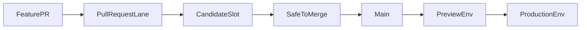

# CI/CD Pipeline Flow

## Overview

This spec defines the target CI/CD model for the repo:

- `main` is the only long-lived code branch
- pull requests prove safety before merge in fixed `candidate-*` slots
- accepted code promotes forward from `main` without rebuilds
- deploy branches hold environment state only and are reconciled by Argo CD

This document supersedes the old canary-first branch model. Existing workflows may still reflect legacy behavior during migration, but new design work should follow this spec rather than the older branch semantics.

## Core Axioms

1. **`main` is code truth**. It holds safe, accepted code.
2. **Code merges when safe, not merely when ready**. Incomplete work should be hidden behind flags or stay in PRs.
3. **Pre-merge safety happens in candidate or flight slots**. Do not call those lanes `canary`.
4. **Build once, promote by digest**. Downstream environments never rebuild artifacts.
5. **Deploy branches are environment state only**. `deploy/*` branches contain rendered deployment state, not product code.
6. **Argo owns reconciliation**. CI writes desired state to git; Argo syncs from git.
7. **Affected-only CI is the default**. Required checks should scope to the changed surface where practical.
8. **Release branches are exceptional only**. They are not the default path for accepted code.
9. **Direct edits to `deploy/*` are incident-only**. Repair the live environment first when necessary, then mirror the fix back into the normal source-of-truth path.
10. **Agent guidance is part of the control plane**. Prompts, skills, AGENTS files, and workflow docs must not tell agents to PR into or diff against legacy branches.

## Branch And Deploy-State Model

```text
feature/* → PR → main                               (app code)
deploy/candidate-a, deploy/candidate-b, ...        (pre-merge env state)
deploy/preview, deploy/production                  (post-merge env state)
```

- **Feature branches** are short-lived and PR into `main`.
- **`main`** is the only long-lived shared code branch.
- **`deploy/candidate-*`** branches hold desired state for pre-merge safety lanes.
- **`deploy/preview`** and **`deploy/production`** hold desired state for post-merge promotion lanes.
- CI writes deployment state directly to deploy branches; Argo watches those branches and syncs the cluster.

**Key invariant**: CI never pushes application code to protected app branches.

**Key invariant**: Promotion means changing desired state in a deploy branch, not rebuilding an image.

## Delivery Lanes



### PR Lane

The PR lane is authoritative for merge safety in v0.

1. `pull_request` runs affected-only CI where available.
2. CI builds an immutable image for the exact PR head SHA.
3. The PR-head artifact is the authoritative v0 artifact.
4. Automation assigns a fixed candidate slot such as `candidate-a` or `candidate-b`.
5. CI commits the digest to the matching `deploy/candidate-*` branch.
6. Argo syncs the already-running candidate environment.
7. Required safety validation runs against that candidate slot.
8. The PR becomes mergeable only after the candidate lane is green.

### Main Lane

The main lane is authoritative for promotion, not for pre-merge acceptance.

1. Merge to `main` records the accepted PR SHA.
2. The same proven digest promotes forward without rebuild.
3. `preview` is the first required post-merge promotion lane in v0.
4. Production promotion happens from the same digest by policy.

If a post-merge soak lane is retained later, it must be modeled as an explicitly named environment with a distinct purpose. The term `canary` must not be reused for pre-merge acceptance.

Merge queue is deferred in v0. If the repo later adopts merge queue, the workflow graph must add `merge_group` support and revisit artifact authority explicitly instead of assuming the PR-head artifact still maps cleanly to the accepted merge candidate.

## Minimum Authoritative Validation For V0

Do not block the rewrite on perfect black-box E2E maturity. The v0 required pre-merge gate is:

- affected-only static checks plus unit tests
- successful image build for the exact PR SHA
- candidate deployment reaches healthy pods
- a thin smoke pack passes:
  - auth or session sanity
  - health and readiness
  - one chat or completion path
  - one scheduler or worker sanity path
  - one or two node-critical APIs
- any human or AI validation needed to call the change safe

Optional but non-authoritative in v0:

- richer black-box E2E suites
- AI probe jobs against the changed surface
- broader post-merge soak analysis

## Environment Model

### Candidate Environments

Candidate environments are fixed, pre-running slots reused across PRs. They exist to validate unknown code before merge without creating a new VM per PR.

| Environment | Deploy Branch        | Purpose               |
| ----------- | -------------------- | --------------------- |
| candidate-a | `deploy/candidate-a` | pre-merge safety slot |
| candidate-b | `deploy/candidate-b` | pre-merge safety slot |

### Promotion Environments

Promotion environments run accepted code only.

| Environment | Deploy Branch       | Purpose               |
| ----------- | ------------------- | --------------------- |
| preview     | `deploy/preview`    | post-merge validation |
| production  | `deploy/production` | production            |

This spec does not require a `canary` environment. If one is retained during migration, it must be described explicitly as a post-merge soak lane and not as a branch or as a pre-merge safety lane.

## Workflow Design Targets

When implementation begins, workflow changes should follow these rules:

1. **Two lanes only**. One PR safety lane and one main promotion lane.
2. **No branch-name inference for environment routing**. Environment selection must be explicit input, artifact metadata, or deployment-state driven.
3. **No default `release/* -> main` conveyor**. If production still needs explicit approval, make it an environment or promotion control rather than a separate accepted-code branch.
4. **No duplicate orchestration**. E2E, promote, and deploy ownership should be clear rather than split across overlapping workflow graphs.
5. **No legacy branch guidance in prompts or docs**. Agents should not be told to diff against or PR into `staging` or a long-lived `canary` branch.

## Deploy Branch Rules

- Deploy branches are long-lived, machine-written environment-state refs.
- They may contain image digests, overlay patches, and other deployment facts such as environment endpoints.
- They are never merged back into app branches.
- PRs are not required for routine automated deploy-state updates; git history is the audit trail.
- Push access on `deploy/*` should be restricted to the CI app or bot, with incident-only human bypass if needed.
- Rollback is by reverting deployment-state commits.

## Known Unknowns

Track these explicitly during the spec rewrite, following the CI/CD scorecard style of keeping unresolved questions visible:

- [ ] **Candidate selection and slot control**
      Define how candidate slots are assigned, reused, preempted, or serialized, and who owns lease, timeout, cleanup, and status reporting.
- [ ] **E2E validation workflows**
      Decide what stays in the authoritative v0 gate versus what remains advisory, and define how smoke tests, richer black-box E2E, and post-merge validation divide across the PR lane and main lane.
- [ ] **Git-manager agent as a first-class control-plane actor**
      Define whether a git-manager style agent owns PR build tracking, candidate slot coordination, deploy-branch promotion, and status reporting, or whether those responsibilities stay in plain workflows with agent assistance around them.
- [ ] **OpenFeature flags**
      Decide how feature flags reduce PR scope, shrink risky surface area, and let code merge when safe without requiring every incomplete capability to be fully user-exposed.
- [ ] **Merge queue integration later**
      If concurrency pressure eventually justifies merge queue, add `merge_group` workflows and revisit authoritative artifact selection at that time rather than mixing both models in v0.

## Legacy Surfaces To Retire

The following patterns are now legacy and should be removed during implementation:

- long-lived `staging` or `canary` code-branch semantics
- branch-based environment inference in workflow logic
- prompts, skills, AGENTS files, or workflow docs that steer agents toward `origin/staging` or PRs into non-`main` branches
- release branch enforcement as the normal path for accepted code
- namespace, overlay, or deploy-state naming that still encodes `staging` for the preview lane

## Non-Goals For V0

This spec does not require:

- fully dynamic per-PR ephemeral environments
- perfect end-to-end coverage before adopting the model
- a production release branch for every accepted change
- a decision today on every future soak, canary, or experimentation lane

## Related Documentation

- [CD Pipeline E2E](cd-pipeline-e2e.md) — trunk-alignment guide mapping legacy multi-node GitOps design to the target workflow and code-task changes
- [CD Pipeline E2E Legacy Canary](cd-pipeline-e2e-legacy-canary.md) — historical canary/staging-era multi-node GitOps detail retained for reference during migration
- [Node CI/CD Contract](node-ci-cd-contract.md) — CI/CD sovereignty invariants, file ownership
- [Application Architecture](architecture.md) — Hexagonal design and code organization
- [Deployment Architecture](../runbooks/DEPLOYMENT_ARCHITECTURE.md) — Infrastructure details
- [CI/CD Conflict Recovery](../runbooks/CICD_CONFLICT_RECOVERY.md) — historical release conflict recovery guidance
