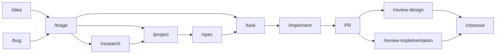

# Development Lifecycle

> Work enters the system as ideas or bugs. It flows through triage, planning, execution, review, and closeout via `/commands` that enforce content boundaries.

### Key References

|             |                                                                                           |                              |
| ----------- | ----------------------------------------------------------------------------------------- | ---------------------------- |
| **Spec**    | [Docs + Work System](./docs-work-system.md)                                               | Type taxonomy and ownership  |
| **Project** | [proj.docs-system-infrastructure](../../work/projects/proj.docs-system-infrastructure.md) | Tooling roadmap (CI, MkDocs) |
| **Guide**   | [Work Management Guide](../../work/README.md)                                             | Front door to `/work`        |

## Design

### Workflow



### Commands

| Command                  | Creates/Updates                               | Purpose                                                       |
| ------------------------ | --------------------------------------------- | ------------------------------------------------------------- |
| `/idea`                  | `story.*` item (+ `spike.*` if unclear)       | Entry point: new feature concept                              |
| `/research`              | `docs/research/*.md` + proposed layout        | Execute a spike: research + plausible project/spec/task plan  |
| `/bug`                   | `bug.*` item                                  | Entry point: something is broken                              |
| `/triage`                | updates item                                  | Route to project or leave standalone                          |
| `/project`               | `proj.*` project                              | Plan roadmap with Crawl/Walk/Run phases                       |
| `/spec`                  | spec in `docs/spec/`                          | Write or update technical contract                            |
| `/task`                  | `task.*` item                                 | Decompose into PR-sized work                                  |
| `/implement`             | code changes                                  | Execute a task/bug: clean code, checkpointed, spec-aligned    |
| `/review-design`         | —                                             | Critical design review against architecture and principles    |
| `/review-implementation` | —                                             | Critical code review against style, specs, and best practices |
| `/closeout`              | updates item, spec, headers, AGENTS.md, index | Pre-PR finish pass: scan diff, update all docs, close item    |

### Spec State Lifecycle

| State        | Meaning                          | Required                                              |
| ------------ | -------------------------------- | ----------------------------------------------------- |
| `draft`      | Exploratory. May not match code. | Invariants can be incomplete. Open Questions allowed. |
| `proposed`   | Stable enough to review against. | Invariants enumerated. Acceptance checks defined.     |
| `active`     | Matches code. Enforced.          | Open Questions empty. `verified:` current.            |
| `deprecated` | No longer authoritative.         | Points to replacement spec.                           |

### Workflows

**Bug (simple fix):**

```
/bug → /triage (attach proj.* or none) → /task → PR → /closeout
```

**New idea, new project:**

```
/idea → /triage → new proj.* → /project → /spec (draft) → /task(s) → PR(s) → /review-design → /review-implementation → /closeout
```

**Idea slots into existing project:**

```
/idea → /triage → attach proj.* → /task → PR → /closeout
        └─ if contract change: /spec (draft) before /task
```

**Research spike (unknown design space):**

```
/idea (creates story.* + spike.*) → /triage → /research spike.XXXX → docs/research/<topic>.md + proposed layout → /project → /spec → /task(s) → PR(s) → /closeout
```

### When to Create What

| Situation                           | Flow                                                                          |
| ----------------------------------- | ----------------------------------------------------------------------------- |
| Small fix, no behavior change       | `/bug` → `/task` → PR → `/closeout`                                           |
| Single PR, clear scope              | `/idea` → `/triage` → `/task` → PR → `/closeout`                              |
| Multi-PR effort                     | `/idea` → `/triage` → `/project` → `/spec` → `/task`(s) → PR(s) → `/closeout` |
| Unknown design space, need research | `/idea` → `/triage` → `/research` → `/project` → `/spec` → `/task`(s)         |
| Architecture decision               | ADR in `docs/decisions/adr/`                                                  |

### PR Body Format

```markdown
## References

Work: task.0042
Spec: docs/spec/feature.md#invariants (or Spec-Impact: none)
```

- Missing `Work:` → merge blocked
- Missing `Spec:` → warning (blocked if behavior/security/interface change)

## Goal

Enumerate the command-driven workflows, their sequencing, and the gates that enforce quality.

## Non-Goals

- Type taxonomy (see [docs-work-system](./docs-work-system.md))
- Project management methodology
- CI implementation details

## Invariants

| Rule                 | Constraint                                                                                                                 |
| -------------------- | -------------------------------------------------------------------------------------------------------------------------- |
| PR_LINKS_ITEM        | Every code PR references exactly one primary work item (`task.*` or `bug.*`) and at least one spec, or `Spec-Impact: none` |
| TRIAGE_OWNS_ROUTING  | Only `/triage` sets or changes the `project:` linkage on an idea or bug                                                    |
| SPEC_NO_EXEC_PLAN    | Specs never contain roadmap, phases, tasks, owners, or timelines. At any `spec_state`                                      |
| SPEC_STATE_LIFECYCLE | `draft` → `proposed` → `active` → `deprecated`. No skipping                                                                |
| ACTIVE_MEANS_CLEAN   | `spec_state: active` requires Open Questions empty and `verified:` current                                                 |
| PROJECTS_BEFORE_CODE | Projects may exist before any code. Specs are created or updated when code lands                                           |
| REVIEW_BEFORE_MERGE  | Design and implementation reviews use `/review-design` and `/review-implementation` before `/closeout`                     |

### File Pointers

| File                                        | Purpose                                     |
| ------------------------------------------- | ------------------------------------------- |
| `.claude/commands/idea.md`                  | `/idea` command definition                  |
| `.claude/commands/research.md`              | `/research` command definition              |
| `.claude/commands/bug.md`                   | `/bug` command definition                   |
| `.claude/commands/triage.md`                | `/triage` command definition                |
| `.claude/commands/project.md`               | `/project` command definition               |
| `.claude/commands/spec.md`                  | `/spec` command definition                  |
| `.claude/commands/task.md`                  | `/task` command definition                  |
| `.claude/commands/implement.md`             | `/implement` command definition             |
| `.claude/commands/review-design.md`         | `/review-design` command definition         |
| `.claude/commands/review-implementation.md` | `/review-implementation` command definition |
| `.claude/commands/closeout.md`              | `/closeout` command definition              |
| `scripts/validate-docs-metadata.mjs`        | Frontmatter and heading validation          |

## Open Questions

- [ ] Should we lint specs for roadmap/phase language?
- [ ] CI enforcement of PR body format (Work: / Spec: lines)

## Related

- [Docs + Work System](./docs-work-system.md) — type taxonomy and ownership
- [Work Management Guide](../../work/README.md)
