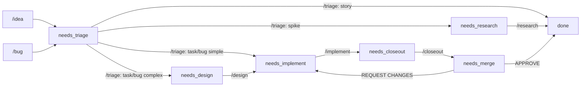

# Development Lifecycle

> Every work item status maps to exactly one `/command`. Automation picks the next item, dispatches the matching command, and commits the result. No ambiguity, no status rot.

### Key References

|             |                                                                                           |                              |
| ----------- | ----------------------------------------------------------------------------------------- | ---------------------------- |
| **Spec**    | [Docs + Work System](./docs-work-system.md)                                               | Type taxonomy and ownership  |
| **Project** | [proj.docs-system-infrastructure](../../work/projects/proj.docs-system-infrastructure.md) | Tooling roadmap (CI, MkDocs) |
| **Guide**   | [Work Management Guide](../../work/README.md)                                             | Front door to `/work`        |

## Design

### Status Enum

9 values. Every `needs_*` status has exactly one command that resolves it.

#### Command-driven (automation dispatches these)

| Status            | Command                  | What happens                                                        |
| ----------------- | ------------------------ | ------------------------------------------------------------------- |
| `needs_triage`    | `/triage`                | Routes item; stories → `done`; tasks/bugs → next status             |
| `needs_research`  | `/research`              | Executes spike; spike → `done`; creates follow-up items             |
| `needs_design`    | `/design`                | Writes/updates spec; task/bug → `needs_implement`                   |
| `needs_implement` | `/implement`             | Writes code on branch                                               |
| `needs_closeout`  | `/closeout`              | Docs/headers pass + creates PR                                      |
| `needs_merge`     | `/review-implementation` | Reviews PR; APPROVE → `done` or REQUEST CHANGES → `needs_implement` |

#### Terminal

| Status      | Meaning                                                          |
| ----------- | ---------------------------------------------------------------- |
| `done`      | PR merged. `deploy_verified` field tracks prod deploy separately |
| `blocked`   | Cannot proceed. `blocked_by:` field required                     |
| `cancelled` | Abandoned, won't do                                              |

### Workflow



### Transition Rules

```
/idea or /bug       → item created at needs_triage

/triage on story    → story: done (intake complete); may create task/bug items
/triage on bug      → needs_implement | needs_design | needs_research
/triage on task     → needs_implement | needs_design
/triage on spike    → needs_research

/research           → spike: done; creates follow-up task/bug/spike items as needed

/design on task/bug → same item: needs_implement (writes spec, may create additional tasks)
/design on story    → story: done (intake); creates task items at needs_implement

/implement          → needs_closeout
/closeout           → needs_merge (PR created, pr: field set)
/review-impl        → done (APPROVE) | needs_implement + revision++ (REQUEST CHANGES)
```

### Commands

| Command                  | Entry Status      | Exit Status                 | Creates/Updates                         | Purpose                                                    |
| ------------------------ | ----------------- | --------------------------- | --------------------------------------- | ---------------------------------------------------------- |
| `/idea`                  | —                 | `needs_triage`              | `story.*` item (+ `spike.*` if unclear) | Entry point: new feature concept                           |
| `/bug`                   | —                 | `needs_triage`              | `bug.*` item                            | Entry point: something is broken                           |
| `/triage`                | `needs_triage`    | varies by type              | updates item                            | Route to project or leave standalone                       |
| `/research`              | `needs_research`  | `done`                      | `docs/research/*.md` + follow-up items  | Execute a spike: research + proposed layout                |
| `/design`                | `needs_design`    | `needs_implement`           | spec + task items (optional)            | Write spec contract; task/bug stays as lifecycle carrier   |
| `/task`                  | —                 | `needs_implement`           | `task.*` item                           | Decompose into PR-sized work (utility, not lifecycle gate) |
| `/implement`             | `needs_implement` | `needs_closeout`            | code changes                            | Execute a task/bug: clean code, checkpointed, spec-aligned |
| `/closeout`              | `needs_closeout`  | `needs_merge`               | docs + PR                               | Docs pass + PR creation; sets `pr:` field                  |
| `/review-implementation` | `needs_merge`     | `done` or `needs_implement` | —                                       | Critical code review; APPROVE or REQUEST CHANGES           |
| `/pull-request`          | any               | —                           | PR                                      | Standalone PR creation (manual workflow)                   |

### Automation Dispatch

The governance runner selects and dispatches work items in a deterministic loop:

```
SELECT item WHERE
  type IN (task, bug, spike)
  AND status NOT IN (done, blocked, cancelled)
  AND claimed_by_run IS NULL
ORDER BY priority ASC, selection_weight DESC

DISPATCH based on status:
  needs_merge           → /review-implementation  (weight: 6)
  needs_closeout        → /closeout               (weight: 5)
  needs_implement       → /implement              (weight: 4)
  needs_design          → /design                 (weight: 3)
  needs_research        → /research               (weight: 2)
  needs_triage          → /triage                 (weight: 1)

PRE-DISPATCH:
  SET claimed_by_run = <run_id>, claimed_at = <now>

POST-DISPATCH:
  COMMIT work item changes
  CLEAR claimed_by_run, claimed_at
```

Items closer to `done` get higher selection weight, ensuring near-complete work finishes before new work starts.

### Loop Detection

`revision: 0` field in frontmatter. Incremented each time `/review-implementation` sends an item back to `needs_implement`. If `revision >= 3` → auto-set `blocked` with note "Review loop limit — escalate to human."

### Spec State Lifecycle

| State        | Meaning                          | Required                                              |
| ------------ | -------------------------------- | ----------------------------------------------------- |
| `draft`      | Exploratory. May not match code. | Invariants can be incomplete. Open Questions allowed. |
| `proposed`   | Stable enough to review against. | Invariants enumerated. Acceptance checks defined.     |
| `active`     | Matches code. Enforced.          | Open Questions empty. `verified:` current.            |
| `deprecated` | No longer authoritative.         | Points to replacement spec.                           |

### Workflows

**Bug (simple fix):**

```
/bug → needs_triage → /triage → needs_implement → /implement → needs_closeout → /closeout → needs_merge → /review-implementation → done
```

**Story (new idea, spawns tasks):**

```
/idea → needs_triage → /triage → story: done + task created at needs_design
→ /design → task: needs_implement → /implement → needs_closeout → /closeout → needs_merge → /review-implementation → done
```

**Spike (unknown design space):**

```
/idea (creates spike) → needs_triage → /triage → needs_research → /research → spike: done (+ follow-up items)
```

**Design-required task:**

```
needs_design → /design (writes spec, same item stays carrier) → needs_implement → /implement → ...
```

### When to Create What

| Situation                           | Flow                                                                        |
| ----------------------------------- | --------------------------------------------------------------------------- |
| Small fix, no behavior change       | `/bug` → `/triage` → `/implement` → `/closeout` → `/review-implementation`  |
| Single PR, clear scope              | `/idea` → `/triage` → `/implement` → `/closeout` → `/review-implementation` |
| Multi-PR effort                     | `/idea` → `/triage` → `/design` → `/implement`(s) → `/closeout` → `/review` |
| Unknown design space, need research | `/idea` → `/triage` → `/research` → follow-up tasks                         |
| Architecture decision               | ADR in `docs/decisions/adr/`                                                |

### PR Body Format

```markdown
## References

Work: task.0042
Spec: docs/spec/feature.md#invariants (or Spec-Impact: none)
```

- Missing `Work:` → merge blocked
- Missing `Spec:` → warning (blocked if behavior/security/interface change)

## Goal

Define a status-driven lifecycle where every `needs_*` status maps to exactly one `/command`, enabling deterministic automation dispatch.

## Non-Goals

- Type taxonomy (see [docs-work-system](./docs-work-system.md))
- Project management methodology
- CI implementation details
- Deploy verification automation (tracked via `deploy_verified` field, separate concern)

## Invariants

| Rule                      | Constraint                                                                                                                 |
| ------------------------- | -------------------------------------------------------------------------------------------------------------------------- |
| STATUS_COMMAND_MAP        | Every `needs_*` status has exactly one command. No ambiguity.                                                              |
| BRANCH_REQUIRED           | `branch:` must be set when status ∈ {`needs_implement`, `needs_closeout`, `needs_merge`}. `/implement` creates if missing. |
| PR_EVIDENCE_REQUIRED      | `pr:` must be set before entering `needs_merge`.                                                                           |
| BLOCKED_EVIDENCE          | `blocked_by:` must be set when status = `blocked`.                                                                         |
| CLEAN_WORKTREE_ON_EXIT    | `/implement` and `/closeout` must end with clean `git status`.                                                             |
| COMMIT_ON_PROGRESS        | Commands that change repo files must end with ≥1 commit. Review-only commands are exempt.                                  |
| CLAIM_REQUIRED            | Governance runner must set `claimed_by_run` before acting. Prevents double-dispatch.                                       |
| LOOP_LIMIT                | `revision >= 3` → `blocked` with escalation note.                                                                          |
| STORIES_ARE_INTAKE        | Stories go `done` after triage. Never enter implementation lifecycle.                                                      |
| DEPLOY_TRACKED_SEPARATELY | `done` = merged. `deploy_verified` field tracks production deployment.                                                     |
| PR_LINKS_ITEM             | Every code PR references exactly one primary work item (`task.*` or `bug.*`) and at least one spec, or `Spec-Impact: none` |
| TRIAGE_OWNS_ROUTING       | Only `/triage` sets or changes the `project:` linkage on an idea or bug                                                    |
| SPEC_NO_EXEC_PLAN         | Specs never contain roadmap, phases, tasks, owners, or timelines. At any `spec_state`                                      |
| SPEC_STATE_LIFECYCLE      | `draft` → `proposed` → `active` → `deprecated`. No skipping                                                                |
| ACTIVE_MEANS_CLEAN        | `spec_state: active` requires Open Questions empty and `verified:` current                                                 |
| REVIEW_BEFORE_MERGE       | `/review-implementation` runs at `needs_merge` (reviews the PR, not pre-PR code)                                           |

### File Pointers

| File                                        | Purpose                                     |
| ------------------------------------------- | ------------------------------------------- |
| `.claude/commands/idea.md`                  | `/idea` command definition                  |
| `.claude/commands/research.md`              | `/research` command definition              |
| `.claude/commands/bug.md`                   | `/bug` command definition                   |
| `.claude/commands/triage.md`                | `/triage` command definition                |
| `.claude/commands/project.md`               | `/project` command definition               |
| `.claude/commands/spec.md`                  | `/spec` command definition                  |
| `.claude/commands/design.md`                | `/design` command definition                |
| `.claude/commands/task.md`                  | `/task` command definition                  |
| `.claude/commands/implement.md`             | `/implement` command definition             |
| `.claude/commands/review-implementation.md` | `/review-implementation` command definition |
| `.claude/commands/closeout.md`              | `/closeout` command definition              |
| `.claude/commands/pull-request.md`          | `/pull-request` command definition          |
| `.openclaw/skills/gov-engineering/SKILL.md` | ENGINEERING governance dispatch loop        |
| `scripts/validate-docs-metadata.mjs`        | Frontmatter and heading validation          |

## Open Questions

- [ ] Should we lint specs for roadmap/phase language?
- [ ] CI enforcement of PR body format (Work: / Spec: lines)

## Related

- [Docs + Work System](./docs-work-system.md) — type taxonomy and ownership
- [Work Management Guide](../../work/README.md)
