# Governance Schedule Sync

> Repo-spec declares charter schedules. Deploy syncs them to Temporal. Temporal fires cron. Worker executes governance run via OpenClaw.

### Key References

|             |                                                                                       |                         |
| ----------- | ------------------------------------------------------------------------------------- | ----------------------- |
| **Project** | [proj.system-tenant-governance](../../work/projects/proj.system-tenant-governance.md) | Roadmap and planning    |
| **Spec**    | [Scheduler](scheduler.md)                                                             | Grants, workflows, runs |

## Design


> **💡 Preview Environments**
>
> Set `GOVERNANCE_SCHEDULES_ENABLED=false` to skip schedule sync in preview deployments (prevents duplicate governance operations). Defaults to `true` in production/staging.
>
> See: `.github/workflows/staging-preview.yml`

### Runtime Identity Model

- Governance schedules are Temporal-only identities (`governance:*`).
- Workflow payload includes `temporalScheduleId` and `dbScheduleId=null`.
- Idempotency key uses `temporalScheduleId:scheduledFor`.

### Sync Logic (per schedule)

```mermaid
flowchart LR
    S[Schedule in config] -->|createSchedule| C{Conflict?}
    C -->|no| CREATED[Created]
    C -->|yes| P{Paused?}
    P -->|yes| RESUMED[Resumed]
    P -->|no| SKIPPED[Skipped]

    X[In Temporal, not in config] --> PAUSED[Paused ⚠️]
```



### Config Schema

```yaml
# .cogni/repo-spec.yaml
governance:
  schedules:
    - charter: COMMUNITY # unique key → schedule ID governance:community
      cron: "0 */6 * * *" # 5-field cron
      timezone: UTC # IANA (default: UTC)
      entrypoint: COMMUNITY # 1-word trigger → OpenClaw gateway
```

`governance` is optional — defaults to `{ schedules: [] }`. Validated by `governanceScheduleSchema` (Zod).

### Execution Layers

| Layer     | File                                                              | Responsibility                   |
| --------- | ----------------------------------------------------------------- | -------------------------------- |
| Endpoint  | `src/app/api/internal/ops/governance/schedules/sync/route.ts`     | Internal auth + deploy trigger   |
| Job       | `src/bootstrap/jobs/syncGovernanceSchedules.job.ts`               | Advisory lock + container wiring |
| Service   | `packages/scheduler-core/src/services/syncGovernanceSchedules.ts` | Pure orchestration via ports     |
| Re-export | `src/features/governance/services/syncGovernanceSchedules.ts`     | Feature-layer convenience        |

## Goal

Repo-spec is source of truth for governance schedules. Temporal is derived state, synced idempotently at deploy time.

## Non-Goals

- **No cron update detection** — changed cron requires manual delete+recreate
- **No heartbeat/monitoring** — schedule creation only
- **No tenant API** — system-ops only, never exposed as endpoint

## Invariants

| Rule                         | Constraint                                                                                                                            |
| ---------------------------- | ------------------------------------------------------------------------------------------------------------------------------------- |
| REPO_SPEC_IS_SOURCE_OF_TRUTH | `.cogni/repo-spec.yaml` declares schedules; Temporal is derived                                                                       |
| PRUNE_IS_PAUSE               | Removed schedules are paused, never deleted (reversible)                                                                              |
| SYSTEM_TENANT_IS_TENANT      | Governance schedules are first-class DB rows owned by system principal; Temporal schedule IDs stored in `temporal_schedule_id` column |
| SYSTEM_OPS_ONLY              | Sync runs at deploy time via internal ops endpoint, never callable by tenants                                                         |
| GRANT_ON_DEMAND              | Governance grant created idempotently by sync, not by migration                                                                       |
| OVERLAP_SKIP_ALWAYS          | All governance schedules use `overlap=SKIP` (one run at a time)                                                                       |
| SINGLE_WRITER                | `pg_advisory_lock(hashtext('governance_sync'))` prevents concurrent sync                                                              |
| PURE_ORCHESTRATION           | Sync function depends only on ports/types/callbacks — no adapters                                                                     |
| LINK_DRIFT_SELF_HEAL         | If Temporal schedule has wrong/missing `dbScheduleId`, sync detects drift and updates                                                 |

### File Pointers

| File                                                              | Purpose                          |
| ----------------------------------------------------------------- | -------------------------------- |
| `.cogni/repo-spec.yaml`                                           | Schedule declarations            |
| `src/shared/config/repoSpec.schema.ts`                            | `governanceScheduleSchema`       |
| `src/shared/config/repoSpec.server.ts`                            | `getGovernanceConfig()` accessor |
| `packages/scheduler-core/src/services/syncGovernanceSchedules.ts` | Canonical sync logic             |
| `src/app/api/internal/ops/governance/schedules/sync/route.ts`     | Internal trigger endpoint        |
| `src/bootstrap/jobs/syncGovernanceSchedules.job.ts`               | Job module (lock + wiring)       |
| `src/app/api/internal/graphs/[graphId]/runs/route.ts`             | Input normalization + state key  |
| `platform/ci/scripts/deploy.sh`                                   | Deploy integration (Step 10.1)   |
| `packages/scheduler-core/src/ports/schedule-control.port.ts`      | `listScheduleIds`                |
| `packages/scheduler-core/src/ports/execution-grant.port.ts`       | `ensureGrant`                    |

## Open Questions

_(none)_

## Related

- [Scheduler Spec](scheduler.md) — Execution infrastructure, grants, workflows
- [Governance Council](governance-council.md) — Distributed GOVERN architecture
- [OpenClaw Sandbox](openclaw-sandbox-spec.md) — Gateway execution
