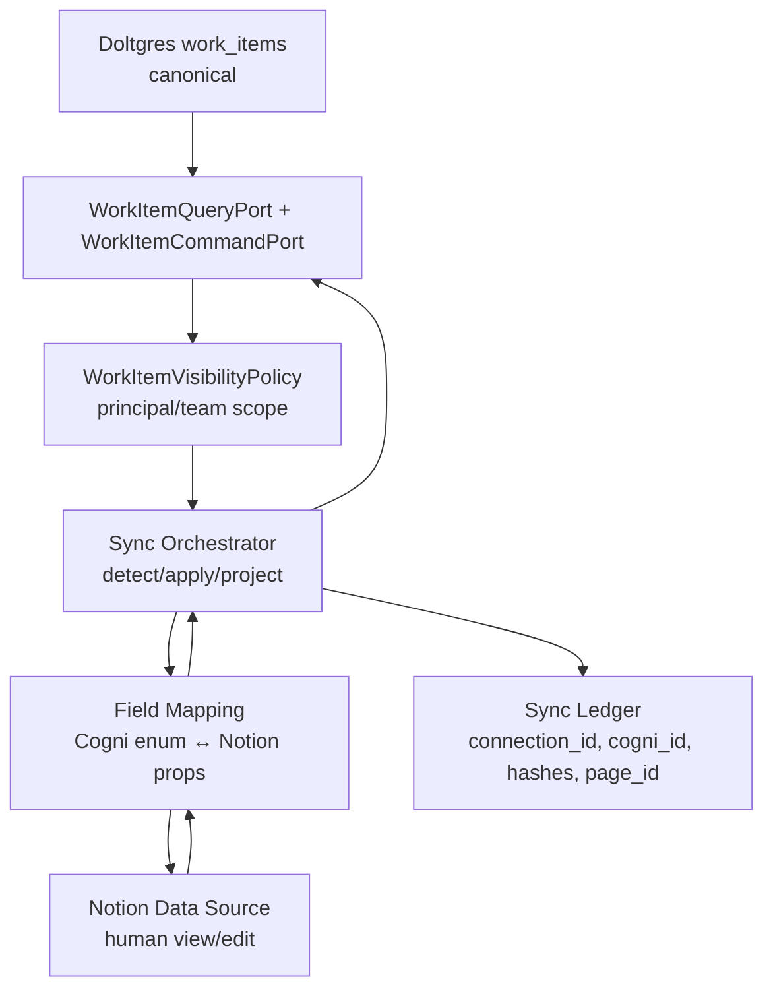

# Notion Work Items Bridge

> Notion is an optional human port over Cogni work items. It is not a tracker, ID allocator, lifecycle owner, or permission authority.

## Goal

Expose Dolt-backed Cogni work items through Notion in a way that is pleasant for humans, accessible to agents, and reusable across future per-human and per-team Notion connections.

The bridge must preserve Cogni's core work semantics:

- exact work item IDs
- exact lifecycle statuses
- Doltgres as source of truth
- versioned writes with audit commits
- authorization decided by Cogni, not by Notion

## Design

The bridge is a policy-wrapped projection from canonical Cogni work items to one or more Notion data sources. It is composed from a pure Notion HTTP/property mapper, a sync orchestrator, a visibility/edit policy, and a ledger for per-connection sync state.

## References

| Spec                                                                 | Relevance                                                               |
| -------------------------------------------------------------------- | ----------------------------------------------------------------------- |
| [Knowledge Data Plane](./knowledge-data-plane.md)                    | Doltgres is the versioned, compounding memory plane.                    |
| [Development Lifecycle](./development-lifecycle.md)                  | Defines the status enum and command dispatch meaning.                   |
| [Work Items Port](./work-items-port.md)                              | Defines `WorkItem`, ports, adapter contract, and Notion mirror package. |
| [Notion Connection Guide](../guides/notion-work-items-connection.md) | Human setup and current prototype environment keys.                     |

## Data Ownership

### Canonical Store

`work_items` in Doltgres is canonical. A Notion page is a projection row keyed by `Cogni ID = WorkItem.id`.

Notion never owns:

- work item identity
- status vocabulary
- lifecycle transition meaning
- assignment authority
- visibility authority
- revision history

### Projection Store

Each Notion data source is a projection target. It may be personal, team-owned, or temporary. The same canonical work item can appear in multiple Notion data sources if multiple authorized connections subscribe to it.

Projection rows are disposable. If a Notion page is deleted, the next authorized sync may recreate it from Cogni. If a Cogni work item is deleted or hidden from a connection, the bridge archives or marks the Notion projection according to the connection policy.

## Architecture

### Components

| Component                  | Responsibility                                                                  |
| -------------------------- | ------------------------------------------------------------------------------- |
| `NotionWorkItemMirror`     | Stateless HTTP adapter for Notion pages and property mapping.                   |
| `WorkItemNotionSyncJob`    | Orchestrates list/read/diff/apply/project for one connection.                   |
| `WorkItemVisibilityPolicy` | Filters canonical items and editable fields per human/team/agent principal.     |
| `Sync Ledger`              | Stores page IDs, last projected hash, last observed Notion hash, and errors.    |
| `WorkItemCommandPort`      | Applies validated edits back to Doltgres and commits with `system:notion-sync`. |

The package adapter stays thin. It should not import app code, know tenant policy, allocate IDs, or decide whether a user may see/edit a work item.

## Field Contract

### Required Notion Properties

| Property   | Type             | Direction      | Meaning                                           |
| ---------- | ---------------- | -------------- | ------------------------------------------------- |
| `Name`     | title            | both           | `WorkItem.title`                                  |
| `Cogni ID` | rich_text/title  | Cogni → Notion | exact `WorkItem.id`; immutable in Notion practice |
| `Status`   | select preferred | both           | exact `WorkItemStatus` value                      |

### Recommended Properties

| Property         | Direction       | Notes                                      |
| ---------------- | --------------- | ------------------------------------------ |
| `Type`           | Cogni → Notion  | `task`, `bug`, `story`, `spike`, `subtask` |
| `Node`           | both            | node ownership/filter key                  |
| `Priority`       | both            | numeric sort                               |
| `Rank`           | both            | ordering within priority                   |
| `Estimate`       | both            | coarse sizing                              |
| `Summary`        | both            | human-readable context                     |
| `Outcome`        | both            | desired terminal state                     |
| `Labels`         | both            | tags                                       |
| `Branch`         | both            | code branch hint                           |
| `PR`             | both            | PR URL                                     |
| `Reviewer`       | both            | reviewer hint                              |
| `Cogni Revision` | Cogni → Notion  | current canonical revision                 |
| `Sync Hash`      | Cogni → Notion  | hash of last projected editable fields     |
| `Sync State`     | Bridge → Notion | `synced`, `conflict`, `error`              |
| `Sync Error`     | Bridge → Notion | human-readable repair message              |
| `Last Synced At` | Bridge → Notion | bridge timestamp                           |

## Status Invariant

`Status` must be a one-to-one representation of `WorkItemStatus` from [Development Lifecycle](./development-lifecycle.md):

- `needs_triage`
- `needs_research`
- `needs_design`
- `needs_implement`
- `needs_closeout`
- `needs_merge`
- `done`
- `blocked`
- `cancelled`

The bridge must reject unknown Notion labels. It must not map generic Notion statuses like `Not started` or `In progress` into Cogni statuses.

Use a Notion `select` property for exact labels. Notion's special `status` property is acceptable only if its options are constrained to Cogni values; `Done` may appear as a display alias for `done` because Notion reserves done-like status semantics.

## Sync Algorithm

For one connection:

1. Load connection config: token, data source ID, principal/team scope.
2. Query Cogni work items through `WorkItemQueryPort`.
3. Apply `WorkItemVisibilityPolicy` to choose visible items and editable fields.
4. Query Notion data source pages and index by `Cogni ID`.
5. Reject duplicate Notion pages for the same `Cogni ID`; mark duplicates `Sync State = error`.
6. Validate Notion enum values before diffing.
7. If Notion changed and Cogni did not change since last projection, apply allowed edits through `WorkItemCommandPort`.
8. If both Notion and Cogni changed, mark `Sync State = conflict` and leave Cogni unchanged.
9. Project canonical Cogni state back to Notion with fresh `Sync Hash`, `Cogni Revision`, and `Last Synced At`.
10. Record sync results in the ledger and logs.

## Authorization Model

Cogni owns authorization. Notion sharing is a convenience layer, not an authority boundary.

Every Notion connection is bound to a Cogni principal:

| Connection Kind | Principal Scope                         |
| --------------- | --------------------------------------- |
| personal        | one Cogni user                          |
| team            | one Cogni team or group                 |
| system          | operator/admin projection for debugging |

The visibility policy answers:

- which work items this connection may see
- which fields this connection may edit
- whether edits require review before applying
- whether a work item should be archived in this Notion data source

Prototype deployments may expose all work items to one trusted connection. Production behavior must use the same sync pipeline with a narrower policy, not a separate adapter.

## Multi-Tenant Connections

The bridge should model Notion credentials as connection records, not global process env:

| Field            | Purpose                                    |
| ---------------- | ------------------------------------------ |
| `connection_id`  | stable Cogni ID for this Notion connection |
| `principal_ref`  | user/team/system owner                     |
| `data_source_id` | Notion target                              |
| `token_ref`      | reference to encrypted secret material     |
| `scope`          | filter expression or policy reference      |
| `enabled`        | operational kill switch                    |
| `last_sync_at`   | cursor/debugging                           |

Secrets live in the operational secret store. The work-item package receives decrypted values only at the edge.

## Conflict Handling

The bridge compares hashes over editable fields:

- `Sync Hash`: editable-field hash at last successful projection
- current Notion hash
- current Cogni hash

| Case                                      | Action                              |
| ----------------------------------------- | ----------------------------------- |
| Notion unchanged, Cogni unchanged         | no-op or metadata refresh           |
| Notion unchanged, Cogni changed           | project Cogni to Notion             |
| Notion changed, Cogni unchanged           | apply allowed Notion patch to Cogni |
| Notion changed, Cogni changed             | mark conflict, leave Cogni as-is    |
| Notion invalid enum or duplicate Cogni ID | mark error, leave Cogni as-is       |

## Agent Accessibility

Agents should not scrape Notion as the canonical work queue. Agents read and write Cogni work items through the Cogni API or work-item ports.

Notion remains useful to agents for:

- resolving human-entered context on a connected page
- diagnosing sync errors
- reading human notes that have not yet synced
- guiding humans through setup

Agent automation dispatch still follows [Development Lifecycle](./development-lifecycle.md); Notion status edits are accepted only when they preserve that lifecycle contract.

## Non-Goals

- Replacing Cogni APIs or work-item ports with Notion as the canonical work queue.
- Allocating work item IDs from Notion pages.
- Using Notion permissions as the source of truth for Cogni authorization.
- Encoding tenant policy inside the reusable Notion adapter package.
- Defining the final UI/UX for Notion database templates.

## Invariants

| Rule                       | Constraint                                                                  |
| -------------------------- | --------------------------------------------------------------------------- |
| COGNI_SOURCE_OF_TRUTH      | Doltgres `work_items` owns canonical state.                                 |
| EXACT_ID_MIRROR            | Notion `Cogni ID` equals `WorkItem.id`; bridge never allocates work IDs.    |
| EXACT_STATUS_VOCABULARY    | Notion status values must be the Cogni lifecycle enum or explicit alias.    |
| POLICY_BEFORE_PROJECTION   | Visibility/edit policy is applied before writing to or reading from Notion. |
| THIN_NOTION_ADAPTER        | Notion package handles HTTP/property mapping only; no app policy imports.   |
| SYNC_ERRORS_VISIBLE        | Duplicate IDs, invalid enums, and conflicts are visible in Notion.          |
| DOLT_WRITES_AUDITED        | Every Notion-originated Cogni write commits to Dolt with sync provenance.   |
| CONNECTIONS_ARE_SCOPED     | Notion credentials bind to a principal/team/system connection.              |
| AGENTS_USE_COGNI_CANONICAL | Agents use Cogni APIs/ports for dispatch; Notion is not the queue source.   |

## Open Questions

- Should status transitions from Notion call `transitionStatus()` and enforce lifecycle edges, or should privileged humans be allowed to patch status directly with audit provenance?
- Should hidden/out-of-scope Notion rows be archived, deleted, or marked read-only?
- What is the minimal connection schema location: operator Postgres for secrets/cursors, Doltgres for durable projection metadata, or split by hot/cold responsibility?
