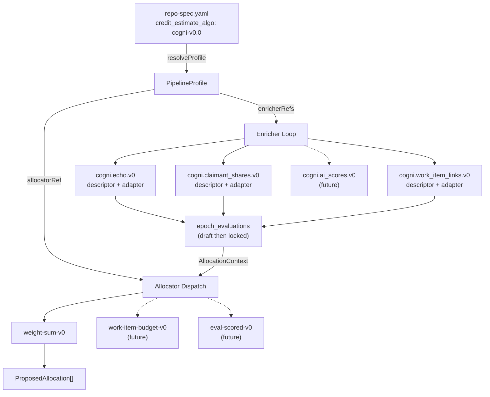

# Plugin Attribution Pipeline: Profile-Based Enricher and Allocator Dispatch

> A **pipeline profile** selects which enricher plugins run and which allocation algorithm computes credit. Profiles are plain data keyed by `credit_estimate_algo` from `repo-spec.yaml`. Adding a new enricher or allocator means writing a descriptor, implementing the adapter interface, and registering it in a profile — no switch/case editing, no hardcoded wiring. Customers installing the Cogni review app choose from built-in profiles or implement custom plugins against stable, well-defined interfaces.

### Key References

|              |                                                                                           |                                                  |
| ------------ | ----------------------------------------------------------------------------------------- | ------------------------------------------------ |
| **Project**  | [proj.transparent-credit-payouts](../../work/projects/proj.transparent-credit-payouts.md) | Project roadmap                                  |
| **Spec**     | [attribution-ledger](./attribution-ledger.md)                                             | Core domain: store port, hashing, statement math |
| **Spec**     | [packages-architecture](./packages-architecture.md)                                       | Package boundary rules                           |
| **Research** | [attribution-scoring-design](../research/attribution-scoring-design.md)                   | LLM evaluation design, quarterly review model    |
| **Spec**     | [identity-model](./identity-model.md)                                                     | actor_id future evolution (orthogonal)           |

## Design

### Pipeline Dispatch Flow



### Plugin Package Ownership

The plugin package (`packages/plugin-attribution-pipeline/`) owns **everything about plugins**: contracts (port interfaces), built-in descriptors, built-in adapter implementations, profiles, and dispatch logic. The executor (currently `services/scheduler-worker/`) is a thin generic shell that resolves a profile and dispatches to the registries — it contains zero plugin-specific code.

```
packages/plugin-attribution-pipeline/
├── src/
│   ├── enricher.ts          ←── EnricherDescriptor + EnricherAdapter port interface
│   ├── allocator.ts         ←── AllocatorDescriptor + AllocationContext + dispatch
│   ├── profile.ts           ←── PipelineProfile + ProfileRegistry + resolveProfile
│   ├── plugins/
│   │   ├── echo/
│   │   │   ├── descriptor.ts   ←── pure constants, payload types, builder
│   │   │   └── adapter.ts      ←── EnricherAdapter implementation (I/O)
│   │   ├── claimant-shares/
│   │   │   ├── descriptor.ts
│   │   │   └── adapter.ts
│   │   └── work-item-links/
│   │       ├── descriptor.ts
│   │       └── adapter.ts
│   └── profiles/
│       └── cogni-v0.0.ts       ←── built-in profile
```

Each built-in plugin ships as a **descriptor** (pure constants + builder functions) and an **adapter** (implements `EnricherAdapter`, performs I/O). Both live in the plugin package. The adapter reads from `AttributionStore`, calls external APIs, invokes the descriptor's pure builder, computes hashes, and returns `UpsertEvaluationParams`.

A custom plugin follows the same pattern: implement `EnricherAdapter` and/or `AllocatorDescriptor` from `@cogni/plugin-attribution-pipeline`, register in a profile.

### Package Structure

```
packages/plugin-attribution-pipeline/
├── AGENTS.md
├── package.json           # @cogni/plugin-attribution-pipeline
├── tsconfig.json          # composite, references @cogni/attribution-ledger
├── tsup.config.ts
├── src/
│   ├── index.ts           # public barrel
│   ├── profile.ts         # PipelineProfile, ProfileRegistry, resolveProfile()
│   ├── enricher.ts        # EnricherDescriptor + EnricherAdapter port interface
│   ├── allocator.ts       # AllocatorDescriptor, AllocationContext, dispatchAllocator()
│   ├── plugins/
│   │   ├── echo/
│   │   │   ├── descriptor.ts       # EchoPayload, buildEchoPayload(), constants
│   │   │   └── adapter.ts          # EnricherAdapter impl (deps injected via EnricherContext)
│   │   ├── claimant-shares/
│   │   │   ├── descriptor.ts       # re-exports ledger types, descriptor constant
│   │   │   └── adapter.ts          # EnricherAdapter impl
│   │   └── work-item-links/
│   │       ├── descriptor.ts       # WorkItemLink, extractWorkItemIds(), constants
│   │       └── adapter.ts          # EnricherAdapter impl
│   └── profiles/
│       └── cogni-v0.0.ts           # weekly activity profile (built-in)
└── tests/
    ├── profile.test.ts
    ├── allocator.test.ts
    └── plugins/
        └── echo/adapter.test.ts    # adapter tests with mocked AttributionStore
```

**PURE_LIBRARY compliance:** The package has no process lifecycle, no env vars, no Docker image. Adapter functions accept all dependencies via `EnricherContext` (dependency injection). The package defines functions that _use_ injected ports — it doesn't _own_ the ports or start processes. Same pattern as `attribution-ledger` defining `computeStatementItems()` that operates on injected data.

### Profile Type

A profile is a plain readonly object, never a class. Keyed by the `credit_estimate_algo` value from `repo-spec.yaml`. Profile IDs are versioned (`cogni-v0.0`, `cogni-v0.1`). Operators upgrade by changing `credit_estimate_algo` in `repo-spec.yaml`. Open epochs pick up changes on the next pipeline pass — nothing is hardcoded at epoch creation. The epoch locks down at `closeIngestion`.

```typescript
interface PipelineProfile {
  /** The credit_estimate_algo key that selects this profile. Immutable once published. */
  readonly profileId: string;

  /** Human-readable label for logging/UI. */
  readonly label: string;

  /**
   * Ordered list of enricher evaluation refs to run.
   * Execution is strictly sequential — later enrichers run after earlier ones complete.
   * Future: enrichers may declare dependsOn[] for parallel execution of independent enrichers.
   */
  readonly enricherRefs: readonly string[];

  /** The allocation algorithm ref (also pinned on epoch at closeIngestion per ALLOCATION_ALGO_PINNED). */
  readonly allocatorRef: string;

  /**
   * Epoch kind discriminator for the epochs table.
   * Default: "activity". Quarterly review: "quarterly_review".
   * Included in EPOCH_WINDOW_UNIQUE to allow overlapping time windows.
   */
  readonly epochKind: string;

  /**
   * Zod schema for user-provided config. If non-null, the profile expects
   * a config file at `.cogni/attribution/<profileId>.yaml` (or .json).
   * The executor loads and validates the file against this schema at epoch creation,
   * then passes the parsed config to enrichers/allocators via context.
   * Built-in profiles define their own schemas; custom profiles bring their own.
   * null = no user config expected (profile is fully self-contained).
   */
  readonly configSchema: ZodType | null;
}
```

**Registry and resolution:**

```typescript
type ProfileRegistry = ReadonlyMap<string, PipelineProfile>;

/** Resolve profile or throw. Replaces deriveAllocationAlgoRef(). */
function resolveProfile(
  registry: ProfileRegistry,
  creditEstimateAlgo: string
): PipelineProfile;
```

**Profile lifecycle within an epoch:**

1. `repo-spec.yaml` declares `credit_estimate_algo: cogni-v0.0`.
2. At **epoch creation**, the executor resolves the profile and stores `profile_id` on the epoch row (provenance). If `profile.configSchema` is non-null, loads and validates `.cogni/attribution/cogni-v0.0.yaml`.
3. During **`open`**, each enrichment pass re-resolves `credit_estimate_algo` from `repo-spec.yaml` to get the current profile's `enricherRefs`. Draft evaluations are upserted (overwritten) on each pass. If the operator updates `repo-spec.yaml` to `cogni-v0.1` mid-epoch, the next enrichment pass uses `v0.1`'s enrichers. Orphan drafts from removed enrichers are harmless — they won't be locked at close.
4. At **closeIngestion** (open→review), the profile is resolved one final time. `allocatorRef` is written to `allocation_algo_ref`. Only evaluations matching the current profile's `enricherRefs` are locked. Weight config hash, approver set hash, and artifacts hash are also locked. After this point, the epoch is immutable.
5. At **finalization** (review→finalized), the locked allocator and evaluations are consumed. No further profile resolution.

**Built-in profiles:**

| Profile ID   | enricherRefs                                | allocatorRef    | epochKind  |
| ------------ | ------------------------------------------- | --------------- | ---------- |
| `cogni-v0.0` | `[cogni.echo.v0, cogni.claimant_shares.v0]` | `weight-sum-v0` | `activity` |

Future profiles add enricher refs (e.g., `cogni.work_item_links.v0`, `cogni.ai_scores.v0`) and select different allocators (e.g., `work-item-budget-v0`, `eval-scored-v0`). No code changes to the dispatch layer — only profile data and new plugin implementations.

### Enricher Plugin Interface

Each enricher has two parts, both defined in this package:

**`EnricherDescriptor`** — Pure data. Constants, payload types, and optional pure builder functions. No I/O.

```typescript
interface EnricherDescriptor {
  /** Namespaced evaluation ref (EVALUATION_REF_NAMESPACED from attribution-ledger spec). */
  readonly evaluationRef: string;

  /** Algorithm ref for this enricher. */
  readonly algoRef: string;
}
```

Pure payload builder functions are exported alongside the descriptor as named exports (e.g., `buildEchoPayload()`), not as methods on an interface. This keeps the descriptor a plain data object and avoids forcing a common function signature across enrichers with different input shapes.

**`EnricherAdapter`** — Port interface. The contract that all enricher implementations fulfill. Defined in `packages/plugin-attribution-pipeline/src/enricher.ts`. Built-in adapters live alongside their descriptors in `plugins/*/adapter.ts`. Custom plugins implement this same interface.

```typescript
interface EnricherAdapter {
  /** Must match the descriptor's evaluationRef. */
  readonly evaluationRef: string;

  /**
   * Produce a draft evaluation for the given epoch.
   * Called during the enrichment phase (epoch is open).
   * May perform I/O: read from store, call external APIs, invoke LLMs.
   * Must return a complete UpsertEvaluationParams with status='draft'.
   */
  evaluateDraft(ctx: EnricherContext): Promise<UpsertEvaluationParams>;

  /**
   * Produce a locked (final) evaluation for epoch close.
   * Called during closeIngestion. Same contract as evaluateDraft but
   * returns status='locked'. The caller writes atomically.
   */
  buildLocked(ctx: EnricherContext): Promise<UpsertEvaluationParams>;
}

interface EnricherContext {
  readonly epochId: bigint;
  readonly nodeId: string;
  readonly attributionStore: AttributionStore;
  readonly logger: Logger;
  /** User-provided config parsed from .cogni/attribution/<profileId>.yaml, or null if profile has no configSchema. */
  readonly profileConfig: Record<string, unknown> | null;
}
```

**Adapter registry** — The executor resolves adapters by `evaluationRef`:

```typescript
type EnricherAdapterRegistry = ReadonlyMap<string, EnricherAdapter>;
```

The executor iterates `profile.enricherRefs`, resolves each from the registry, and calls `evaluateDraft()` or `buildLocked()`. The executor owns no enricher-specific logic — it is a generic dispatch loop.

### Allocator Interface

```typescript
interface AllocatorDescriptor {
  /** Algorithm ref (matches what gets pinned on epoch at closeIngestion). */
  readonly algoRef: string;

  /**
   * Evaluation refs this allocator requires. Empty = no evaluations needed.
   * dispatchAllocator() validates all required refs are present before calling compute().
   */
  readonly requiredEvaluationRefs: readonly string[];

  /**
   * Compute proposed allocations. Async to support future allocators that may
   * need I/O (e.g., LLM-scored allocation). Deterministic allocators simply
   * return a resolved promise.
   */
  readonly compute: (
    context: AllocationContext
  ) => Promise<ProposedAllocation[]>;
}

interface AllocationContext {
  readonly events: readonly SelectedReceiptForAllocation[];
  readonly weightConfig: Record<string, number>;
  /**
   * Locked evaluation payloads keyed by evaluationRef.
   * Present when the profile's enrichers have produced locked evaluations.
   * weight-sum-v0 ignores this; future allocators consume it.
   */
  readonly evaluations: ReadonlyMap<string, Record<string, unknown>>;
  /** User-provided config parsed from .cogni/attribution/<profileId>.yaml, or null if profile has no configSchema. */
  readonly profileConfig: Record<string, unknown> | null;
}
```

`dispatchAllocator()` resolves the allocator from the profile, validates required evaluations are present, and calls `compute()`:

```typescript
async function dispatchAllocator(
  registry: AllocatorRegistry,
  profile: PipelineProfile,
  context: AllocationContext
): Promise<ProposedAllocation[]>;
```

The `weight-sum-v0` descriptor wraps the existing `computeProposedAllocations("weight-sum-v0", events, weightConfig)` from `@cogni/attribution-ledger`, returning the result as a resolved promise. The function in attribution-ledger is not removed — the descriptor delegates to it.

### Quarterly Review — Same Lifecycle, Different Profile

A quarterly review epoch is **not** a special epoch type with its own lifecycle. It follows the same three-phase lifecycle (`open → review → finalized`) as a weekly activity epoch. The differences are entirely in the profile:

| Dimension      | Weekly Activity (`cogni-v0.0`)     | Quarterly Review (`cogni-quarterly-v0.0`)  |
| -------------- | ---------------------------------- | ------------------------------------------ |
| `epochKind`    | `"activity"`                       | `"quarterly_review"`                       |
| `enricherRefs` | echo, claimant_shares              | claimant_shares, (future: peer_assessment) |
| `allocatorRef` | `weight-sum-v0`                    | `weight-sum-v0` (or future dedicated algo) |
| Epoch window   | 7 days, Monday-aligned             | ~90 days, quarter-aligned                  |
| Weight config  | per-event-type weights             | different weight schema                    |
| Receipts       | From source adapters (GitHub, etc) | From governance input or none              |

The `epoch_kind` column allows a quarterly review epoch and a weekly activity epoch to overlap the same time window without violating `EPOCH_WINDOW_UNIQUE`:

```sql
ALTER TABLE epochs ADD COLUMN epoch_kind TEXT NOT NULL DEFAULT 'activity';
-- EPOCH_WINDOW_UNIQUE becomes:
UNIQUE(node_id, scope_id, period_start, period_end, epoch_kind)
```

The workflow passes `profile.epochKind` when creating the epoch. No branching in the epoch lifecycle code.

### Boundary Summary

- **`packages/attribution-ledger/`** — Pure domain. Owns `AttributionStore`, hashing, statement math, `claimant-shares.ts`, `allocation.ts` (existing implementations). Never imports from the pipeline package (PLUGIN_NO_LEDGER_CORE_LEAK).
- **`packages/plugin-attribution-pipeline/`** — **The plugin home.** Owns all plugin contracts (`EnricherAdapter`, `AllocatorDescriptor`, `PipelineProfile`), all built-in plugin implementations (descriptor + adapter per plugin), profile registry, and dispatch logic. This is the package customers depend on.
- **Executor (currently `services/scheduler-worker/`)** — Generic dispatch shell. Imports profiles and adapter registries from the plugin package. Wires `EnricherContext` with live dependencies (store, logger). Iterates `profile.enricherRefs`, calls adapters, calls `dispatchAllocator()`. Contains zero plugin-specific code (EXECUTOR_IS_GENERIC). Could be any Temporal worker, a CLI tool, or a test harness.

## Goal

Provide a plugin architecture for the attribution pipeline that supports two use cases:

1. **Internal iteration** — Cogni developers rapidly add new enrichers, allocation algorithms, and pipeline versions by writing a descriptor + adapter and publishing a new profile. No switch/case editing, no touching core domain logic, no modifying the epoch lifecycle.
2. **Customer extensibility** — A new customer installs the Cogni review app into their GitHub repo, creates a `repo-spec.yaml`, and either chooses a built-in attribution profile or implements a custom enricher/allocator against the stable `EnricherAdapter` and `AllocatorDescriptor` interfaces from `@cogni/plugin-attribution-pipeline`.

## Non-Goals

- **`actor_id` integration** — The pipeline dispatches plugins and produces `ProposedAllocation[]` keyed by `userId`. When `actor_id` lands (see [identity-model spec](./identity-model.md)), the allocation output type gains an `actorId` field in `attribution-ledger`, not here. Orthogonal concern.
- **Quarterly review evaluation payload design** — The people-centric assessment model (what the LLM evaluates, what governance inputs look like) requires a dedicated research spike. This spec defines how quarterly review _dispatches_ via a different profile, not what the enricher _produces_.
- **Source adapter plugin interface** — Already defined in [attribution-ledger spec](./attribution-ledger.md#source-adapter-interface). Source adapters are a separate plugin surface.
- **LLM evaluation prompt engineering** — Implementation detail of the `cogni.ai_scores.v0` enricher adapter, not a pipeline architecture concern.

## Invariants

| Rule                           | Constraint                                                                                                                                                                                                                                                                                                                                                                                                                                                                                                                                         |
| ------------------------------ | -------------------------------------------------------------------------------------------------------------------------------------------------------------------------------------------------------------------------------------------------------------------------------------------------------------------------------------------------------------------------------------------------------------------------------------------------------------------------------------------------------------------------------------------------- |
| PROFILE_IS_DATA                | A `PipelineProfile` is a plain readonly object. No classes, no methods, no I/O. Constructed at import time, registered in a `ReadonlyMap`.                                                                                                                                                                                                                                                                                                                                                                                                         |
| PROFILE_VERSIONED              | Profile IDs are versioned (e.g., `cogni-v0.0`, `cogni-v0.1`). Operators upgrade by changing `credit_estimate_algo` in `repo-spec.yaml`. Open epochs pick up the new profile on the next enrichment pass. The `profile_id` stored on the epoch at creation is provenance only — the live `repo-spec.yaml` value is authoritative until closeIngestion locks the epoch.                                                                                                                                                                              |
| PROFILE_RESOLVED_NOT_HARDCODED | The `profile_id` is stored on the epoch row at creation for provenance, but the profile is **re-resolved at each pipeline stage**. During `open`, each enrichment pass resolves the profile to get the current `enricherRefs`. At `closeIngestion` (open→review), the profile is resolved to get `allocatorRef`, which is pinned as `allocation_algo_ref` per `CONFIG_LOCKED_AT_REVIEW`. This means updating `repo-spec.yaml` mid-epoch takes effect on the next enrichment pass and at close — consistent treatment for enrichers and allocators. |
| PROFILE_SELECTS_ENRICHERS      | The profile's `enricherRefs` array is the **sole authority** for which enrichers run during an epoch. The executor iterates this array and dispatches to the matching `EnricherAdapter`. Adding a new enricher to a pipeline = adding its ref to a new profile version.                                                                                                                                                                                                                                                                            |
| PROFILE_SELECTS_ALLOCATOR      | The profile's `allocatorRef` is the **sole authority** for which allocation algorithm runs. Replaces `deriveAllocationAlgoRef()`. The allocator ref is also pinned on the epoch at closeIngestion (per ALLOCATION_ALGO_PINNED in attribution-ledger spec).                                                                                                                                                                                                                                                                                         |
| ENRICHER_DESCRIPTOR_PURE       | An `EnricherDescriptor` contains only pure constants and functions. All I/O (store reads, API calls, file reads, LLM calls) lives in the corresponding `EnricherAdapter` implementation. Descriptors and adapters are co-located per plugin in the pipeline package.                                                                                                                                                                                                                                                                               |
| PLUGIN_PACKAGE_OWNS_ALL        | `packages/plugin-attribution-pipeline/` owns all plugin contracts (port interfaces), all built-in plugin implementations (adapters), all profiles, and all dispatch logic. The executor imports from this package — never the reverse.                                                                                                                                                                                                                                                                                                             |
| ALLOCATOR_NEEDS_DECLARED       | Each `AllocatorDescriptor` declares `requiredEvaluationRefs[]`. `dispatchAllocator()` validates that all required evaluation refs are present in `AllocationContext.evaluations` before calling `compute()`. Missing evaluations throw, not silently degrade.                                                                                                                                                                                                                                                                                      |
| ALLOCATION_CONTEXT_EXTENSIBLE  | `AllocationContext` is the single input type for all allocators. New allocators access enricher outputs via `context.evaluations` (a `Map<evaluationRef, payload>`). Existing allocators like `weight-sum-v0` ignore this field. Context grows by adding optional fields, never by changing the `compute()` signature.                                                                                                                                                                                                                             |
| PLUGIN_NO_LEDGER_CORE_LEAK     | `packages/attribution-ledger/` must never import from `packages/plugin-attribution-pipeline/`. The dependency direction is `plugin-attribution-pipeline → attribution-ledger`, never reverse. Plugin-specific types (e.g., `WorkItemLinksPayload`, `EchoPayload`) are defined in the pipeline package, not in the ledger.                                                                                                                                                                                                                          |
| EXECUTOR_IS_GENERIC            | The executor (currently `services/scheduler-worker/`) contains no plugin-specific logic. It resolves profiles, iterates enricher refs, dispatches to the adapter registry, and calls `dispatchAllocator()`. Adding a new plugin requires zero changes to the executor — only changes to the plugin package.                                                                                                                                                                                                                                        |
| CONFIG_VALIDATED_AT_CREATION   | If a profile declares `configSchema`, the executor loads `.cogni/attribution/<profileId>.yaml` (or `.json`) from the repo, validates against the Zod schema, and rejects epoch creation on validation failure. The validated config is passed to all plugins via `profileConfig` on `EnricherContext` and `AllocationContext`.                                                                                                                                                                                                                     |

### Schema

**Table: `epochs`** — Add columns:

| Column       | Type | Constraints                 | Description                                                                                                                                                                           |
| ------------ | ---- | --------------------------- | ------------------------------------------------------------------------------------------------------------------------------------------------------------------------------------- |
| `profile_id` | TEXT | NOT NULL                    | Pipeline profile ID recorded at epoch creation (provenance). The profile is re-resolved at each pipeline stage; this field records what was selected at creation for audit/debugging. |
| `epoch_kind` | TEXT | NOT NULL DEFAULT 'activity' | Pipeline kind discriminator derived from profile. Application-validated (no DB CHECK — new kinds don't require migrations).                                                           |

**Index changes:**

- `EPOCH_WINDOW_UNIQUE` becomes `UNIQUE(node_id, scope_id, period_start, period_end, epoch_kind)` — allows different epoch kinds to overlap the same time window.
- `ONE_OPEN_EPOCH` becomes `UNIQUE(node_id, scope_id, epoch_kind) WHERE status = 'open'` — allows one open epoch per kind per scope.

### File Pointers

| File                                                               | Purpose                                                               |
| ------------------------------------------------------------------ | --------------------------------------------------------------------- |
| `packages/plugin-attribution-pipeline/src/profile.ts`              | PipelineProfile type, ProfileRegistry, resolveProfile()               |
| `packages/plugin-attribution-pipeline/src/enricher.ts`             | EnricherDescriptor + EnricherAdapter port interface + EnricherContext |
| `packages/plugin-attribution-pipeline/src/allocator.ts`            | AllocatorDescriptor, AllocationContext, dispatchAllocator()           |
| `packages/plugin-attribution-pipeline/src/plugins/*/descriptor.ts` | Per-plugin pure constants, types, builder functions                   |
| `packages/plugin-attribution-pipeline/src/plugins/*/adapter.ts`    | Per-plugin EnricherAdapter implementations (I/O via injected deps)    |
| `packages/plugin-attribution-pipeline/src/profiles/*.ts`           | Built-in profile definitions                                          |
| `packages/attribution-ledger/src/allocation.ts`                    | Existing allocator implementations (wrapped by descriptors)           |
| `.cogni/repo-spec.yaml`                                            | `credit_estimate_algo` field that selects the profile                 |

## Open Questions

- [ ] **Claimant-shares finalization path:** The finalization path in `ledger.ts` reads claimant-shares evaluation payload directly to compute `ClaimantCreditLineItems`. Should this go through the pipeline dispatch, or continue reading from the evaluation table directly? The latter is simpler since finalization is a domain operation, not a plugin concern.
- [ ] **Customer-authored plugins:** When a customer wants to bring their own enricher/allocator implementation (not just config), how does our service discover and execute it safely? Deferred — config-driven customization via `.cogni/attribution/` covers the near-term need. Code-level extensibility requires a trust/sandbox model.

## Related

- [Attribution Ledger Spec](./attribution-ledger.md) — Core domain invariants, evaluation lifecycle, store port
- [Packages Architecture](./packages-architecture.md) — Package boundary rules (NO_SRC_IMPORTS, PURE_LIBRARY)
- [Attribution Scoring Design](../research/attribution-scoring-design.md) — LLM evaluation design, quarterly review model, retrospective value
- [Identity Model](./identity-model.md) — `actor_id` future evolution (orthogonal to plugin dispatch)
- [proj.transparent-credit-payouts](../../work/projects/proj.transparent-credit-payouts.md) — Project roadmap
