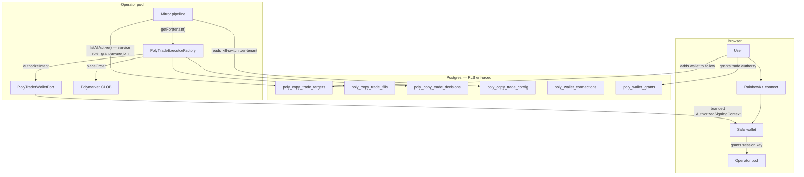

# Poly Multi-Tenant Auth — Tracked Wallets, Actor Wallets, Grants & RLS

> Tenant-isolated copy-trade. Each user manages their own list of wallets to mirror **and** owns the wallet that places trades. RLS enforces isolation at the database. A durable grant gates autonomous placement so the executor can run while the user is offline.

### Key References

|             |                                                                             |                                          |
| ----------- | --------------------------------------------------------------------------- | ---------------------------------------- |
| **Project** | [proj.poly-prediction-bot](../../work/projects/proj.poly-prediction-bot.md) | Roadmap and planning                     |
| **Task**    | [task.0318](../../work/items/task.0318.poly-wallet-multi-tenant-auth.md)    | Implementation phasing + checkpoints     |
| **Spec**    | [database-rls](./database-rls.md)                                           | RLS substrate this builds on             |
| **Spec**    | [tenant-connections](./tenant-connections.md)                               | Encrypted-credential pattern reused here |
| **Spec**    | [operator-wallet](./operator-wallet.md)                                     | Privy custody + intent-only API surface  |
| **Spec**    | [poly-copy-trade-phase1](./poly-copy-trade-phase1.md)                       | Single-tenant predecessor                |
| **Spec**    | [poly-trader-wallet-port](./poly-trader-wallet-port.md)                     | Port contract + `authorizeIntent` shape  |

## Goal

Define the contract for a multi-tenant Polymarket copy-trade system in which (a) each user records their own list of wallets to mirror, (b) each user owns the on-chain wallet that places those mirrored trades, and (c) autonomous placement runs under a durable, revocable grant when the user is offline — with PostgreSQL RLS as the structural enforcement layer.

## Non-Goals

- BYO raw private keys (user-pasted private keys backing a plain wallet, without HSM / Safe). Custody is restricted to recognized signing backends (Safe + session keys, Privy, Turnkey).
- Multiple actor wallets per tenant. One active `poly_wallet_connections` row per `billing_account_id`.
- Mid-flight cancellation when a grant is revoked. Revocation halts **future** placements; in-flight orders complete.
- DAO-treasury-funded trading. Per-user wallets only — DAO treasury is a future, separate wallet kind.
- Backfilling Phase-0 single-tenant prototype rows to a tenant. They are dropped by the migration that introduces tenant columns (see Decisions).

## Design

### System overview

### Two layers, one tenancy model

| Layer               | Question it answers                                                                      | Source-of-truth table                            | Port                                                                                           |
| ------------------- | ---------------------------------------------------------------------------------------- | ------------------------------------------------ | ---------------------------------------------------------------------------------------------- |
| **Tracked wallets** | "Which Polymarket wallets is this user mirroring?"                                       | `poly_copy_trade_targets`                        | `CopyTradeTargetSource` (already exists; today env-backed, lands DB-backed under this spec)    |
| **Actor wallets**   | "Which on-chain wallet places this user's mirror trades, and who's authorized to do so?" | `poly_wallet_connections` + `poly_wallet_grants` | [`PolyTraderWalletPort`](./poly-trader-wallet-port.md) (abstracts Privy / Safe+4337 / Turnkey) |

Both layers share the same tenant boundary: `billing_account_id` is the **data column** that names the financial owner, but the **RLS policy keys on `created_by_user_id = current_setting('app.current_user_id', true)`** — the exact pattern shipped by [`connections`](./tenant-connections.md) (migration `0025_add_connections.sql`).

> **Why the split?** Today `billing_account` ↔ `user` is 1:1, so the two clamps are equivalent. The schema is forward-compatible with multi-user-per-account: when that ships, a `billing_account_members` join replaces the policy clause and `billing_account_id` becomes load-bearing. **App code MUST defense-in-depth verify `row.billing_account_id === expected.tenantId`** after the RLS-scoped SELECT — same pattern as `DrizzleConnectionBrokerAdapter.resolve()` (`adapters/server/connections/drizzle-broker.adapter.ts`). RLS is the structural floor; the app check catches misconfig + future RBAC drift.

The executor is a thin orchestrator over the two ports.

### Tenant resolution & bootstrap

| Caller                                                          | DB role                                           | RLS context                                                                                                                                                                                                                                                                                                                                                                                           |
| --------------------------------------------------------------- | ------------------------------------------------- | ----------------------------------------------------------------------------------------------------------------------------------------------------------------------------------------------------------------------------------------------------------------------------------------------------------------------------------------------------------------------------------------------------- |
| Authenticated HTTP route (CRUD on targets, connections, grants) | `app_user` (RLS enforced)                         | `withTenantScope(appDb, sessionUser.id, ...)` — uses existing helper from `@cogni/db-client/tenant-scope`                                                                                                                                                                                                                                                                                             |
| Mirror-poll cross-tenant enumerator                             | `app_service` (BYPASSRLS)                         | none — the enumerator returns `(billing_account_id, created_by_user_id, target_wallet)` triples and the **per-tenant inner loop** then opens a `withTenantScope(appDb, created_by_user_id, ...)` for fills/decisions/config writes                                                                                                                                                                    |
| Bootstrap operator (seed migration + dev / candidate-a flights) | `app_service` for the seed; `app_user` thereafter | `COGNI_SYSTEM_PRINCIPAL_USER_ID` (`00000000-0000-4000-a000-000000000001`) + `COGNI_SYSTEM_BILLING_ACCOUNT_ID` (`00000000-0000-4000-b000-000000000000`) per [system-tenant](./system-tenant.md). The seed migration inserts a `poly_copy_trade_config` row + (optionally) a `poly_copy_trade_targets` row owned by the system tenant so the existing single-operator candidate-a flight keeps working. |

### Signing backends — `PolyTraderWalletPort` abstracts the choice

A single port [`PolyTraderWalletPort`](./poly-trader-wallet-port.md) is the only seam any backend speaks to. The `PolyTradeExecutor` never names a backend; it is parameterized by the port on construction (see `packages/poly-wallet/src/port/poly-trader-wallet.port.ts`).

| Backend                               | OSS       | Autonomous      | Connect UX                                                                                                                                                                     | Where it lives                                                                                                                                                                      |
| ------------------------------------- | --------- | --------------- | ------------------------------------------------------------------------------------------------------------------------------------------------------------------------------ | ----------------------------------------------------------------------------------------------------------------------------------------------------------------------------------- |
| **Privy per-user** (shipped Phase B)  | ❌ closed | ✅              | Email / social login, custodial — `PrivyPolyTraderWalletAdapter` provisions + signs inside a **separate** Privy app from the system operator wallet                            | `nodes/poly/app/src/adapters/server/wallet/privy-poly-trader-wallet.adapter.ts`                                                                                                     |
| Safe + ERC-4337 session keys (future) | ✅        | ✅ within scope | RainbowKit connect → user signs **one** meta-tx granting a session key scoped to (CTF approvals + USDC.e approvals + CLOB order signing), bounded by $/day + expiry, revocable | New `SafePolyTraderWalletAdapter` impl backed by Safe SDK + 4337 bundler. Filed under OSS-hardening task (see "Phase B signing-backend decision" below).                            |
| Turnkey (future)                      | partial   | ✅              | API-driven MPC                                                                                                                                                                 | Same port, different impl.                                                                                                                                                          |
| RainbowKit / wagmi alone              | ✅        | ❌ popup per tx | Connect-wallet UI only                                                                                                                                                         | **Not a valid `PolyTraderWalletPort` impl by itself** — every signature requires a browser popup. RainbowKit is used to bootstrap the Safe connection, not as an autonomous signer. |

> **`KEY_NEVER_IN_APP`** holds for every backend: raw signing-key material lives in the HSM / Safe / MPC; the app stores only an opaque `backend_ref` (`privy_wallet_id` / `safe_address` / `turnkey_subaccount_id`). Polymarket L2 API creds (api_key / api_secret / passphrase) are stored as a `connections` row with `provider = 'polymarket_clob'` and resolved via the existing `ConnectionBrokerPort` — same AEAD envelope, same `CONNECTIONS_ENCRYPTION_KEY` env, same AAD shape. No bespoke crypto in the poly node.

### Authorization model — `authorizeIntent` is the fail-closed checkpoint

The placement pipeline splits cleanly into **pure planning** and **authorized signing**. Cap + scope checks live **inside the port adapter**, not inside the planner or the mirror pipeline — the planner never names a grant, and `PolymarketClobAdapter.placeOrder` takes a branded `AuthorizedSigningContext` that only `authorizeIntent` can mint.

| Stage                                                 | Where                                                                  | What it does                                                                                                                                                                          | What it is NOT allowed to do                                                                                                   |
| ----------------------------------------------------- | ---------------------------------------------------------------------- | ------------------------------------------------------------------------------------------------------------------------------------------------------------------------------------- | ------------------------------------------------------------------------------------------------------------------------------ |
| **1. Enumerate tenants** (cross-tenant, service-role) | `mirror-pipeline.ts` → `CopyTradeTargetSource.listAllActive`           | Return `(billing_account_id, created_by_user_id, target_wallet)` triples; joined against `poly_wallet_connections` + `poly_wallet_grants` so tenants without an active grant drop out | Read/write any per-tenant fill, decision, or config row — that work happens under `withTenantScope` inside the per-tenant loop |
| **2. Dispatch to per-tenant executor**                | `PolyTradeExecutorFactory.getFor(billingAccountId)`                    | Lazily build + cache a `PolyTradeExecutor` bound to the tenant's `PolyTraderWalletPort` + `ConnectionBroker`                                                                          | Touch grants; that's the adapter's job                                                                                         |
| **3. Plan the mirror** (pure)                         | `planMirrorFromFill` (renamed from `decide`) in `features/copy-trade/` | Map a source fill + mirror config → a typed `MirrorIntent \| null`. **No cap checks. No grant reads. No signer calls.**                                                               | Reach into grants, env vars, or hardcoded cap constants — that is a violation                                                  |
| **4. Authorize the intent**                           | `PolyTraderWalletPort.authorizeIntent(billingAccountId, intent)`       | SELECT the active grant, validate scope for this intent's side (`poly:trade:buy` / `poly:trade:sell`), enforce `per_order_usdc_cap`, mint the branded `AuthorizedSigningContext`      | Mutate state, place an order, or return a bare signer object                                                                   |
| **5. Place the order**                                | `PolymarketClobAdapter.placeOrder(ctx)` — `ctx` is the branded context | Sign + POST to CLOB using the credentials embedded in `ctx`                                                                                                                           | Re-check caps / scope — that authority was already proven structurally by the branded context                                  |

Outcomes that fail step 4 are recorded in `poly_copy_trade_decisions` with one of: `reason = no_active_grant`, `reason = scope_missing`, `reason = cap_exceeded_per_order`, `reason = cap_exceeded_daily`. No row ever reaches step 5 without an `AuthorizedSigningContext`; you cannot construct one from outside the adapter, which is how `AUTHORIZED_SIGNING_ONLY` in [poly-trader-wallet-port](./poly-trader-wallet-port.md) is enforced structurally at the TypeScript level.

### Schema

#### Tracked wallets

**Table:** `poly_copy_trade_targets`

| Column               | Type        | Constraints                                             | Description                                                                   |
| -------------------- | ----------- | ------------------------------------------------------- | ----------------------------------------------------------------------------- |
| `id`                 | uuid        | PK, default `gen_random_uuid()`                         |                                                                               |
| `billing_account_id` | text        | NOT NULL, FK → `billing_accounts(id)` ON DELETE CASCADE | Tenant boundary                                                               |
| `target_wallet`      | text        | NOT NULL, CHECK `target_wallet ~ '^0x[a-fA-F0-9]{40}$'` | Polymarket wallet address being followed                                      |
| `created_at`         | timestamptz | NOT NULL, DEFAULT `now()`                               |                                                                               |
| `created_by_user_id` | text        | NOT NULL, FK → `users(id)`                              | Audit                                                                         |
| `disabled_at`        | timestamptz | NULL                                                    | Soft delete (preferred over hard delete to preserve fill attribution history) |

Constraints:

- `UNIQUE (billing_account_id, target_wallet) WHERE disabled_at IS NULL` — one active row per (tenant, wallet)
- RLS: `USING (created_by_user_id = current_setting('app.current_user_id', true))` (matches `connections` policy)

> No per-target `enabled` flag, no per-target caps. Per-tenant `poly_copy_trade_config.enabled` is the kill-switch; caps come from `poly_wallet_grants`.

#### Per-tenant config

**Table:** `poly_copy_trade_config`

| Column               | Type        | Constraints                                       | Description                                                |
| -------------------- | ----------- | ------------------------------------------------- | ---------------------------------------------------------- |
| `billing_account_id` | text        | PK, FK → `billing_accounts(id)` ON DELETE CASCADE | Tenant boundary, replaces v0 `singleton_id`                |
| `enabled`            | boolean     | NOT NULL, DEFAULT `false`                         | Per-tenant kill-switch. **Default `false` (fail-closed).** |
| `updated_at`         | timestamptz | NOT NULL, DEFAULT `now()`                         |                                                            |

RLS: same policy. `app_service` role bypasses (used by the cross-tenant mirror enumerator).

#### Per-tenant outcomes

**Table:** `poly_copy_trade_fills`

| Column                 | Type        | Constraints                                  | Description                                                |
| ---------------------- | ----------- | -------------------------------------------- | ---------------------------------------------------------- |
| `id`                   | uuid        | PK                                           |                                                            |
| `billing_account_id`   | text        | NOT NULL, FK                                 | Tenant boundary                                            |
| `created_by_user_id`   | text        | NOT NULL, FK                                 | Attribution                                                |
| `target_id`            | uuid        | NOT NULL, FK → `poly_copy_trade_targets(id)` |                                                            |
| `wallet_connection_id` | uuid        | NOT NULL, FK → `poly_wallet_connections(id)` | Which actor wallet placed the trade                        |
| `client_order_id`      | text        | NOT NULL                                     | `keccak256(target_id + ':' + fill_id)` (preserved from v0) |
| `order_id`             | text        | NULL                                         | CLOB order id once placed                                  |
| `status`               | text        | NOT NULL                                     | `pending` / `placed` / `failed` / `filled` / `cancelled`   |
| `created_at`           | timestamptz | NOT NULL                                     |                                                            |

Same shape applies to `poly_copy_trade_decisions` (every coordinator outcome — placed/skipped/error — gets a row, per `RECORD_EVERY_DECISION` from [poly-copy-trade-phase1](./poly-copy-trade-phase1.md)). Both tables RLS-scoped by `billing_account_id`.

#### Actor wallets — wallet metadata + reused `connections` for L2 creds

> **Reuse over rebuild.** Polymarket L2 API creds (api_key + api_secret + passphrase) are a tenant-scoped credential — exactly the shape `connections` already handles. We add `polymarket_clob` to the existing provider CHECK list, store creds as a `connections` row, and reference it from `poly_wallet_connections`. **Zero new crypto code, zero new env var, zero new AAD shape.** The existing `DrizzleConnectionBrokerAdapter`, `aeadEncrypt`/`aeadDecrypt`, `CONNECTIONS_ENCRYPTION_KEY` (env), and `encryption_key_id` rotation column all transfer.

**Table:** `poly_wallet_connections` (wallet metadata only — no credentials)

| Column               | Type        | Constraints                                                                                                           | Description                                                                                                                                      |
| -------------------- | ----------- | --------------------------------------------------------------------------------------------------------------------- | ------------------------------------------------------------------------------------------------------------------------------------------------ |
| `id`                 | uuid        | PK                                                                                                                    |                                                                                                                                                  |
| `billing_account_id` | text        | NOT NULL, FK → `billing_accounts(id)` ON DELETE CASCADE                                                               | Tenant data column                                                                                                                               |
| `created_by_user_id` | text        | NOT NULL, FK → `users(id)`                                                                                            | RLS key + audit                                                                                                                                  |
| `backend`            | text        | NOT NULL, CHECK `backend IN ('safe_4337', 'privy', 'turnkey')`                                                        | Which `PolyTraderWalletPort` adapter owns this row                                                                                               |
| `address`            | text        | NOT NULL                                                                                                              | Checksummed wallet address (plain wallet or Safe)                                                                                                |
| `chain_id`           | int         | NOT NULL                                                                                                              | 137 (Polygon mainnet)                                                                                                                            |
| `backend_ref`        | text        | NOT NULL                                                                                                              | Opaque ID into the backend (Privy `walletId` / Safe `address` / Turnkey `subaccount_id`)                                                         |
| `clob_connection_id` | uuid        | NOT NULL, FK → `connections(id)` ON DELETE RESTRICT, CHECK `provider = 'polymarket_clob'` (enforced by app + trigger) | Foreign key to the `connections` row holding L2 creds. The `connections` row's own RLS + AEAD envelope handles credential storage.               |
| `allowance_state`    | jsonb       | NULL                                                                                                                  | Last on-chain allowance snapshot (Exchange + Neg-Risk Exchange + Neg-Risk Adapter for USDC.e, both Exchanges for CTF). Refreshed asynchronously. |
| `created_at`         | timestamptz | NOT NULL                                                                                                              |                                                                                                                                                  |
| `last_used_at`       | timestamptz | NULL                                                                                                                  | Stale-wallet detection                                                                                                                           |
| `revoked_at`         | timestamptz | NULL                                                                                                                  | Soft delete                                                                                                                                      |
| `revoked_by_user_id` | text        | NULL                                                                                                                  | Audit                                                                                                                                            |

Constraints:

- `UNIQUE (billing_account_id) WHERE revoked_at IS NULL` — one active wallet per tenant
- `address` per `chain_id` MUST appear in at most one un-revoked row globally (prevents two tenants binding to the same Safe)
- RLS: `EXISTS (SELECT 1 FROM billing_accounts ba WHERE ba.id = poly_wallet_connections.billing_account_id AND ba.owner_user_id = current_setting('app.current_user_id', true))` — as shipped in migration `0030_poly_wallet_connections.sql`. This is the **billing-account-ownership** form of the policy (same substrate, different join). Swap the subquery to a `billing_account_members` check when multi-user-per-account lands — no column change.

**Reused: `connections` table** (one row per tenant with `provider = 'polymarket_clob'`)

- Add `'polymarket_clob'` to the `connections_provider_check` CHECK list (single migration on `packages/db-schema/src/connections.ts`).
- Credential blob shape (encrypted): `{ apiKey: string, apiSecret: string, passphrase: string }`.
- AAD: `{ billing_account_id, connection_id, provider: "polymarket_clob" }` — already the existing `AeadAAD` shape (see `packages/node-shared/src/crypto/aead.ts`).
- Encryption key: `CONNECTIONS_ENCRYPTION_KEY` env (already required for BYO-AI). No new env var.
- Resolution: `connectionBroker.resolve(clobConnectionId, { actorId, tenantId })` returns the decrypted blob. The broker's existing tenant-verification and refresh-locking apply unchanged.

#### Trade-placement grants

**Table:** `poly_wallet_grants`

| Column                 | Type          | Constraints                                                    | Description                                            |
| ---------------------- | ------------- | -------------------------------------------------------------- | ------------------------------------------------------ |
| `id`                   | uuid          | PK                                                             |                                                        |
| `billing_account_id`   | text          | NOT NULL, FK                                                   | Tenant boundary (denormalized from connection for RLS) |
| `wallet_connection_id` | uuid          | NOT NULL, FK → `poly_wallet_connections(id)` ON DELETE CASCADE | Which actor wallet this grant authorizes               |
| `created_by_user_id`   | text          | NOT NULL, FK                                                   | Who issued the grant                                   |
| `scopes`               | text[]        | NOT NULL                                                       | e.g. `["poly:trade:buy", "poly:trade:sell"]`           |
| `per_order_usdc_cap`   | numeric(10,2) | NOT NULL                                                       |                                                        |
| `daily_usdc_cap`       | numeric(10,2) | NOT NULL                                                       |                                                        |
| `hourly_fills_cap`     | int           | NOT NULL                                                       |                                                        |
| `expires_at`           | timestamptz   | NULL                                                           | NULL = no expiry; recommend non-null in production     |
| `created_at`           | timestamptz   | NOT NULL                                                       |                                                        |
| `revoked_at`           | timestamptz   | NULL                                                           | Soft delete                                            |
| `revoked_by_user_id`   | text          | NULL                                                           | Audit                                                  |

Constraints (as shipped, migration `0031_poly_wallet_grants.sql`):

- `CHECK array_length(scopes, 1) > 0` — non-empty scopes
- `CHECK per_order_usdc_cap > 0` + `CHECK daily_usdc_cap > 0` + `CHECK hourly_fills_cap > 0`
- `CHECK daily_usdc_cap >= per_order_usdc_cap` — a single order can never exceed the day
- Partial index `poly_wallet_grants_active_idx ON (billing_account_id, created_at DESC) WHERE revoked_at IS NULL` — hot-path "latest active grant per tenant" read
- Partial index `poly_wallet_grants_connection_idx ON (wallet_connection_id) WHERE revoked_at IS NULL` — adapter.revoke cascade
- RLS: same billing-account-ownership EXISTS form as `poly_wallet_connections` above

**Revoke semantics** (`REVOKE_CASCADES_FROM_CONNECTION`): when `PrivyPolyTraderWalletAdapter.revoke` flips `poly_wallet_connections.revoked_at`, the same transaction flips `revoked_at` on every grant whose `wallet_connection_id` matches. Enforced app-side (no DB trigger) so `revoked_by_user_id` flows uniformly.

### Mirror enumerator — the only cross-tenant path

The autonomous 30s poll (`mirror-pipeline.ts`) runs as a system process; it cannot operate inside a single user's RLS scope. Resolution: **one** read uses the `app_service` role to enumerate `(billing_account_id, created_by_user_id, target_wallet)` triples across all tenants whose `poly_copy_trade_config.enabled = true` AND that have an active `poly_wallet_connections` row AND at least one active `poly_wallet_grants` row. Every subsequent operation runs under `withTenantScope(appDb, created_by_user_id, ...)` so RLS still enforces isolation for fills / decisions / config writes.

Per-tenant dispatch then goes through `PolyTradeExecutorFactory.getFor(billingAccountId)`, which lazily constructs (and caches) a `PolyTradeExecutor` bound to that tenant's `PolyTraderWalletPort` + `ConnectionBroker`. The factory is the only place that crosses the tenant/signer boundary — from there on, every call is tenant-scoped by construction.

Per [database-rls](./database-rls.md) § `SERVICE_BYPASS_CONTAINED`: the service role's password lives in a separate env var the web runtime never sees.

## Invariants

| Rule                                  | Constraint                                                                                                                                                                                                                                                                                                                                                                                                                                                                                                                                                                                                                                                                                                                              |
| ------------------------------------- | --------------------------------------------------------------------------------------------------------------------------------------------------------------------------------------------------------------------------------------------------------------------------------------------------------------------------------------------------------------------------------------------------------------------------------------------------------------------------------------------------------------------------------------------------------------------------------------------------------------------------------------------------------------------------------------------------------------------------------------- |
| TENANT_SCOPED_ROWS                    | Every `poly_copy_trade_*` and `poly_wallet_*` table has `billing_account_id NOT NULL` (data column, FK → `billing_accounts(id)` ON DELETE CASCADE) + `created_by_user_id NOT NULL` (RLS key, FK → `users(id)`) + RLS policy `USING (created_by_user_id = current_setting('app.current_user_id', true)) WITH CHECK (...)`. Mirrors `connections` migration `0025_add_connections.sql`. No row may exist without both.                                                                                                                                                                                                                                                                                                                    |
| TENANT_DEFENSE_IN_DEPTH               | After every RLS-scoped SELECT, app code verifies `row.billing_account_id === expected.tenantId`. Mirrors `DrizzleConnectionBrokerAdapter.resolve()` defense check. RLS is the structural floor; the app check catches misconfig and future multi-user-per-account RBAC drift.                                                                                                                                                                                                                                                                                                                                                                                                                                                           |
| GRANT_REQUIRED_FOR_PLACEMENT          | `PolyTraderWalletPort.authorizeIntent` MUST resolve an active, unrevoked, unexpired `poly_wallet_grants` row before returning a branded `AuthorizedSigningContext`. Missing grant → `authorizeIntent` throws; the intent is recorded in `poly_copy_trade_decisions` with `reason = no_active_grant`. `placeOrder` is structurally unreachable without a branded context.                                                                                                                                                                                                                                                                                                                                                                |
| SCOPES_ENFORCED                       | A grant's `scopes` array gates the corresponding intent: `poly:trade:buy` for BUY, `poly:trade:sell` for SELL. Missing scope → skip with `reason = scope_missing`.                                                                                                                                                                                                                                                                                                                                                                                                                                                                                                                                                                      |
| PER_TENANT_KILL_SWITCH                | `poly_copy_trade_config.enabled` is per-`billing_account_id`. Flipping one tenant's row has zero effect on other tenants. Default-`false` is fail-closed.                                                                                                                                                                                                                                                                                                                                                                                                                                                                                                                                                                               |
| CAPS_ENFORCED_PER_GRANT               | `decide()` reads `per_order_usdc_cap` / `daily_usdc_cap` / `hourly_fills_cap` from the resolved grant. Reading these from env vars or hardcoded constants is a violation.                                                                                                                                                                                                                                                                                                                                                                                                                                                                                                                                                               |
| KEY_NEVER_IN_APP                      | No raw key material is ever stored in app DB or app memory. Only opaque backend references (`backend_ref`) and AEAD-encrypted L2 API creds.                                                                                                                                                                                                                                                                                                                                                                                                                                                                                                                                                                                             |
| SIGNING_BACKEND_PORTABLE              | `PolyTradeExecutor` and `PolyTradeExecutorFactory` depend only on `PolyTraderWalletPort`. Adding a new backend (Safe+4337 / Turnkey) is a new adapter + a `backend` enum value — zero changes to the executor, the factory, or the mirror pipeline.                                                                                                                                                                                                                                                                                                                                                                                                                                                                                     |
| TARGET_SOURCE_TENANT_SCOPED           | `CopyTradeTargetSource.listTargets({ billingAccountId })` returns only that tenant's rows under `appDb` (RLS-enforced). The cross-tenant enumerator is a separate, explicitly named method (`listAllActive()`) that runs under `app_service` and is the **only** place that observes more than one tenant.                                                                                                                                                                                                                                                                                                                                                                                                                              |
| CONFIG_ROW_AUTO_ENABLED_ON_FIRST_POST | `POST /api/v1/poly/copy-trade/targets` upserts `poly_copy_trade_config { enabled: true }` for the calling tenant inside the same `withTenantScope(appDb, actorId, ...)` block that inserts the target. Semantics: `ON CONFLICT (billing_account_id) DO NOTHING` — an existing row (including a user-disabled one) is never overwritten. Rationale: POSTing a tracked wallet IS the explicit opt-in intent. The DB default (`enabled=false`) remains the fail-closed safety net for bare-migrated tenants that never expressed intent.                                                                                                                                                                                                   |
| POLL_RECONCILES_PER_TICK              | The mirror-poll enumerator runs `CopyTradeTargetSource.listAllActive()` on every tick (30s cadence), not once at container boot. A reconciler diffs the returned set against a `Map<(billingAccountId, targetWallet), MirrorJobStopFn>`: `start` for newly-active targets, stored stop-fn invoked for removed targets. Mid-flight POSTs/DELETEs are reflected in ≤30s without a pod restart. Per-tick emission: `poly.mirror.targets.reconcile.tick { active_targets, added, removed, total_running }`.                                                                                                                                                                                                                                 |
| CROSS_TENANT_ISOLATION_TESTED         | An integration test with two distinct billing accounts proves user-A cannot SELECT, INSERT, UPDATE, or DELETE user-B's targets / connections / grants / fills / decisions / config via `appDb`.                                                                                                                                                                                                                                                                                                                                                                                                                                                                                                                                         |
| REVOCATION_HALTS_PLACEMENT            | Setting `poly_wallet_grants.revoked_at = now()` halts placement from the next poll cycle. In-flight orders complete; no new orders place. The skip is recorded in `poly_copy_trade_decisions` with `reason = no_active_grant`.                                                                                                                                                                                                                                                                                                                                                                                                                                                                                                          |
| FAIL_CLOSED_ON_DB_ERROR               | Any DB read failure during grant or config resolution treats the tenant as disabled (no placements). RLS denying-by-zero-rows counts as "disabled," not as an error to retry-and-place.                                                                                                                                                                                                                                                                                                                                                                                                                                                                                                                                                 |
| ONE_ACTIVE_WALLET_PER_TENANT          | `poly_wallet_connections` has at most one row per tenant where `revoked_at IS NULL`. Enforced by partial unique index.                                                                                                                                                                                                                                                                                                                                                                                                                                                                                                                                                                                                                  |
| ADDRESS_NOT_REUSED_ACROSS_TENANTS     | A given `(chain_id, address)` appears in at most one un-revoked `poly_wallet_connections` row globally. Prevents two tenants binding to the same Safe.                                                                                                                                                                                                                                                                                                                                                                                                                                                                                                                                                                                  |
| CLOB_BOUND_TO_WALLET                  | Polymarket CLOB credentials (`apiKey` / `apiSecret` / `passphrase`) are derived from an EIP-712 signature by the wallet that owns them — Polymarket enforces 1:1 binding between a credset and its signing wallet. `poly_wallet_connections.clob_connection_id` MUST reference a `connections` row whose creds were derived from the same wallet address as `poly_wallet_connections.address`. Sharing one CLOB credset across multiple `poly_wallet_connections` rows is forbidden by Polymarket itself, not just by us. **Consequence**: Phase A (one shared operator wallet) has one CLOB credset; Phase B (per-user wallets) has one CLOB credset per user. There is no "one company-wide CLOB" option once multiple wallets exist. |

## File pointers

**Shipped (Phase A):**

| File                                                                                    | Purpose                                                                                                                                                                                                                |
| --------------------------------------------------------------------------------------- | ---------------------------------------------------------------------------------------------------------------------------------------------------------------------------------------------------------------------- |
| `nodes/poly/app/src/adapters/server/db/migrations/0029_poly_copy_trade_multitenant.sql` | Migration adding `billing_account_id` + `created_by_user_id` columns + RLS `tenant_isolation` policy to `poly_copy_trade_{fills,decisions,config}`; creates `poly_copy_trade_targets`; seeds system-tenant config row. |
| `nodes/poly/packages/db-schema/src/copy-trade.ts`                                       | Drizzle schemas for the four tables above. Exports `polyCopyTradeTargets`, `polyCopyTradeFills`, `polyCopyTradeConfig`, `polyCopyTradeDecisions`.                                                                      |
| `nodes/poly/app/src/features/copy-trade/target-source.ts`                               | `CopyTradeTargetSource` port with `listForActor` (RLS via appDb) + `listAllActive` (BYPASSRLS via serviceDb). `envTargetSource` and `dbTargetSource` impls.                                                            |
| `nodes/poly/app/src/features/copy-trade/types.ts`                                       | `TargetConfig` carries `billing_account_id` + `created_by_user_id` so the coordinator inherits tenant on every fills/decisions write.                                                                                  |
| `nodes/poly/app/src/features/trading/order-ledger.ts` + `.types.ts`                     | `OrderLedger` — `snapshotState(target_id, billing_account_id)` reads the per-tenant config; `insertPending` + `recordDecision` inputs extend `TenantBinding`.                                                          |
| `nodes/poly/app/src/bootstrap/container.ts`                                             | Wires `dbTargetSource` + `PolyTradeExecutorFactory`. Gates the mirror pipeline + order-reconciler startup on `polyTradeExecutorFactory !== undefined` (post-Stage-4: there is no other gate).                          |
| `nodes/poly/app/src/features/copy-trade/mirror-pipeline.ts`                             | Autonomous 30s pipeline (renamed from `mirror-coordinator`): `listAllActive` enumerator + per-tenant dispatch through `PolyTradeExecutorFactory.getFor`. Emits `poly.mirror.pipeline.tick`.                            |
| `nodes/poly/app/src/features/copy-trade/plan-mirror.ts`                                 | `planMirrorFromFill` — pure planner (renamed from `decide`). Emits `MirrorIntent \| null`. **No cap checks, no grant reads** — those live inside `authorizeIntent`.                                                    |
| `nodes/poly/app/src/bootstrap/copy-trade-reconciler.ts`                                 | Target-set reconciler — ticks `listAllActive` every 30s, diffs against a `Map<(tenant, wallet), StopFn>`, starts/stops per-target polls. First tick immediate. Emits `poly.mirror.targets.reconcile.tick`.             |
| `packages/node-contracts/src/poly.copy-trade.targets.v1.contract.ts`                    | Three operations: list + create + delete. All RLS-scoped.                                                                                                                                                              |
| `nodes/poly/app/src/app/api/v1/poly/copy-trade/targets/route.ts`                        | `GET` (per-user list) + `POST` (create, with app-side tenant defense-in-depth).                                                                                                                                        |
| `nodes/poly/app/src/app/api/v1/poly/copy-trade/targets/[id]/route.ts`                   | `DELETE /:id` — soft-delete via RLS-clamped UPDATE.                                                                                                                                                                    |
| `nodes/poly/app/src/app/(app)/dashboard/_components/TopWalletsCard.tsx`                 | +/− mutations + pooled-execution disclaimer banner.                                                                                                                                                                    |
| `nodes/poly/app/tests/component/copy-trade/db-target-source.int.test.ts`                | Two-tenant RLS / kill-switch / soft-delete / attribution integration tests.                                                                                                                                            |
| `scripts/experiments/poly-rls-smoke.sh`                                                 | Manual psql smoke reproducing acceptance check #2.                                                                                                                                                                     |

**Shipped (Phase B — tenant connections + grants + per-tenant execution):**

| File                                                                                     | Purpose                                                                                                                                                                                                                             |
| ---------------------------------------------------------------------------------------- | ----------------------------------------------------------------------------------------------------------------------------------------------------------------------------------------------------------------------------------- |
| `packages/poly-wallet/src/port/poly-trader-wallet.port.ts`                               | `PolyTraderWalletPort` contract: `provisionWithGrant`, `authorizeIntent`, `withdrawUsdc`, `revoke`. Branded `AuthorizedSigningContext` — unforgeable from outside the adapter.                                                      |
| `nodes/poly/app/src/adapters/server/wallet/privy-poly-trader-wallet.adapter.ts`          | `PrivyPolyTraderWalletAdapter` — Phase B adapter; uses a **separate** Privy app (poly-user wallets) from the operator-wallet Privy app. Does the atomic `provisionWithGrant` write + all cap/scope checks inside `authorizeIntent`. |
| `nodes/poly/app/src/bootstrap/poly-trader-wallet.ts`                                     | Bootstrap wiring for the adapter (config + dependencies).                                                                                                                                                                           |
| `nodes/poly/app/src/adapters/server/db/migrations/0030_poly_wallet_connections.sql`      | Wallet-metadata table + RLS policy keyed on `billing_accounts.owner_user_id`. Adds `custodial_consent_accepted_at` (single source of truth for consent).                                                                            |
| `nodes/poly/app/src/adapters/server/db/migrations/0031_poly_wallet_grants.sql`           | Grant-authorization table + `AUTHORIZED_SIGNING_ONLY` invariant substrate (partial indexes + CHECK constraints + same RLS form).                                                                                                    |
| `nodes/poly/packages/db-schema/src/wallet-connections.ts`                                | Drizzle schema for `poly_wallet_connections`.                                                                                                                                                                                       |
| `nodes/poly/packages/db-schema/src/wallet-grants.ts`                                     | Drizzle schema for `poly_wallet_grants`.                                                                                                                                                                                            |
| `nodes/poly/app/src/bootstrap/capabilities/poly-trade-executor.ts`                       | `PolyTradeExecutorFactory` — lazily builds + caches `PolyTradeExecutor` per `billingAccountId`. The **sole** placement path post-Stage-4.                                                                                           |
| `nodes/poly/app/src/features/copy-trade/mirror-pipeline.ts`                              | Autonomous 30s pipeline (renamed from `mirror-coordinator`). Consumes `CopyTradeTargetSource.listAllActive` (now grant-aware) and dispatches through the factory.                                                                   |
| `nodes/poly/app/src/features/copy-trade/plan-mirror.ts`                                  | `planMirrorFromFill` — pure planner, **no cap checks**.                                                                                                                                                                             |
| `packages/node-contracts/src/poly.wallet.connection.v1.contract.ts`                      | API contracts for per-tenant wallet connection state (`GET/POST /api/v1/poly/wallet/connect`).                                                                                                                                      |
| `nodes/poly/app/src/app/api/v1/poly/wallet/connect/route.ts`                             | `POST` = atomic `provisionWithGrant`; `GET` = per-tenant status for the UI.                                                                                                                                                         |
| `nodes/poly/app/src/adapters/server/db/order-reconciler-deps.ts` + `order-reconciler.ts` | Order reconciler rewired to be per-tenant: `LedgerRow.billing_account_id` + `getOrderForTenant` dispatches through `PolyTradeExecutorFactory`.                                                                                      |

> The previously-planned `wallet-signer/` backend directory was **not** the shape that shipped. The port contract (`PolyTraderWalletPort`) lives in `packages/poly-wallet/` and adapters live under `nodes/poly/app/src/adapters/server/wallet/` per hex-layering. See [poly-trader-wallet-port](./poly-trader-wallet-port.md) for the full as-built port design.

**Stage 4 prototype purge** (Phase B3, 2026-04-22) — the single-operator prototype path is gone:

| Removed                                                                    | Replaced by                                                                                                                         |
| -------------------------------------------------------------------------- | ----------------------------------------------------------------------------------------------------------------------------------- |
| `nodes/poly/app/src/bootstrap/capabilities/poly-trade.ts` + fake adapter   | Per-tenant `PolyTradeExecutorFactory`                                                                                               |
| `POLY_PROTO_PRIVY_{APP_ID,APP_SECRET,SIGNING_KEY,WALLET_ADDRESS}` env vars | Per-user Privy app credentials (`POLY_USER_PRIVY_*`, resolved via adapter)                                                          |
| `POLY_CLOB_API_{KEY,SECRET,PASSPHRASE}` env vars                           | Per-tenant `connections` row with `provider = 'polymarket_clob'`                                                                    |
| `src/app/_lib/poly/operator-extras.ts` (locked-notional signal)            | _Deleted._ `available/locked` breakdown is deferred to the Money page (v2)                                                          |
| `GET /api/v1/poly/wallet/balance` active body                              | **Tombstone** — returns stable `{ stale: true, error_reason: "operator_wallet_removed_use_money_page" }` for contract compatibility |
| `OperatorWalletCard` active render                                         | Dormant "unconfigured" placeholder pointing users to the Money page                                                                 |

## Acceptance Checks

| #   | Phase | Status | Check                                                                                                                                                                                                                                                                                                                                                                                                                                                                 |
| --- | ----- | ------ | --------------------------------------------------------------------------------------------------------------------------------------------------------------------------------------------------------------------------------------------------------------------------------------------------------------------------------------------------------------------------------------------------------------------------------------------------------------------- |
| 1   | A     | ✅     | Two-tenant integration test: user-A writes a target, fills/decisions accumulate. User-B SELECTs `poly_copy_trade_targets / fills / decisions / config` via `appDb` and sees zero rows for user-A. Covered by `tests/component/copy-trade/db-target-source.int.test.ts`.                                                                                                                                                                                               |
| 2   | A     | ✅     | `psql` smoke as `app_user`: `SET LOCAL app.current_user_id = '<userA-uuid>'; INSERT INTO poly_copy_trade_targets (..., created_by_user_id) VALUES (..., '<userB-uuid>');` is rejected by `WITH CHECK`. `scripts/experiments/poly-rls-smoke.sh`.                                                                                                                                                                                                                       |
| 2b  | A     | ✅     | App defense-in-depth: after every RLS-scoped SELECT the route verifies `row.billing_account_id === expected.tenantId`. `POST /api/v1/poly/copy-trade/targets` logs a security warning + rejects on mismatch.                                                                                                                                                                                                                                                          |
| 3   | A     | ✅     | Per-tenant kill-switch: flipping tenant-A's `poly_copy_trade_config.enabled = false` drops only tenant-A's rows from `listAllActive`; tenant-B unaffected. Covered by `db-target-source.int.test.ts` "per-tenant kill-switch".                                                                                                                                                                                                                                        |
| 4   | B     | ✅     | Grant revocation: `PrivyPolyTraderWalletAdapter.revoke` flips `poly_wallet_grants.revoked_at`. The next intent through `authorizeIntent` throws `no_active_grant` and is recorded in `poly_copy_trade_decisions`. No order is placed. Covered by `tests/component/wallet/privy-poly-trader-wallet.adapter.int.test.ts` (revoke cascade) + unit tests on `authorizeIntent`.                                                                                            |
| 5   | B     | ✅     | Grant scope: a BUY-only grant rejects a SELL intent with `reason = scope_missing`. Covered by `privy-poly-trader-wallet.adapter.int.test.ts` ("grant with `['poly:trade:buy']` only rejects SELL intent").                                                                                                                                                                                                                                                            |
| 6   | B     | ✅     | Cap enforcement: a target whose `mirror_usdc` exceeds the grant's `per_order_usdc_cap` is skipped with `reason = cap_exceeded_per_order`. Enforced inside `authorizeIntent` before the branded `AuthorizedSigningContext` is minted. Covered by adapter unit + component tests. Daily-cap rolling-window check (`cap_exceeded_daily`) uses `poly_copy_trade_fills` sums over the last 24h.                                                                            |
| 7   | B     | 🔀     | **Deferred** to the future OSS-hardening task. Phase B ships a single signing backend (Privy-per-user); a portable `PolyTraderWalletPort` with a second (Safe+4337) backend is the acceptance gate for that follow-up task, not for Phase B. The port contract is shipped and in use — adding a second adapter is additive.                                                                                                                                           |
| 8   | B     | ✅     | Address uniqueness: attempting to insert a second un-revoked `poly_wallet_connections` row with an existing `(chain_id, address)` is rejected by the partial unique index shipped in migration `0030`. Covered by `privy-poly-trader-wallet.adapter.int.test.ts` (provisioning re-entry + conflict path).                                                                                                                                                             |
| 9   | A     | ✅     | `pnpm check:fast` clean. `pnpm check:docs` clean.                                                                                                                                                                                                                                                                                                                                                                                                                     |
| 10  | A     | ⏳     | **New-user end-to-end (bug.0338 fix).** Freshly-registered tenant with no pre-seeded config POSTs a `target_wallet` via `/api/v1/poly/copy-trade/targets`. Within ≤60s the mirror pod emits `poly.mirror.pipeline.tick` for that wallet under the tenant's `billing_account_id`, with no intervening pod boot event. Proven on candidate-a via Loki. **Gate is `deploy_verified: true` on task.0318, not `status: done`.**                                            |
| 11  | B3    | ⏳     | **Per-tenant placement end-to-end (task.0318 Phase B3).** Freshly-provisioned tenant with funded Privy wallet POSTs via `/api/v1/poly/wallet/connect` → adapter writes `poly_wallet_connections` + default `poly_wallet_grants` atomically. Autonomous mirror (or qa-agent direct intent) drives an intent through `authorizeIntent` → `placeOrder` → CLOB fill. Proven on candidate-a via Loki (`poly.trade.authorize` + `poly.trade.place.ok`) at the deployed SHA. |
| 12  | B3    | ✅     | **Prototype purge is total.** `rg "POLY_PROTO_\|POLY_CLOB_API" -g '!docs/**' -g '!work/**'` returns no live references; the `bootstrap/capabilities/poly-trade.ts` file and `operator-extras.ts` are gone; `/api/v1/poly/wallet/balance` returns the tombstone body. Verified in the Stage-4 CP3 + CP4 commits.                                                                                                                                                       |

## Phase A scope clarification — what RLS does and doesn't prove

`task.0318` ships a Phase A intermediate where **tracked-wallet records are tenant-scoped, but the actor wallet (the shared operator wallet) and its on-chain USDC + positions are still shared**. The dashboard renders a disclaimer; the spec pins the test boundary so isolation tests don't assert what RLS can't deliver.

| What Phase A guarantees                                                                         | What Phase A does NOT guarantee                                                        |
| ----------------------------------------------------------------------------------------------- | -------------------------------------------------------------------------------------- |
| `poly_copy_trade_targets` rows isolated per `created_by_user_id` (RLS)                          | On-chain USDC balance per user (single shared wallet)                                  |
| `poly_copy_trade_fills` / `_decisions` / `_config` rows isolated per `created_by_user_id` (RLS) | Per-user CTF positions (operator wallet holds them all)                                |
| User-A cannot SELECT, INSERT, UPDATE, or DELETE user-B's tracked-wallet rows via `appDb`        | Per-user P&L attribution from on-chain state                                           |
| App-side defense-in-depth catches RLS bypass / multi-user-future drift                          | Per-user spend caps (caps are still operator-wide via the existing job-shim hardcodes) |

**Phase A test contract:** A8 isolation tests assert **row-level isolation only**. They MUST NOT assert "user-A's USDC balance differs from user-B's" or "user-B's CTF positions are unaffected by user-A's mirror." Those isolations require Phase B's per-user `PolyTraderWalletPort` adapter — pinning them in Phase A would be testing for an illusion.

## Phase B signing-backend decision (revised 2026-04-20)

The earlier Safe-vs-Privy escalation criteria in this section — five pinned pass conditions on a 2-day Safe + ERC-4337 spike, with Privy as "last option" — are **withdrawn**. The revised Phase B commits to **Privy-per-user** as the signing backend and moves Safe + 4337 to a separate repo-wide OSS-hardening task.

**Why revised**:

1. **The OSS argument didn't survive the Pimlico dependency.** "Safe + 4337" is OSS for contracts, closed SaaS for bundlers (Pimlico / Alchemy / Biconomy). A genuine OSS-end-to-end stack requires self-hosting a bundler (`silius` / `skandin`) — ~1 week of additional engineering. Without that leg, Safe+4337 trades Privy-the-vendor for Pimlico-the-vendor, not an OSS win.
2. **Phase A already ships Privy.** `nodes/poly/app/src/bootstrap/capabilities/poly-trade.ts:660-726` uses `@privy-io/node` + `createViemAccount` → `PolymarketClobAdapter({ signer, creds, funderAddress })`. Per-user is a credential-lookup change, not an architecture change. Incremental cost: ~11 days.
3. **Custody sovereignty is a real Safe+4337 benefit** — user owns the Safe; Pimlico is swappable — but one that earns its engineering cost when the DAO explicitly asks for it, not by being bolted onto a multi-tenant-isolation task.
4. **SIWE + stored CLOB creds (no custody) was considered and ruled out.** Autonomous 30 s polling requires an EIP-712 order signature at order time; CLOB L2 creds only authenticate HTTP. Without a custodial signer or a delegated-signing scheme, no autonomous trading.

**Phase B backend**: per-user Privy embedded wallet, one per `billing_account_id`, provisioned via `privyClient.walletApi.createWallet` on first opt-in, keys stored HSM-side (never in app).

**Filed separately**: `Cogni-wide OSS custody hardening` — a future task to replace Privy across all signing paths (operator wallet + per-user wallets + future Temporal-worker signers) with a self-hosted Safe + 4337 + bundler stack. That scope spans the repo and earns its engineering budget by eliminating one vendor, not by adding an alternate backend to this task.

**Invariant carried forward from the original escalation block**: `KEY_NEVER_IN_APP`. Whatever backend ships, raw key material never enters the app process — satisfied by Privy HSM today, would be satisfied by a self-hosted Safe module tomorrow.

## Decisions (resolved 2026-04-19 at `/design`)

| Question                                                            | Decision                                                                                                                                                                                                                                                                                                                                                                                                   | Rationale                                                                                                                                                                                                                                                                                                                  |
| ------------------------------------------------------------------- | ---------------------------------------------------------------------------------------------------------------------------------------------------------------------------------------------------------------------------------------------------------------------------------------------------------------------------------------------------------------------------------------------------------- | -------------------------------------------------------------------------------------------------------------------------------------------------------------------------------------------------------------------------------------------------------------------------------------------------------------------------- |
| Bootstrap operator                                                  | Reuse `COGNI_SYSTEM_PRINCIPAL_USER_ID` + `COGNI_SYSTEM_BILLING_ACCOUNT_ID` from [system-tenant](./system-tenant.md). The same migration that creates `poly_copy_trade_targets` seeds one row owned by the system tenant + one `poly_copy_trade_config` row with `enabled = true`.                                                                                                                          | Avoids inventing a new `system:poly-bootstrap` ID. The system tenant is already the canonical "no human owner" identity in the codebase. Dev / candidate-a flights run as the system tenant; real users are layered on top.                                                                                                |
| Pre-existing Phase-0 rows in `poly_copy_trade_fills` / `_decisions` | **Drop** in the migration.                                                                                                                                                                                                                                                                                                                                                                                 | Prototype debris, no production users (pre-PR-#932). Backfill is engineering time spent on data with no readers.                                                                                                                                                                                                           |
| Per-tenant Prometheus labels                                        | **Do not add `billing_account_id` as a Prometheus label.** Aggregate counters stay across-tenant (`poly_mirror_decisions_total{outcome, reason, source}`). Per-tenant slicing comes from Pino JSON → Loki query.                                                                                                                                                                                           | Tenant cardinality is unbounded; adding it as a label is a known anti-pattern. Loki is the correct slice layer.                                                                                                                                                                                                            |
| Revocation during an active poll tick                               | **Halt-future-only.** Setting `revoked_at` halts placement from the next coordinator tick; in-flight orders complete. Cancellation is a separate explicit "emergency cancel" UI affordance, out of scope here.                                                                                                                                                                                             | Cancellation logic introduces failure modes (CLOB-side race conditions, partial-fill ambiguity) that aren't worth bundling with the auth contract. Revocation is about future authority, not undoing the past.                                                                                                             |
| Safe + 4337 spike scope                                             | **Resolved (2026-04-20).** Spike replaced by the revised Phase B decision below — Privy-per-user shipped as the single Phase B backend; Safe+4337 is filed as a separate OSS-hardening task. `poly_wallet_connections.backend_ref` + `poly_wallet_grants` columns shipped in migrations `0030` + `0031` and are in active use by `PrivyPolyTraderWalletAdapter`.                                           | The Phase A contract (tracked-wallet RLS over the existing shared operator wallet) did not depend on Phase B's backend choice and shipped independently. Phase B's concrete schema is now fixed by the shipped migrations.                                                                                                 |
| Phase B3 rollout shape                                              | **Full-cutover, `purge_no_bridge`.** Stage 4 deletes the single-operator prototype wholesale (env vars, capability file, fake adapter, legacy balance route active body) rather than running prototype + per-tenant in parallel. No migration of prototype fills into a tenant — the prototype and Phase-B user wallets live in different Privy apps, making any in-place mapping fragile and short-lived. | Cleaner invariant surface: exactly one placement path (`PolyTradeExecutorFactory`), one signer port (`PolyTraderWalletPort`), one grant table (`poly_wallet_grants`). Prototype fills remain as historical rows in `poly_copy_trade_{fills,decisions}` under the system tenant; they're not replayed through the new path. |
| POST-as-opt-in vs explicit toggle                                   | **POST is the opt-in.** POST `/targets` upserts `poly_copy_trade_config { enabled: true }` for the calling tenant (`ON CONFLICT DO NOTHING`). DB default stays `false` as a fail-closed safety net. A separate `PATCH /config` toggle endpoint is deliberately not shipped in Phase A — filed as a follow-up only if a user asks for pause-without-delete UX. (bug.0338 § Rejected)                        | One-click "add wallet and go" matches the prototype UX. The alternative (require a second click to enable) adds friction for zero correctness gain when the user has already expressed intent via POST. Existing disabled rows are preserved, so a future toggle endpoint composes cleanly without behaviour change.       |
| Mirror enumerator cadence                                           | **Reconcile per tick**, not per boot. A 30s `setInterval` calls `listAllActive()` and diffs against a `Map<key, MirrorJobStopFn>`. This bug's correctness fix (ref bug.0338). task.0332 replaces the N-setIntervals shape with a single shared batched poller — orthogonal scale problem, stays queued for Phase 3.                                                                                        | Boot-time enumeration drops all mid-flight POSTs until a pod restart — unusable for real users. A per-tick reconciler is ≤40 LOC, reuses `MirrorJobStopFn`, and leaves task.0332's scale work unblocked.                                                                                                                   |

## Related

- [database-rls](./database-rls.md) — RLS substrate (`SET LOCAL`, dual roles, `app.current_user_id`). This spec extends to `app.current_billing_account_id`.
- [tenant-connections](./tenant-connections.md) — the credential-broker pattern reused for `poly_wallet_connections.clob_api_key_ciphertext`.
- [operator-wallet](./operator-wallet.md) — Privy custody + intent-only API surface; the existing single-operator pattern this spec generalizes.
- [poly-copy-trade-phase1](./poly-copy-trade-phase1.md) — single-tenant predecessor; `INSERT_BEFORE_PLACE`, `IDEMPOTENT_BY_CLIENT_ID`, `RECORD_EVERY_DECISION` carry forward.
- [poly-trader-wallet-port](./poly-trader-wallet-port.md) — the port contract this spec's "actor wallets" layer delegates to (`authorizeIntent`, `AuthorizedSigningContext`, adapter lifecycle).
- [system-tenant](./system-tenant.md) — how the system tenant fits alongside per-user tenants.
