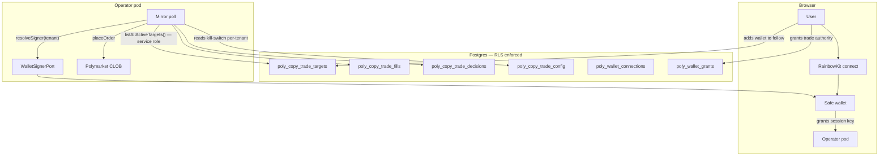

# Poly Multi-Tenant Auth — Tracked Wallets, Actor Wallets, Grants & RLS

> Tenant-isolated copy-trade. Each user manages their own list of wallets to mirror **and** owns the wallet that places trades. RLS enforces isolation at the database. A durable grant gates autonomous placement so the executor can run while the user is offline.

### Key References

|             |                                                                             |                                          |
| ----------- | --------------------------------------------------------------------------- | ---------------------------------------- |
| **Project** | [proj.poly-prediction-bot](../../work/projects/proj.poly-prediction-bot.md) | Roadmap and planning                     |
| **Task**    | [task.0318](../../work/items/task.0318.poly-wallet-multi-tenant-auth.md)    | Implementation phasing + checkpoints     |
| **Spec**    | [database-rls](./database-rls.md)                                           | RLS substrate this builds on             |
| **Spec**    | [tenant-connections](./tenant-connections.md)                               | Encrypted-credential pattern reused here |
| **Spec**    | [operator-wallet](./operator-wallet.md)                                     | Privy custody + intent-only API surface  |
| **Spec**    | [poly-copy-trade-phase1](./poly-copy-trade-phase1.md)                       | Single-tenant predecessor                |

## Goal

Define the contract for a multi-tenant Polymarket copy-trade system in which (a) each user records their own list of wallets to mirror, (b) each user owns the on-chain wallet that places those mirrored trades, and (c) autonomous placement runs under a durable, revocable grant when the user is offline — with PostgreSQL RLS as the structural enforcement layer.

## Non-Goals

- BYO raw private keys (user-supplied EOAs without HSM / Safe). Custody is restricted to recognized signing backends (Safe + session keys, Privy, Turnkey).
- Multiple actor wallets per tenant. One active `poly_wallet_connections` row per `billing_account_id`.
- Mid-flight cancellation when a grant is revoked. Revocation halts **future** placements; in-flight orders complete.
- DAO-treasury-funded trading. Per-user wallets only — DAO treasury is a future, separate wallet kind.
- Migrating Phase-0 single-tenant prototype rows. They are dropped on the migration that introduces tenant columns.

## Design

### System overview

### Two layers, one tenancy model

| Layer               | Question it answers                                                                      | Source-of-truth table                            | Port                                                                                        |
| ------------------- | ---------------------------------------------------------------------------------------- | ------------------------------------------------ | ------------------------------------------------------------------------------------------- |
| **Tracked wallets** | "Which Polymarket wallets is this user mirroring?"                                       | `poly_copy_trade_targets`                        | `CopyTradeTargetSource` (already exists; today env-backed, lands DB-backed under this spec) |
| **Actor wallets**   | "Which on-chain wallet places this user's mirror trades, and who's authorized to do so?" | `poly_wallet_connections` + `poly_wallet_grants` | `WalletSignerPort` (new — abstracts Safe / Privy / Turnkey)                                 |

Both layers share the same tenant key: `billing_account_id`. RLS enforces isolation at the database; the executor is a thin orchestrator over the two ports.

### Signing backends — `WalletSignerPort` abstracts the choice

A single port `WalletSignerPort` is the only seam any backend speaks to. The executor never names a backend.

| Backend                                      | OSS       | Autonomous      | Connect UX                                                                                                                                                                     | Where it lives                                                                                                                                                                  |
| -------------------------------------------- | --------- | --------------- | ------------------------------------------------------------------------------------------------------------------------------------------------------------------------------ | ------------------------------------------------------------------------------------------------------------------------------------------------------------------------------- |
| **Safe + ERC-4337 session keys** (preferred) | ✅        | ✅ within scope | RainbowKit connect → user signs **one** meta-tx granting a session key scoped to (CTF approvals + USDC.e approvals + CLOB order signing), bounded by $/day + expiry, revocable | `WalletSignerPort` impl backed by Safe SDK + 4337 bundler                                                                                                                       |
| Privy per-user                               | ❌ closed | ✅              | Email / social login, custodial                                                                                                                                                | Same port, different impl. Locks Cogni to a closed dependency.                                                                                                                  |
| Turnkey                                      | partial   | ✅              | API-driven MPC                                                                                                                                                                 | Same port, different impl.                                                                                                                                                      |
| RainbowKit / wagmi alone                     | ✅        | ❌ popup per tx | Connect-wallet UI only                                                                                                                                                         | **Not a valid `WalletSignerPort` impl by itself** — every signature requires a browser popup. RainbowKit is used to bootstrap the Safe connection, not as an autonomous signer. |

> **`KEY_NEVER_IN_APP`** holds for every backend: raw key material lives in the HSM / Safe / MPC; the app stores only an opaque reference (`privy_wallet_id` / `safe_address` / `turnkey_subaccount_id`). Polymarket L2 API creds (`POLY_CLOB_*`) are AEAD-encrypted in `poly_wallet_connections.clob_api_key_ciphertext` per the [tenant-connections](./tenant-connections.md) envelope (AAD: `{billing_account_id, wallet_connection_id, "polymarket_clob"}`).

### Authorization model — three checks before `placeOrder`

For every mirror placement, the executor MUST in this order:

1. **Resolve the tenant**: `target.billing_account_id`. The tenant-scoped enumerator (a service-role read) is the only point that crosses tenant boundaries — it returns `(billing_account_id, target_wallet)` pairs across all tenants.
2. **Resolve the grant**: SELECT one `poly_wallet_grants` row WHERE `billing_account_id = $tenant AND revoked_at IS NULL AND (expires_at IS NULL OR expires_at > now()) AND $intent.scope = ANY(scopes)`. Missing → skip with `reason = no_active_grant`.
3. **Resolve the signer**: `walletSigner.resolve(grant.wallet_connection_id)` returns a `LocalAccount`-shaped signer. Failure → skip with `reason = signer_unavailable`.

Then `decide()` runs against `grant`-scoped caps (`per_order_usdc_cap`, `daily_usdc_cap`, `hourly_fills_cap`) — never against env vars or hardcoded constants.

### Schema

#### Tracked wallets

**Table:** `poly_copy_trade_targets`

| Column               | Type        | Constraints                                             | Description                                                                   |
| -------------------- | ----------- | ------------------------------------------------------- | ----------------------------------------------------------------------------- |
| `id`                 | uuid        | PK, default `gen_random_uuid()`                         |                                                                               |
| `billing_account_id` | text        | NOT NULL, FK → `billing_accounts(id)` ON DELETE CASCADE | Tenant boundary                                                               |
| `target_wallet`      | text        | NOT NULL, CHECK `target_wallet ~ '^0x[a-fA-F0-9]{40}$'` | Polymarket EOA being followed                                                 |
| `created_at`         | timestamptz | NOT NULL, DEFAULT `now()`                               |                                                                               |
| `created_by_user_id` | text        | NOT NULL, FK → `users(id)`                              | Audit                                                                         |
| `disabled_at`        | timestamptz | NULL                                                    | Soft delete (preferred over hard delete to preserve fill attribution history) |

Constraints:

- `UNIQUE (billing_account_id, target_wallet) WHERE disabled_at IS NULL` — one active row per (tenant, wallet)
- RLS: `USING (billing_account_id = current_setting('app.current_billing_account_id', true))`

> No per-target `enabled` flag, no per-target caps. Per-tenant `poly_copy_trade_config.enabled` is the kill-switch; caps come from `poly_wallet_grants`.

#### Per-tenant config

**Table:** `poly_copy_trade_config`

| Column               | Type        | Constraints                                       | Description                                                |
| -------------------- | ----------- | ------------------------------------------------- | ---------------------------------------------------------- |
| `billing_account_id` | text        | PK, FK → `billing_accounts(id)` ON DELETE CASCADE | Tenant boundary, replaces v0 `singleton_id`                |
| `enabled`            | boolean     | NOT NULL, DEFAULT `false`                         | Per-tenant kill-switch. **Default `false` (fail-closed).** |
| `updated_at`         | timestamptz | NOT NULL, DEFAULT `now()`                         |                                                            |

RLS: same policy. `app_service` role bypasses (used by the cross-tenant mirror enumerator).

#### Per-tenant outcomes

**Table:** `poly_copy_trade_fills`

| Column                 | Type        | Constraints                                  | Description                                                |
| ---------------------- | ----------- | -------------------------------------------- | ---------------------------------------------------------- |
| `id`                   | uuid        | PK                                           |                                                            |
| `billing_account_id`   | text        | NOT NULL, FK                                 | Tenant boundary                                            |
| `created_by_user_id`   | text        | NOT NULL, FK                                 | Attribution                                                |
| `target_id`            | uuid        | NOT NULL, FK → `poly_copy_trade_targets(id)` |                                                            |
| `wallet_connection_id` | uuid        | NOT NULL, FK → `poly_wallet_connections(id)` | Which actor wallet placed the trade                        |
| `client_order_id`      | text        | NOT NULL                                     | `keccak256(target_id + ':' + fill_id)` (preserved from v0) |
| `order_id`             | text        | NULL                                         | CLOB order id once placed                                  |
| `status`               | text        | NOT NULL                                     | `pending` / `placed` / `failed` / `filled` / `cancelled`   |
| `created_at`           | timestamptz | NOT NULL                                     |                                                            |

Same shape applies to `poly_copy_trade_decisions` (every coordinator outcome — placed/skipped/error — gets a row, per `RECORD_EVERY_DECISION` from [poly-copy-trade-phase1](./poly-copy-trade-phase1.md)). Both tables RLS-scoped by `billing_account_id`.

#### Actor wallets

**Table:** `poly_wallet_connections`

| Column                    | Type        | Constraints                                                    | Description                                                                                                                                      |
| ------------------------- | ----------- | -------------------------------------------------------------- | ------------------------------------------------------------------------------------------------------------------------------------------------ |
| `id`                      | uuid        | PK                                                             |                                                                                                                                                  |
| `billing_account_id`      | text        | NOT NULL, FK → `billing_accounts(id)` ON DELETE CASCADE        | Tenant boundary                                                                                                                                  |
| `backend`                 | text        | NOT NULL, CHECK `backend IN ('safe_4337', 'privy', 'turnkey')` | Which `WalletSignerPort` impl owns this row                                                                                                      |
| `address`                 | text        | NOT NULL                                                       | Checksummed EOA / Safe address                                                                                                                   |
| `chain_id`                | int         | NOT NULL                                                       | 137 (Polygon mainnet)                                                                                                                            |
| `backend_ref`             | text        | NOT NULL                                                       | Opaque ID into the backend (Privy `walletId` / Safe `address` / Turnkey `subaccount_id`)                                                         |
| `clob_api_key_ciphertext` | bytea       | NOT NULL                                                       | AEAD-encrypted Polymarket L2 creds. AAD: `{billing_account_id, wallet_connection_id, "polymarket_clob"}`                                         |
| `encryption_key_id`       | text        | NOT NULL                                                       | Per [tenant-connections](./tenant-connections.md) — versioned for rotation                                                                       |
| `allowance_state`         | jsonb       | NULL                                                           | Last on-chain allowance snapshot (Exchange + Neg-Risk Exchange + Neg-Risk Adapter for USDC.e, both Exchanges for CTF). Refreshed asynchronously. |
| `created_at`              | timestamptz | NOT NULL                                                       |                                                                                                                                                  |
| `created_by_user_id`      | text        | NOT NULL                                                       | Audit                                                                                                                                            |
| `last_used_at`            | timestamptz | NULL                                                           | Stale-wallet detection                                                                                                                           |
| `revoked_at`              | timestamptz | NULL                                                           | Soft delete                                                                                                                                      |
| `revoked_by_user_id`      | text        | NULL                                                           | Audit                                                                                                                                            |

Constraints:

- `UNIQUE (billing_account_id) WHERE revoked_at IS NULL` — one active wallet per tenant
- `address` per chain MUST appear in at most one un-revoked row globally (prevents two tenants binding to the same Safe)
- RLS: same policy

#### Trade-placement grants

**Table:** `poly_wallet_grants`

| Column                 | Type          | Constraints                                                    | Description                                            |
| ---------------------- | ------------- | -------------------------------------------------------------- | ------------------------------------------------------ |
| `id`                   | uuid          | PK                                                             |                                                        |
| `billing_account_id`   | text          | NOT NULL, FK                                                   | Tenant boundary (denormalized from connection for RLS) |
| `wallet_connection_id` | uuid          | NOT NULL, FK → `poly_wallet_connections(id)` ON DELETE CASCADE | Which actor wallet this grant authorizes               |
| `created_by_user_id`   | text          | NOT NULL, FK                                                   | Who issued the grant                                   |
| `scopes`               | text[]        | NOT NULL                                                       | e.g. `["poly:trade:buy", "poly:trade:sell"]`           |
| `per_order_usdc_cap`   | numeric(10,2) | NOT NULL                                                       |                                                        |
| `daily_usdc_cap`       | numeric(10,2) | NOT NULL                                                       |                                                        |
| `hourly_fills_cap`     | int           | NOT NULL                                                       |                                                        |
| `expires_at`           | timestamptz   | NULL                                                           | NULL = no expiry; recommend non-null in production     |
| `created_at`           | timestamptz   | NOT NULL                                                       |                                                        |
| `revoked_at`           | timestamptz   | NULL                                                           | Soft delete                                            |
| `revoked_by_user_id`   | text          | NULL                                                           | Audit                                                  |

RLS: same policy.

### Mirror enumerator — the only cross-tenant path

The autonomous 30s poll runs as a system process; it cannot operate inside a single user's RLS scope. Resolution: **one** read uses the `app_service` role to enumerate `(billing_account_id, target_wallet)` pairs across all tenants whose `poly_copy_trade_config.enabled = true`. Every subsequent operation runs under `SET LOCAL app.current_billing_account_id = $tenant` so RLS still enforces isolation for fills / decisions / config writes.

Per [database-rls](./database-rls.md) § `SERVICE_BYPASS_CONTAINED`: the service role's password lives in a separate env var the web runtime never sees.

## Invariants

| Rule                              | Constraint                                                                                                                                                                                                                                                                                                 |
| --------------------------------- | ---------------------------------------------------------------------------------------------------------------------------------------------------------------------------------------------------------------------------------------------------------------------------------------------------------- |
| TENANT_SCOPED_ROWS                | Every `poly_copy_trade_*` and `poly_wallet_*` table has `billing_account_id NOT NULL` + RLS policy `USING (billing_account_id = current_setting('app.current_billing_account_id', true))`. No row may exist without a tenant.                                                                              |
| GRANT_REQUIRED_FOR_PLACEMENT      | Executor MUST resolve an active, unrevoked, unexpired `poly_wallet_grants` row before invoking `walletSigner.placeOrder`. Missing grant → skip with `reason = no_active_grant`.                                                                                                                            |
| SCOPES_ENFORCED                   | A grant's `scopes` array gates the corresponding intent: `poly:trade:buy` for BUY, `poly:trade:sell` for SELL. Missing scope → skip with `reason = scope_missing`.                                                                                                                                         |
| PER_TENANT_KILL_SWITCH            | `poly_copy_trade_config.enabled` is per-`billing_account_id`. Flipping one tenant's row has zero effect on other tenants. Default-`false` is fail-closed.                                                                                                                                                  |
| CAPS_ENFORCED_PER_GRANT           | `decide()` reads `per_order_usdc_cap` / `daily_usdc_cap` / `hourly_fills_cap` from the resolved grant. Reading these from env vars or hardcoded constants is a violation.                                                                                                                                  |
| KEY_NEVER_IN_APP                  | No raw key material is ever stored in app DB or app memory. Only opaque backend references (`backend_ref`) and AEAD-encrypted L2 API creds.                                                                                                                                                                |
| SIGNING_BACKEND_PORTABLE          | Executor depends only on `WalletSignerPort`. Adding a new backend (Safe / Privy / Turnkey) is a new impl + a `backend` enum value — zero changes to the executor or the copy-trade coordinator.                                                                                                            |
| TARGET_SOURCE_TENANT_SCOPED       | `CopyTradeTargetSource.listTargets({ billingAccountId })` returns only that tenant's rows under `appDb` (RLS-enforced). The cross-tenant enumerator is a separate, explicitly named method (`listAllActive()`) that runs under `app_service` and is the **only** place that observes more than one tenant. |
| CROSS_TENANT_ISOLATION_TESTED     | An integration test with two distinct billing accounts proves user-A cannot SELECT, INSERT, UPDATE, or DELETE user-B's targets / connections / grants / fills / decisions / config via `appDb`.                                                                                                            |
| REVOCATION_HALTS_PLACEMENT        | Setting `poly_wallet_grants.revoked_at = now()` halts placement from the next poll cycle. In-flight orders complete; no new orders place. The skip is recorded in `poly_copy_trade_decisions` with `reason = no_active_grant`.                                                                             |
| FAIL_CLOSED_ON_DB_ERROR           | Any DB read failure during grant or config resolution treats the tenant as disabled (no placements). RLS denying-by-zero-rows counts as "disabled," not as an error to retry-and-place.                                                                                                                    |
| ONE_ACTIVE_WALLET_PER_TENANT      | `poly_wallet_connections` has at most one row per tenant where `revoked_at IS NULL`. Enforced by partial unique index.                                                                                                                                                                                     |
| ADDRESS_NOT_REUSED_ACROSS_TENANTS | A given `(chain_id, address)` appears in at most one un-revoked `poly_wallet_connections` row globally. Prevents two tenants binding to the same Safe.                                                                                                                                                     |

## File pointers

| File                                                                   | Purpose                                                                                                                                                                                    |
| ---------------------------------------------------------------------- | ------------------------------------------------------------------------------------------------------------------------------------------------------------------------------------------ |
| `nodes/poly/app/src/features/copy-trade/target-source.ts`              | `CopyTradeTargetSource` port. Today: `envTargetSource`. Lands a `dbTargetSource` impl under this spec.                                                                                     |
| `nodes/poly/app/src/features/wallet-signer/` (new)                     | `WalletSignerPort` + backend impls (`safe-4337-signer`, `privy-signer`, `turnkey-signer`).                                                                                                 |
| `nodes/poly/app/src/bootstrap/jobs/copy-trade-mirror.job.ts`           | Mirror poll. Iterates the cross-tenant enumerator, sets the per-tenant RLS context, calls the coordinator.                                                                                 |
| `nodes/poly/app/src/features/copy-trade/mirror-coordinator.ts`         | Adds grant + signer resolution to `runOnce` before `placeIntent`.                                                                                                                          |
| `packages/db-schema/src/poly/` (new files)                             | Drizzle schemas for `poly_copy_trade_targets`, `poly_wallet_connections`, `poly_wallet_grants`, plus migrations adding `billing_account_id` to `poly_copy_trade_{fills,decisions,config}`. |
| `packages/node-contracts/src/poly.copy-trade.targets.v1.contract.ts`   | Existing contract; adds POST + DELETE operations under this spec.                                                                                                                          |
| `nodes/poly/app/src/app/api/v1/poly/copy-trade/targets/route.ts`       | Existing GET route. Lands sibling POST + DELETE routes.                                                                                                                                    |
| `nodes/poly/app/src/app/api/v1/poly/wallet/connections/route.ts` (new) | CRUD for `poly_wallet_connections`.                                                                                                                                                        |
| `nodes/poly/app/src/app/api/v1/poly/wallet/grants/route.ts` (new)      | CRUD for `poly_wallet_grants`.                                                                                                                                                             |

## Acceptance Checks

| #   | Check                                                                                                                                                                                                                                           |
| --- | ----------------------------------------------------------------------------------------------------------------------------------------------------------------------------------------------------------------------------------------------- |
| 1   | Two-tenant integration test: user-A writes a target, fills/decisions accumulate. User-B SELECTs `poly_copy_trade_targets / fills / decisions / config / wallet_connections / grants` via `appDb` and sees zero rows for user-A.                 |
| 2   | `psql` smoke as `app_user`: `SET LOCAL app.current_billing_account_id = 'tenant-a'; INSERT INTO poly_copy_trade_targets (..., billing_account_id) VALUES (..., 'tenant-b');` is rejected by RLS (`new row violates row-level security policy`). |
| 3   | Per-tenant kill-switch: flip `poly_copy_trade_config.enabled = false` for tenant-A only; within one poll cycle (≤30s) tenant-A logs `poly.mirror.decision outcome=skipped reason=tenant_disabled`, tenant-B keeps placing.                      |
| 4   | Grant revocation: set `poly_wallet_grants.revoked_at = now()` on an active grant; the next poll cycle for that tenant logs `poly.mirror.decision outcome=skipped reason=no_active_grant`. No order is placed.                                   |
| 5   | Grant scope: a BUY-only grant rejects a SELL intent with `reason = scope_missing`.                                                                                                                                                              |
| 6   | Cap enforcement: a target whose `mirror_usdc` exceeds the grant's `per_order_usdc_cap` is skipped with `reason = cap_exceeded_per_order`. Day-two spending past `daily_usdc_cap` is skipped with `cap_exceeded_daily`.                          |
| 7   | Backend portability spike: a `WalletSignerPort` test double places an order without touching the executor. Replacing the impl with a Safe-4337 backed signer in a stack test places a real CLOB order against a Safe-controlled EOA.            |
| 8   | Address uniqueness: attempting to insert a second un-revoked `poly_wallet_connections` row with an existing `(chain_id, address)` is rejected by the partial unique index.                                                                      |
| 9   | `pnpm check` clean. `pnpm check:docs` clean. Drizzle `db:generate` produces zero drift against the new schema.                                                                                                                                  |

## Open Questions

- [ ] Bootstrap operator: keep a `system:poly-bootstrap` `billing_accounts` row for the existing PR #932 single-operator path, or hard-cut everything to real tenants on the migration? Default-leaning: bootstrap row + helper seed migration so dev / candidate-a flights keep working.
- [ ] Pre-existing Phase-0 rows in `poly_copy_trade_fills`: drop or backfill to `system:poly-bootstrap`?
- [ ] Per-tenant Prometheus labels (`billing_account_id` on `poly_mirror_decisions_total`): cardinality-safe, or hash / bucket? Coordinate with observability owner.
- [ ] Safe + 4337 spike: confirm session-key scope can be narrow enough to authorize **only** Polymarket Exchange + Neg-Risk Exchange + CTF approvals + CLOB order signing, and that the bundler cost is acceptable per fill ($1 mirror size has thin margin).
- [ ] Revocation during an active poll tick: best-effort cancel placed-but-unfilled orders, or pure halt-future-only? Default-leaning: halt-only; an explicit "emergency cancel" action is a separate UI affordance.

## Related

- [database-rls](./database-rls.md) — RLS substrate (`SET LOCAL`, dual roles, `app.current_user_id`). This spec extends to `app.current_billing_account_id`.
- [tenant-connections](./tenant-connections.md) — the credential-broker pattern reused for `poly_wallet_connections.clob_api_key_ciphertext`.
- [operator-wallet](./operator-wallet.md) — Privy custody + intent-only API surface; the existing single-operator pattern this spec generalizes.
- [poly-copy-trade-phase1](./poly-copy-trade-phase1.md) — single-tenant predecessor; `INSERT_BEFORE_PLACE`, `IDEMPOTENT_BY_CLIENT_ID`, `RECORD_EVERY_DECISION` carry forward.
- [system-tenant](./system-tenant.md) — how the system tenant fits alongside per-user tenants.
