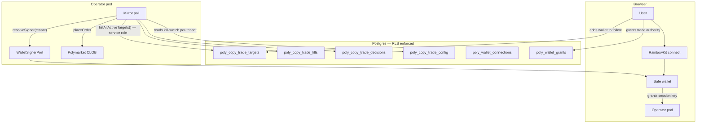

# Poly Multi-Tenant Auth — Tracked Wallets, Actor Wallets, Grants & RLS

> Tenant-isolated copy-trade. Each user manages their own list of wallets to mirror **and** owns the wallet that places trades. RLS enforces isolation at the database. A durable grant gates autonomous placement so the executor can run while the user is offline.

### Key References

|             |                                                                             |                                          |
| ----------- | --------------------------------------------------------------------------- | ---------------------------------------- |
| **Project** | [proj.poly-prediction-bot](../../work/projects/proj.poly-prediction-bot.md) | Roadmap and planning                     |
| **Task**    | [task.0318](../../work/items/task.0318.poly-wallet-multi-tenant-auth.md)    | Implementation phasing + checkpoints     |
| **Spec**    | [database-rls](./database-rls.md)                                           | RLS substrate this builds on             |
| **Spec**    | [tenant-connections](./tenant-connections.md)                               | Encrypted-credential pattern reused here |
| **Spec**    | [operator-wallet](./operator-wallet.md)                                     | Privy custody + intent-only API surface  |
| **Spec**    | [poly-copy-trade-phase1](./poly-copy-trade-phase1.md)                       | Single-tenant predecessor                |

## Goal

Define the contract for a multi-tenant Polymarket copy-trade system in which (a) each user records their own list of wallets to mirror, (b) each user owns the on-chain wallet that places those mirrored trades, and (c) autonomous placement runs under a durable, revocable grant when the user is offline — with PostgreSQL RLS as the structural enforcement layer.

## Non-Goals

- BYO raw private keys (user-pasted private keys backing a plain wallet, without HSM / Safe). Custody is restricted to recognized signing backends (Safe + session keys, Privy, Turnkey).
- Multiple actor wallets per tenant. One active `poly_wallet_connections` row per `billing_account_id`.
- Mid-flight cancellation when a grant is revoked. Revocation halts **future** placements; in-flight orders complete.
- DAO-treasury-funded trading. Per-user wallets only — DAO treasury is a future, separate wallet kind.
- Backfilling Phase-0 single-tenant prototype rows to a tenant. They are dropped by the migration that introduces tenant columns (see Decisions).

## Design

### System overview

### Two layers, one tenancy model

| Layer               | Question it answers                                                                      | Source-of-truth table                            | Port                                                                                        |
| ------------------- | ---------------------------------------------------------------------------------------- | ------------------------------------------------ | ------------------------------------------------------------------------------------------- |
| **Tracked wallets** | "Which Polymarket wallets is this user mirroring?"                                       | `poly_copy_trade_targets`                        | `CopyTradeTargetSource` (already exists; today env-backed, lands DB-backed under this spec) |
| **Actor wallets**   | "Which on-chain wallet places this user's mirror trades, and who's authorized to do so?" | `poly_wallet_connections` + `poly_wallet_grants` | `WalletSignerPort` (new — abstracts Safe / Privy / Turnkey)                                 |

Both layers share the same tenant boundary: `billing_account_id` is the **data column** that names the financial owner, but the **RLS policy keys on `created_by_user_id = current_setting('app.current_user_id', true)`** — the exact pattern shipped by [`connections`](./tenant-connections.md) (migration `0025_add_connections.sql`).

> **Why the split?** Today `billing_account` ↔ `user` is 1:1, so the two clamps are equivalent. The schema is forward-compatible with multi-user-per-account: when that ships, a `billing_account_members` join replaces the policy clause and `billing_account_id` becomes load-bearing. **App code MUST defense-in-depth verify `row.billing_account_id === expected.tenantId`** after the RLS-scoped SELECT — same pattern as `DrizzleConnectionBrokerAdapter.resolve()` (`adapters/server/connections/drizzle-broker.adapter.ts`). RLS is the structural floor; the app check catches misconfig + future RBAC drift.

The executor is a thin orchestrator over the two ports.

### Tenant resolution & bootstrap

| Caller                                                          | DB role                                           | RLS context                                                                                                                                                                                                                                                                                                                                                                                           |
| --------------------------------------------------------------- | ------------------------------------------------- | ----------------------------------------------------------------------------------------------------------------------------------------------------------------------------------------------------------------------------------------------------------------------------------------------------------------------------------------------------------------------------------------------------- |
| Authenticated HTTP route (CRUD on targets, connections, grants) | `app_user` (RLS enforced)                         | `withTenantScope(appDb, sessionUser.id, ...)` — uses existing helper from `@cogni/db-client/tenant-scope`                                                                                                                                                                                                                                                                                             |
| Mirror-poll cross-tenant enumerator                             | `app_service` (BYPASSRLS)                         | none — the enumerator returns `(billing_account_id, created_by_user_id, target_wallet)` triples and the **per-tenant inner loop** then opens a `withTenantScope(appDb, created_by_user_id, ...)` for fills/decisions/config writes                                                                                                                                                                    |
| Bootstrap operator (seed migration + dev / candidate-a flights) | `app_service` for the seed; `app_user` thereafter | `COGNI_SYSTEM_PRINCIPAL_USER_ID` (`00000000-0000-4000-a000-000000000001`) + `COGNI_SYSTEM_BILLING_ACCOUNT_ID` (`00000000-0000-4000-b000-000000000000`) per [system-tenant](./system-tenant.md). The seed migration inserts a `poly_copy_trade_config` row + (optionally) a `poly_copy_trade_targets` row owned by the system tenant so the existing single-operator candidate-a flight keeps working. |

### Signing backends — `WalletSignerPort` abstracts the choice

A single port `WalletSignerPort` is the only seam any backend speaks to. The executor never names a backend.

| Backend                                      | OSS       | Autonomous      | Connect UX                                                                                                                                                                     | Where it lives                                                                                                                                                                  |
| -------------------------------------------- | --------- | --------------- | ------------------------------------------------------------------------------------------------------------------------------------------------------------------------------ | ------------------------------------------------------------------------------------------------------------------------------------------------------------------------------- |
| **Safe + ERC-4337 session keys** (preferred) | ✅        | ✅ within scope | RainbowKit connect → user signs **one** meta-tx granting a session key scoped to (CTF approvals + USDC.e approvals + CLOB order signing), bounded by $/day + expiry, revocable | `WalletSignerPort` impl backed by Safe SDK + 4337 bundler                                                                                                                       |
| Privy per-user                               | ❌ closed | ✅              | Email / social login, custodial                                                                                                                                                | Same port, different impl. Locks Cogni to a closed dependency.                                                                                                                  |
| Turnkey                                      | partial   | ✅              | API-driven MPC                                                                                                                                                                 | Same port, different impl.                                                                                                                                                      |
| RainbowKit / wagmi alone                     | ✅        | ❌ popup per tx | Connect-wallet UI only                                                                                                                                                         | **Not a valid `WalletSignerPort` impl by itself** — every signature requires a browser popup. RainbowKit is used to bootstrap the Safe connection, not as an autonomous signer. |

> **`KEY_NEVER_IN_APP`** holds for every backend: raw signing-key material lives in the HSM / Safe / MPC; the app stores only an opaque `backend_ref` (`privy_wallet_id` / `safe_address` / `turnkey_subaccount_id`). Polymarket L2 API creds (api_key / api_secret / passphrase) are stored as a `connections` row with `provider = 'polymarket_clob'` and resolved via the existing `ConnectionBrokerPort` — same AEAD envelope, same `CONNECTIONS_ENCRYPTION_KEY` env, same AAD shape. No bespoke crypto in the poly node.

### Authorization model — three checks before `placeOrder`

For every mirror placement, the executor MUST in this order:

1. **Resolve the tenant**: `target.billing_account_id`. The tenant-scoped enumerator (a service-role read) is the only point that crosses tenant boundaries — it returns `(billing_account_id, target_wallet)` pairs across all tenants.
2. **Resolve the grant**: SELECT one `poly_wallet_grants` row WHERE `billing_account_id = $tenant AND revoked_at IS NULL AND (expires_at IS NULL OR expires_at > now()) AND $intent.scope = ANY(scopes)`. Missing → skip with `reason = no_active_grant`.
3. **Resolve the signer**: `walletSigner.resolve(grant.wallet_connection_id)` returns a `LocalAccount`-shaped signer. Failure → skip with `reason = signer_unavailable`.

Then `decide()` runs against `grant`-scoped caps (`per_order_usdc_cap`, `daily_usdc_cap`, `hourly_fills_cap`) — never against env vars or hardcoded constants.

### Schema

#### Tracked wallets

**Table:** `poly_copy_trade_targets`

| Column               | Type        | Constraints                                             | Description                                                                   |
| -------------------- | ----------- | ------------------------------------------------------- | ----------------------------------------------------------------------------- |
| `id`                 | uuid        | PK, default `gen_random_uuid()`                         |                                                                               |
| `billing_account_id` | text        | NOT NULL, FK → `billing_accounts(id)` ON DELETE CASCADE | Tenant boundary                                                               |
| `target_wallet`      | text        | NOT NULL, CHECK `target_wallet ~ '^0x[a-fA-F0-9]{40}$'` | Polymarket wallet address being followed                                      |
| `created_at`         | timestamptz | NOT NULL, DEFAULT `now()`                               |                                                                               |
| `created_by_user_id` | text        | NOT NULL, FK → `users(id)`                              | Audit                                                                         |
| `disabled_at`        | timestamptz | NULL                                                    | Soft delete (preferred over hard delete to preserve fill attribution history) |

Constraints:

- `UNIQUE (billing_account_id, target_wallet) WHERE disabled_at IS NULL` — one active row per (tenant, wallet)
- RLS: `USING (created_by_user_id = current_setting('app.current_user_id', true))` (matches `connections` policy)

> No per-target `enabled` flag, no per-target caps. Per-tenant `poly_copy_trade_config.enabled` is the kill-switch; caps come from `poly_wallet_grants`.

#### Per-tenant config

**Table:** `poly_copy_trade_config`

| Column               | Type        | Constraints                                       | Description                                                |
| -------------------- | ----------- | ------------------------------------------------- | ---------------------------------------------------------- |
| `billing_account_id` | text        | PK, FK → `billing_accounts(id)` ON DELETE CASCADE | Tenant boundary, replaces v0 `singleton_id`                |
| `enabled`            | boolean     | NOT NULL, DEFAULT `false`                         | Per-tenant kill-switch. **Default `false` (fail-closed).** |
| `updated_at`         | timestamptz | NOT NULL, DEFAULT `now()`                         |                                                            |

RLS: same policy. `app_service` role bypasses (used by the cross-tenant mirror enumerator).

#### Per-tenant outcomes

**Table:** `poly_copy_trade_fills`

| Column                 | Type        | Constraints                                  | Description                                                |
| ---------------------- | ----------- | -------------------------------------------- | ---------------------------------------------------------- |
| `id`                   | uuid        | PK                                           |                                                            |
| `billing_account_id`   | text        | NOT NULL, FK                                 | Tenant boundary                                            |
| `created_by_user_id`   | text        | NOT NULL, FK                                 | Attribution                                                |
| `target_id`            | uuid        | NOT NULL, FK → `poly_copy_trade_targets(id)` |                                                            |
| `wallet_connection_id` | uuid        | NOT NULL, FK → `poly_wallet_connections(id)` | Which actor wallet placed the trade                        |
| `client_order_id`      | text        | NOT NULL                                     | `keccak256(target_id + ':' + fill_id)` (preserved from v0) |
| `order_id`             | text        | NULL                                         | CLOB order id once placed                                  |
| `status`               | text        | NOT NULL                                     | `pending` / `placed` / `failed` / `filled` / `cancelled`   |
| `created_at`           | timestamptz | NOT NULL                                     |                                                            |

Same shape applies to `poly_copy_trade_decisions` (every coordinator outcome — placed/skipped/error — gets a row, per `RECORD_EVERY_DECISION` from [poly-copy-trade-phase1](./poly-copy-trade-phase1.md)). Both tables RLS-scoped by `billing_account_id`.

#### Actor wallets — wallet metadata + reused `connections` for L2 creds

> **Reuse over rebuild.** Polymarket L2 API creds (api_key + api_secret + passphrase) are a tenant-scoped credential — exactly the shape `connections` already handles. We add `polymarket_clob` to the existing provider CHECK list, store creds as a `connections` row, and reference it from `poly_wallet_connections`. **Zero new crypto code, zero new env var, zero new AAD shape.** The existing `DrizzleConnectionBrokerAdapter`, `aeadEncrypt`/`aeadDecrypt`, `CONNECTIONS_ENCRYPTION_KEY` (env), and `encryption_key_id` rotation column all transfer.

**Table:** `poly_wallet_connections` (wallet metadata only — no credentials)

| Column               | Type        | Constraints                                                                                                           | Description                                                                                                                                      |
| -------------------- | ----------- | --------------------------------------------------------------------------------------------------------------------- | ------------------------------------------------------------------------------------------------------------------------------------------------ |
| `id`                 | uuid        | PK                                                                                                                    |                                                                                                                                                  |
| `billing_account_id` | text        | NOT NULL, FK → `billing_accounts(id)` ON DELETE CASCADE                                                               | Tenant data column                                                                                                                               |
| `created_by_user_id` | text        | NOT NULL, FK → `users(id)`                                                                                            | RLS key + audit                                                                                                                                  |
| `backend`            | text        | NOT NULL, CHECK `backend IN ('safe_4337', 'privy', 'turnkey')`                                                        | Which `WalletSignerPort` impl owns this row                                                                                                      |
| `address`            | text        | NOT NULL                                                                                                              | Checksummed wallet address (plain wallet or Safe)                                                                                                |
| `chain_id`           | int         | NOT NULL                                                                                                              | 137 (Polygon mainnet)                                                                                                                            |
| `backend_ref`        | text        | NOT NULL                                                                                                              | Opaque ID into the backend (Privy `walletId` / Safe `address` / Turnkey `subaccount_id`)                                                         |
| `clob_connection_id` | uuid        | NOT NULL, FK → `connections(id)` ON DELETE RESTRICT, CHECK `provider = 'polymarket_clob'` (enforced by app + trigger) | Foreign key to the `connections` row holding L2 creds. The `connections` row's own RLS + AEAD envelope handles credential storage.               |
| `allowance_state`    | jsonb       | NULL                                                                                                                  | Last on-chain allowance snapshot (Exchange + Neg-Risk Exchange + Neg-Risk Adapter for USDC.e, both Exchanges for CTF). Refreshed asynchronously. |
| `created_at`         | timestamptz | NOT NULL                                                                                                              |                                                                                                                                                  |
| `last_used_at`       | timestamptz | NULL                                                                                                                  | Stale-wallet detection                                                                                                                           |
| `revoked_at`         | timestamptz | NULL                                                                                                                  | Soft delete                                                                                                                                      |
| `revoked_by_user_id` | text        | NULL                                                                                                                  | Audit                                                                                                                                            |

Constraints:

- `UNIQUE (billing_account_id) WHERE revoked_at IS NULL` — one active wallet per tenant
- `address` per `chain_id` MUST appear in at most one un-revoked row globally (prevents two tenants binding to the same Safe)
- RLS: `created_by_user_id = current_setting('app.current_user_id', true)`

**Reused: `connections` table** (one row per tenant with `provider = 'polymarket_clob'`)

- Add `'polymarket_clob'` to the `connections_provider_check` CHECK list (single migration on `packages/db-schema/src/connections.ts`).
- Credential blob shape (encrypted): `{ apiKey: string, apiSecret: string, passphrase: string }`.
- AAD: `{ billing_account_id, connection_id, provider: "polymarket_clob" }` — already the existing `AeadAAD` shape (see `packages/node-shared/src/crypto/aead.ts`).
- Encryption key: `CONNECTIONS_ENCRYPTION_KEY` env (already required for BYO-AI). No new env var.
- Resolution: `connectionBroker.resolve(clobConnectionId, { actorId, tenantId })` returns the decrypted blob. The broker's existing tenant-verification and refresh-locking apply unchanged.

#### Trade-placement grants

**Table:** `poly_wallet_grants`

| Column                 | Type          | Constraints                                                    | Description                                            |
| ---------------------- | ------------- | -------------------------------------------------------------- | ------------------------------------------------------ |
| `id`                   | uuid          | PK                                                             |                                                        |
| `billing_account_id`   | text          | NOT NULL, FK                                                   | Tenant boundary (denormalized from connection for RLS) |
| `wallet_connection_id` | uuid          | NOT NULL, FK → `poly_wallet_connections(id)` ON DELETE CASCADE | Which actor wallet this grant authorizes               |
| `created_by_user_id`   | text          | NOT NULL, FK                                                   | Who issued the grant                                   |
| `scopes`               | text[]        | NOT NULL                                                       | e.g. `["poly:trade:buy", "poly:trade:sell"]`           |
| `per_order_usdc_cap`   | numeric(10,2) | NOT NULL                                                       |                                                        |
| `daily_usdc_cap`       | numeric(10,2) | NOT NULL                                                       |                                                        |
| `hourly_fills_cap`     | int           | NOT NULL                                                       |                                                        |
| `expires_at`           | timestamptz   | NULL                                                           | NULL = no expiry; recommend non-null in production     |
| `created_at`           | timestamptz   | NOT NULL                                                       |                                                        |
| `revoked_at`           | timestamptz   | NULL                                                           | Soft delete                                            |
| `revoked_by_user_id`   | text          | NULL                                                           | Audit                                                  |

RLS: same policy.

### Mirror enumerator — the only cross-tenant path

The autonomous 30s poll runs as a system process; it cannot operate inside a single user's RLS scope. Resolution: **one** read uses the `app_service` role to enumerate `(billing_account_id, target_wallet)` pairs across all tenants whose `poly_copy_trade_config.enabled = true`. Every subsequent operation runs under `SET LOCAL app.current_billing_account_id = $tenant` so RLS still enforces isolation for fills / decisions / config writes.

Per [database-rls](./database-rls.md) § `SERVICE_BYPASS_CONTAINED`: the service role's password lives in a separate env var the web runtime never sees.

## Invariants

| Rule                                  | Constraint                                                                                                                                                                                                                                                                                                                                                                                                                                                                                                                                                                                                                                                                                                                              |
| ------------------------------------- | --------------------------------------------------------------------------------------------------------------------------------------------------------------------------------------------------------------------------------------------------------------------------------------------------------------------------------------------------------------------------------------------------------------------------------------------------------------------------------------------------------------------------------------------------------------------------------------------------------------------------------------------------------------------------------------------------------------------------------------- |
| TENANT_SCOPED_ROWS                    | Every `poly_copy_trade_*` and `poly_wallet_*` table has `billing_account_id NOT NULL` (data column, FK → `billing_accounts(id)` ON DELETE CASCADE) + `created_by_user_id NOT NULL` (RLS key, FK → `users(id)`) + RLS policy `USING (created_by_user_id = current_setting('app.current_user_id', true)) WITH CHECK (...)`. Mirrors `connections` migration `0025_add_connections.sql`. No row may exist without both.                                                                                                                                                                                                                                                                                                                    |
| TENANT_DEFENSE_IN_DEPTH               | After every RLS-scoped SELECT, app code verifies `row.billing_account_id === expected.tenantId`. Mirrors `DrizzleConnectionBrokerAdapter.resolve()` defense check. RLS is the structural floor; the app check catches misconfig and future multi-user-per-account RBAC drift.                                                                                                                                                                                                                                                                                                                                                                                                                                                           |
| GRANT_REQUIRED_FOR_PLACEMENT          | Executor MUST resolve an active, unrevoked, unexpired `poly_wallet_grants` row before invoking `walletSigner.placeOrder`. Missing grant → skip with `reason = no_active_grant`.                                                                                                                                                                                                                                                                                                                                                                                                                                                                                                                                                         |
| SCOPES_ENFORCED                       | A grant's `scopes` array gates the corresponding intent: `poly:trade:buy` for BUY, `poly:trade:sell` for SELL. Missing scope → skip with `reason = scope_missing`.                                                                                                                                                                                                                                                                                                                                                                                                                                                                                                                                                                      |
| PER_TENANT_KILL_SWITCH                | `poly_copy_trade_config.enabled` is per-`billing_account_id`. Flipping one tenant's row has zero effect on other tenants. Default-`false` is fail-closed.                                                                                                                                                                                                                                                                                                                                                                                                                                                                                                                                                                               |
| CAPS_ENFORCED_PER_GRANT               | `decide()` reads `per_order_usdc_cap` / `daily_usdc_cap` / `hourly_fills_cap` from the resolved grant. Reading these from env vars or hardcoded constants is a violation.                                                                                                                                                                                                                                                                                                                                                                                                                                                                                                                                                               |
| KEY_NEVER_IN_APP                      | No raw key material is ever stored in app DB or app memory. Only opaque backend references (`backend_ref`) and AEAD-encrypted L2 API creds.                                                                                                                                                                                                                                                                                                                                                                                                                                                                                                                                                                                             |
| SIGNING_BACKEND_PORTABLE              | Executor depends only on `WalletSignerPort`. Adding a new backend (Safe / Privy / Turnkey) is a new impl + a `backend` enum value — zero changes to the executor or the copy-trade coordinator.                                                                                                                                                                                                                                                                                                                                                                                                                                                                                                                                         |
| TARGET_SOURCE_TENANT_SCOPED           | `CopyTradeTargetSource.listTargets({ billingAccountId })` returns only that tenant's rows under `appDb` (RLS-enforced). The cross-tenant enumerator is a separate, explicitly named method (`listAllActive()`) that runs under `app_service` and is the **only** place that observes more than one tenant.                                                                                                                                                                                                                                                                                                                                                                                                                              |
| CONFIG_ROW_AUTO_ENABLED_ON_FIRST_POST | `POST /api/v1/poly/copy-trade/targets` upserts `poly_copy_trade_config { enabled: true }` for the calling tenant inside the same `withTenantScope(appDb, actorId, ...)` block that inserts the target. Semantics: `ON CONFLICT (billing_account_id) DO NOTHING` — an existing row (including a user-disabled one) is never overwritten. Rationale: POSTing a tracked wallet IS the explicit opt-in intent. The DB default (`enabled=false`) remains the fail-closed safety net for bare-migrated tenants that never expressed intent.                                                                                                                                                                                                   |
| POLL_RECONCILES_PER_TICK              | The mirror-poll enumerator runs `CopyTradeTargetSource.listAllActive()` on every tick (30s cadence), not once at container boot. A reconciler diffs the returned set against a `Map<(billingAccountId, targetWallet), MirrorJobStopFn>`: `start` for newly-active targets, stored stop-fn invoked for removed targets. Mid-flight POSTs/DELETEs are reflected in ≤30s without a pod restart. Per-tick emission: `poly.mirror.reconcile.tick { active_targets, added, removed, total_running }`.                                                                                                                                                                                                                                         |
| CROSS_TENANT_ISOLATION_TESTED         | An integration test with two distinct billing accounts proves user-A cannot SELECT, INSERT, UPDATE, or DELETE user-B's targets / connections / grants / fills / decisions / config via `appDb`.                                                                                                                                                                                                                                                                                                                                                                                                                                                                                                                                         |
| REVOCATION_HALTS_PLACEMENT            | Setting `poly_wallet_grants.revoked_at = now()` halts placement from the next poll cycle. In-flight orders complete; no new orders place. The skip is recorded in `poly_copy_trade_decisions` with `reason = no_active_grant`.                                                                                                                                                                                                                                                                                                                                                                                                                                                                                                          |
| FAIL_CLOSED_ON_DB_ERROR               | Any DB read failure during grant or config resolution treats the tenant as disabled (no placements). RLS denying-by-zero-rows counts as "disabled," not as an error to retry-and-place.                                                                                                                                                                                                                                                                                                                                                                                                                                                                                                                                                 |
| ONE_ACTIVE_WALLET_PER_TENANT          | `poly_wallet_connections` has at most one row per tenant where `revoked_at IS NULL`. Enforced by partial unique index.                                                                                                                                                                                                                                                                                                                                                                                                                                                                                                                                                                                                                  |
| ADDRESS_NOT_REUSED_ACROSS_TENANTS     | A given `(chain_id, address)` appears in at most one un-revoked `poly_wallet_connections` row globally. Prevents two tenants binding to the same Safe.                                                                                                                                                                                                                                                                                                                                                                                                                                                                                                                                                                                  |
| CLOB_BOUND_TO_WALLET                  | Polymarket CLOB credentials (`apiKey` / `apiSecret` / `passphrase`) are derived from an EIP-712 signature by the wallet that owns them — Polymarket enforces 1:1 binding between a credset and its signing wallet. `poly_wallet_connections.clob_connection_id` MUST reference a `connections` row whose creds were derived from the same wallet address as `poly_wallet_connections.address`. Sharing one CLOB credset across multiple `poly_wallet_connections` rows is forbidden by Polymarket itself, not just by us. **Consequence**: Phase A (one shared operator wallet) has one CLOB credset; Phase B (per-user wallets) has one CLOB credset per user. There is no "one company-wide CLOB" option once multiple wallets exist. |

## File pointers

**Shipped (Phase A):**

| File                                                                                    | Purpose                                                                                                                                                                                                                |
| --------------------------------------------------------------------------------------- | ---------------------------------------------------------------------------------------------------------------------------------------------------------------------------------------------------------------------- |
| `nodes/poly/app/src/adapters/server/db/migrations/0029_poly_copy_trade_multitenant.sql` | Migration adding `billing_account_id` + `created_by_user_id` columns + RLS `tenant_isolation` policy to `poly_copy_trade_{fills,decisions,config}`; creates `poly_copy_trade_targets`; seeds system-tenant config row. |
| `nodes/poly/packages/db-schema/src/copy-trade.ts`                                       | Drizzle schemas for the four tables above. Exports `polyCopyTradeTargets`, `polyCopyTradeFills`, `polyCopyTradeConfig`, `polyCopyTradeDecisions`.                                                                      |
| `nodes/poly/app/src/features/copy-trade/target-source.ts`                               | `CopyTradeTargetSource` port with `listForActor` (RLS via appDb) + `listAllActive` (BYPASSRLS via serviceDb). `envTargetSource` and `dbTargetSource` impls.                                                            |
| `nodes/poly/app/src/features/copy-trade/types.ts`                                       | `TargetConfig` carries `billing_account_id` + `created_by_user_id` so the coordinator inherits tenant on every fills/decisions write.                                                                                  |
| `nodes/poly/app/src/features/trading/order-ledger.ts` + `.types.ts`                     | `OrderLedger` — `snapshotState(target_id, billing_account_id)` reads the per-tenant config; `insertPending` + `recordDecision` inputs extend `TenantBinding`.                                                          |
| `nodes/poly/app/src/bootstrap/container.ts`                                             | Wires `dbTargetSource` in production, empty `envTargetSource` in test. Mirror poll iterates `listAllActive` → per-tenant attribution.                                                                                  |
| `packages/node-contracts/src/poly.copy-trade.targets.v1.contract.ts`                    | Three operations: list + create + delete. All RLS-scoped.                                                                                                                                                              |
| `nodes/poly/app/src/app/api/v1/poly/copy-trade/targets/route.ts`                        | `GET` (per-user list) + `POST` (create, with app-side tenant defense-in-depth).                                                                                                                                        |
| `nodes/poly/app/src/app/api/v1/poly/copy-trade/targets/[id]/route.ts`                   | `DELETE /:id` — soft-delete via RLS-clamped UPDATE.                                                                                                                                                                    |
| `nodes/poly/app/src/app/(app)/dashboard/_components/TopWalletsCard.tsx`                 | +/− mutations + pooled-execution disclaimer banner.                                                                                                                                                                    |
| `nodes/poly/app/tests/component/copy-trade/db-target-source.int.test.ts`                | Two-tenant RLS / kill-switch / soft-delete / attribution integration tests.                                                                                                                                            |
| `scripts/experiments/poly-rls-smoke.sh`                                                 | Manual psql smoke reproducing acceptance check #2.                                                                                                                                                                     |

**Pending (Phase B):**

| File                                                                   | Purpose                                                                                                                                                                 |
| ---------------------------------------------------------------------- | ----------------------------------------------------------------------------------------------------------------------------------------------------------------------- |
| `nodes/poly/app/src/features/wallet-signer/` (new)                     | `WalletSignerPort` + backend impls (`safe-4337-signer`, `privy-signer`, `turnkey-signer`).                                                                              |
| `nodes/poly/packages/db-schema/src/wallet-connections.ts` (new)        | Drizzle schemas for `poly_wallet_connections` + `poly_wallet_grants`. Credential storage reuses the existing `connections` table with a new provider `polymarket_clob`. |
| `nodes/poly/app/src/app/api/v1/poly/wallet/connections/route.ts` (new) | CRUD for `poly_wallet_connections`.                                                                                                                                     |
| `nodes/poly/app/src/app/api/v1/poly/wallet/grants/route.ts` (new)      | CRUD for `poly_wallet_grants`.                                                                                                                                          |

## Acceptance Checks

| #   | Phase | Status | Check                                                                                                                                                                                                                                                                                                                                                       |
| --- | ----- | ------ | ----------------------------------------------------------------------------------------------------------------------------------------------------------------------------------------------------------------------------------------------------------------------------------------------------------------------------------------------------------- |
| 1   | A     | ✅     | Two-tenant integration test: user-A writes a target, fills/decisions accumulate. User-B SELECTs `poly_copy_trade_targets / fills / decisions / config` via `appDb` and sees zero rows for user-A. Covered by `tests/component/copy-trade/db-target-source.int.test.ts`.                                                                                     |
| 2   | A     | ✅     | `psql` smoke as `app_user`: `SET LOCAL app.current_user_id = '<userA-uuid>'; INSERT INTO poly_copy_trade_targets (..., created_by_user_id) VALUES (..., '<userB-uuid>');` is rejected by `WITH CHECK`. `scripts/experiments/poly-rls-smoke.sh`.                                                                                                             |
| 2b  | A     | ✅     | App defense-in-depth: after every RLS-scoped SELECT the route verifies `row.billing_account_id === expected.tenantId`. `POST /api/v1/poly/copy-trade/targets` logs a security warning + rejects on mismatch.                                                                                                                                                |
| 3   | A     | ✅     | Per-tenant kill-switch: flipping tenant-A's `poly_copy_trade_config.enabled = false` drops only tenant-A's rows from `listAllActive`; tenant-B unaffected. Covered by `db-target-source.int.test.ts` "per-tenant kill-switch".                                                                                                                              |
| 4   | B     | ⏳     | Grant revocation: set `poly_wallet_grants.revoked_at = now()` on an active grant; the next poll cycle for that tenant logs `poly.mirror.decision outcome=skipped reason=no_active_grant`. No order is placed.                                                                                                                                               |
| 5   | B     | ⏳     | Grant scope: a BUY-only grant rejects a SELL intent with `reason = scope_missing`.                                                                                                                                                                                                                                                                          |
| 6   | B     | ⏳     | Cap enforcement: a target whose `mirror_usdc` exceeds the grant's `per_order_usdc_cap` is skipped with `reason = cap_exceeded_per_order`. Day-two spending past `daily_usdc_cap` is skipped with `cap_exceeded_daily`.                                                                                                                                      |
| 7   | B     | ⏳     | Backend portability spike: a `WalletSignerPort` test double places an order without touching the executor. Replacing the impl with a Safe-4337 backed signer in a stack test places a real CLOB order against a Safe-controlled wallet.                                                                                                                     |
| 8   | B     | ⏳     | Address uniqueness: attempting to insert a second un-revoked `poly_wallet_connections` row with an existing `(chain_id, address)` is rejected by the partial unique index.                                                                                                                                                                                  |
| 9   | A     | ✅     | `pnpm check:fast` clean. `pnpm check:docs` clean.                                                                                                                                                                                                                                                                                                           |
| 10  | A     | ⏳     | **New-user end-to-end (bug.0338 fix).** Freshly-registered tenant with no pre-seeded config POSTs a `target_wallet` via `/api/v1/poly/copy-trade/targets`. Within ≤60s the mirror pod emits `poly.mirror.poll.singleton_claim` for that wallet under the tenant's `billing_account_id`, with no intervening pod boot event. Proven on candidate-a via Loki. |

## Phase A scope clarification — what RLS does and doesn't prove

`task.0318` ships a Phase A intermediate where **tracked-wallet records are tenant-scoped, but the actor wallet (the shared operator wallet) and its on-chain USDC + positions are still shared**. The dashboard renders a disclaimer; the spec pins the test boundary so isolation tests don't assert what RLS can't deliver.

| What Phase A guarantees                                                                         | What Phase A does NOT guarantee                                                        |
| ----------------------------------------------------------------------------------------------- | -------------------------------------------------------------------------------------- |
| `poly_copy_trade_targets` rows isolated per `created_by_user_id` (RLS)                          | On-chain USDC balance per user (single shared wallet)                                  |
| `poly_copy_trade_fills` / `_decisions` / `_config` rows isolated per `created_by_user_id` (RLS) | Per-user CTF positions (operator wallet holds them all)                                |
| User-A cannot SELECT, INSERT, UPDATE, or DELETE user-B's tracked-wallet rows via `appDb`        | Per-user P&L attribution from on-chain state                                           |
| App-side defense-in-depth catches RLS bypass / multi-user-future drift                          | Per-user spend caps (caps are still operator-wide via the existing job-shim hardcodes) |

**Phase A test contract:** A8 isolation tests assert **row-level isolation only**. They MUST NOT assert "user-A's USDC balance differs from user-B's" or "user-B's CTF positions are unaffected by user-A's mirror." Those isolations require Phase B's per-user `WalletSignerPort` impl — pinning them in Phase A would be testing for an illusion.

## Phase B escalation criteria — Safe-vs-Privy fallback

The Phase B detailed design follows a timeboxed (2-day) **B1 spike** on Safe + ERC-4337 session keys. To prevent the spike from quietly graduating Privy-per-user via timebox expiry, the spec pins the escalation conditions before the spike begins.

**Spike succeeds** (commit to Safe + 4337) iff ALL of the following hold:

1. A user can grant a session key from a Safe (connected via RainbowKit) that is **scoped to exactly** Polymarket Exchange (`0x4bFb…982E`) + Neg-Risk Exchange (`0xC5d5…f80a`) + Neg-Risk Adapter (`0xd91E…5296`) + CTF (`0x4D97…6045`) + CLOB order signing — no broader contract-call surface.
2. The session key can place a CLOB BUY + SELL from the operator pod with no user-in-the-loop.
3. Bundler cost per fill is ≤ **$0.10** at $1 mirror size (10% margin ceiling). If higher, the economics don't survive prototype scale; spike fails on cost grounds.
4. Revocation by the user invalidates the session key within ≤ 5 minutes (validated by attempting placement after revoke).
5. Session-key expiry can be set with day-granularity and is enforced by the bundler / Safe module.

**Spike fails → Privy-per-user is NOT the automatic fallback.** A failed spike triggers an explicit go/no-go review with the open options being (a) Turnkey, (b) Privy-per-user, (c) re-spike Safe with a relaxed scope (e.g., wider contract allowlist + tighter $/day cap). Privy is the **last** option, not the default, because shipping it locks Cogni to a closed-source dependency and meaningfully delays B-phase OSS-alignment work later.

**Default-deny on timebox expiry**: if the 2-day timebox elapses without a clean pass on all five criteria, the spike is treated as failed for the purposes of this gate.

## Decisions (resolved 2026-04-19 at `/design`)

| Question                                                            | Decision                                                                                                                                                                                                                                                                                                                                                                            | Rationale                                                                                                                                                                                                                                                                                                            |
| ------------------------------------------------------------------- | ----------------------------------------------------------------------------------------------------------------------------------------------------------------------------------------------------------------------------------------------------------------------------------------------------------------------------------------------------------------------------------- | -------------------------------------------------------------------------------------------------------------------------------------------------------------------------------------------------------------------------------------------------------------------------------------------------------------------- |
| Bootstrap operator                                                  | Reuse `COGNI_SYSTEM_PRINCIPAL_USER_ID` + `COGNI_SYSTEM_BILLING_ACCOUNT_ID` from [system-tenant](./system-tenant.md). The same migration that creates `poly_copy_trade_targets` seeds one row owned by the system tenant + one `poly_copy_trade_config` row with `enabled = true`.                                                                                                   | Avoids inventing a new `system:poly-bootstrap` ID. The system tenant is already the canonical "no human owner" identity in the codebase. Dev / candidate-a flights run as the system tenant; real users are layered on top.                                                                                          |
| Pre-existing Phase-0 rows in `poly_copy_trade_fills` / `_decisions` | **Drop** in the migration.                                                                                                                                                                                                                                                                                                                                                          | Prototype debris, no production users (pre-PR-#932). Backfill is engineering time spent on data with no readers.                                                                                                                                                                                                     |
| Per-tenant Prometheus labels                                        | **Do not add `billing_account_id` as a Prometheus label.** Aggregate counters stay across-tenant (`poly_mirror_decisions_total{outcome, reason, source}`). Per-tenant slicing comes from Pino JSON → Loki query.                                                                                                                                                                    | Tenant cardinality is unbounded; adding it as a label is a known anti-pattern. Loki is the correct slice layer.                                                                                                                                                                                                      |
| Revocation during an active poll tick                               | **Halt-future-only.** Setting `revoked_at` halts placement from the next coordinator tick; in-flight orders complete. Cancellation is a separate explicit "emergency cancel" UI affordance, out of scope here.                                                                                                                                                                      | Cancellation logic introduces failure modes (CLOB-side race conditions, partial-fill ambiguity) that aren't worth bundling with the auth contract. Revocation is about future authority, not undoing the past.                                                                                                       |
| Safe + 4337 spike scope                                             | Defer detailed design until after the **B1 spike** (timeboxed in [task.0318](../../work/items/task.0318.poly-wallet-multi-tenant-auth.md)). Phase B's signing-backend invariants in this spec hold regardless of which backend(s) ship; concrete schema for `poly_wallet_connections.backend_ref` and `poly_wallet_grants` lands in a spec-bump after the spike.                    | The Phase A contract (tracked-wallet RLS over the existing shared operator wallet) does not depend on Phase B's backend choice and can ship independently.                                                                                                                                                           |
| POST-as-opt-in vs explicit toggle                                   | **POST is the opt-in.** POST `/targets` upserts `poly_copy_trade_config { enabled: true }` for the calling tenant (`ON CONFLICT DO NOTHING`). DB default stays `false` as a fail-closed safety net. A separate `PATCH /config` toggle endpoint is deliberately not shipped in Phase A — filed as a follow-up only if a user asks for pause-without-delete UX. (bug.0338 § Rejected) | One-click "add wallet and go" matches the prototype UX. The alternative (require a second click to enable) adds friction for zero correctness gain when the user has already expressed intent via POST. Existing disabled rows are preserved, so a future toggle endpoint composes cleanly without behaviour change. |
| Mirror enumerator cadence                                           | **Reconcile per tick**, not per boot. A 30s `setInterval` calls `listAllActive()` and diffs against a `Map<key, MirrorJobStopFn>`. This bug's correctness fix (ref bug.0338). task.0332 replaces the N-setIntervals shape with a single shared batched poller — orthogonal scale problem, stays queued for Phase 3.                                                                 | Boot-time enumeration drops all mid-flight POSTs until a pod restart — unusable for real users. A per-tick reconciler is ≤40 LOC, reuses `MirrorJobStopFn`, and leaves task.0332's scale work unblocked.                                                                                                             |

## Related

- [database-rls](./database-rls.md) — RLS substrate (`SET LOCAL`, dual roles, `app.current_user_id`). This spec extends to `app.current_billing_account_id`.
- [tenant-connections](./tenant-connections.md) — the credential-broker pattern reused for `poly_wallet_connections.clob_api_key_ciphertext`.
- [operator-wallet](./operator-wallet.md) — Privy custody + intent-only API surface; the existing single-operator pattern this spec generalizes.
- [poly-copy-trade-phase1](./poly-copy-trade-phase1.md) — single-tenant predecessor; `INSERT_BEFORE_PLACE`, `IDEMPOTENT_BY_CLIENT_ID`, `RECORD_EVERY_DECISION` carry forward.
- [system-tenant](./system-tenant.md) — how the system tenant fits alongside per-user tenants.
