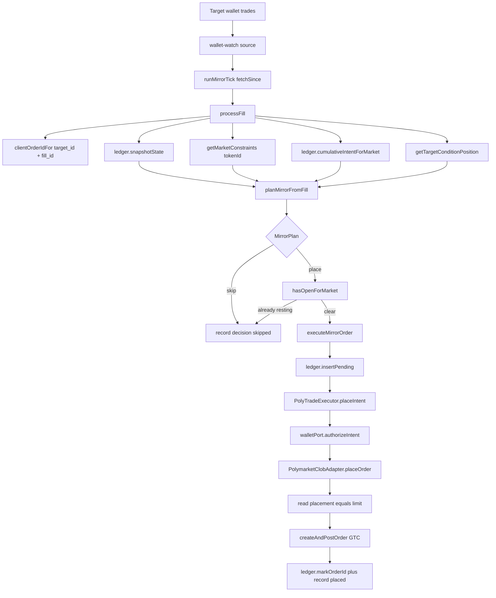
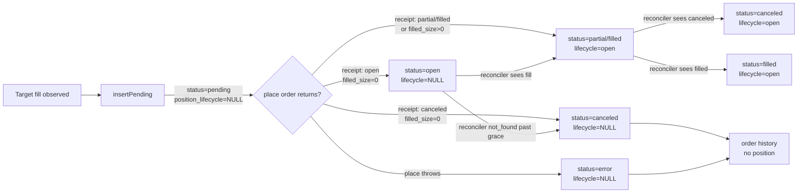
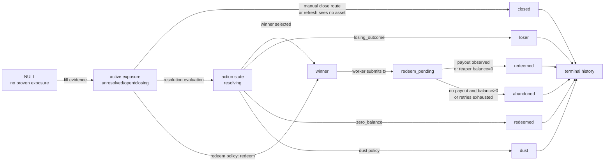
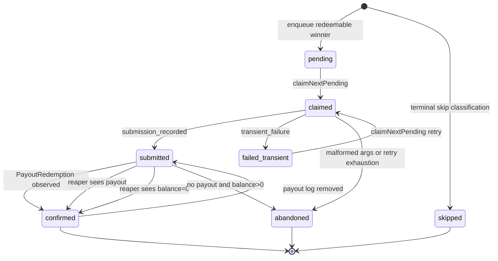
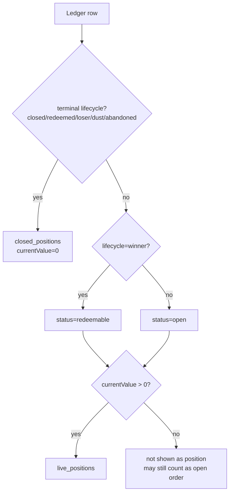
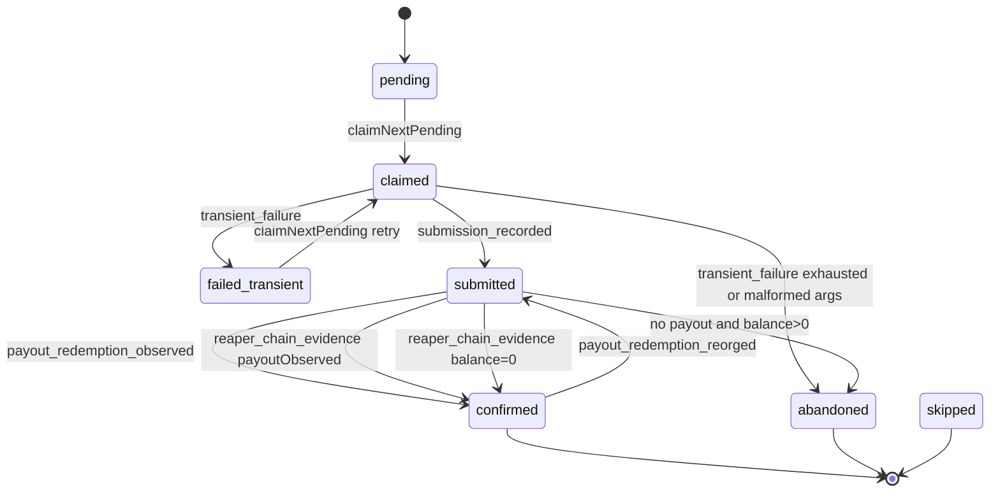

# Poly Order And Position Lifecycle

## Goal

Define one shared, typed model for poly order rows, wallet position exposure,
and redeem jobs so code reviews can reason about task.5006 without re-deriving
state from route behavior.

## Non-Goals

- Define Polymarket's external CLOB state machine beyond the statuses we store.
- Define market-resolution policy internals; that lives in
  `nodes/poly/packages/market-provider/src/policy/redeem.ts`.
- Define portfolio PnL math or historical valuation.
- Replace the existing redeem job state machine in
  `nodes/poly/app/src/core/redeem/transitions.ts`.

## Invariants

- `poly_copy_trade_fills.status` is order state, not position state.
- `poly_copy_trade_fills.position_lifecycle` is asset-scoped by
  `attributes.token_id`.
- `poly_redeem_jobs.status` is transaction job state; `lifecycle_state` is the
  redeem pipeline's projection into position lifecycle.
- A `canceled` or `error` order can still have position exposure when it has
  filled size or later typed lifecycle evidence.
- Terminal position lifecycles are never reopened by stale CLOB refresh.
- Redeem writes must use `positionId`/`token_id`, not `conditionId`, because
  one condition has multiple outcome assets.

## Design

Poly tracks three related but different state machines:

| Axis       | DB field                                        | Meaning                                                                             | Authority                                    |
| ---------- | ----------------------------------------------- | ----------------------------------------------------------------------------------- | -------------------------------------------- |
| Order      | `poly_copy_trade_fills.status`                  | What happened to the CLOB order row.                                                | CLOB receipt/reconciler                      |
| Position   | `poly_copy_trade_fills.position_lifecycle`      | Whether the wallet currently has or had exposure for a specific asset.              | Ledger writers, close/refresh, redeem mirror |
| Redeem job | `poly_redeem_jobs.status` and `lifecycle_state` | Whether a redeem transaction has been enqueued, submitted, confirmed, or abandoned. | Redeem worker/subscriber/reaper              |

## Human Flowcharts

### 0. Mirror Decision To Limit Order

This is the order-entry path before the CLOB order row joins the lifecycle
tables below. It is intentionally split into observation, pure planning,
ledger-first execution, authorization, and CLOB placement.

Review boundaries:

- `wallet-watch` only observes and emits normalized fills. It must not decide,
  write ledger rows, or place orders.
- `planMirrorFromFill` is pure policy. It receives target config, runtime
  snapshot, market constraints, and target-position context as input.
- `ledger.insertPending` runs before `placeIntent`. This is the
  at-most-once gate.
- `authorizeIntent` is downstream of planning and upstream of signing. Grant
  caps and revocation live there, not in the planner.
- CLOB placement reads `OrderIntent.attributes.placement`; mirror limit orders
  route to GTC `createAndPostOrder`.

### 1. CLOB Order Row

### 2. Position Lifecycle

### 3. Redeem Job

### 4. Dashboard Classification

## Order Status

Canonical type: `LedgerStatus` in `nodes/poly/app/src/features/trading/order-ledger.types.ts`.

| Status     | Meaning                                                   | Active order? | Position exposure?                                                                                                 |
| ---------- | --------------------------------------------------------- | ------------- | ------------------------------------------------------------------------------------------------------------------ |
| `pending`  | Ledger row inserted before placement returns.             | Yes           | No, unless filled evidence later appears.                                                                          |
| `open`     | CLOB accepted a resting order.                            | Yes           | Only if `filled_size_usdc > 0`.                                                                                    |
| `partial`  | CLOB order has filled shares and may have remaining size. | Yes           | Yes.                                                                                                               |
| `filled`   | CLOB order fully filled.                                  | No            | Yes.                                                                                                               |
| `canceled` | CLOB order canceled or promoted from stale `not_found`.   | No            | Yes only when filled evidence exists.                                                                              |
| `error`    | Placement failed at the boundary.                         | No            | No unless explicit filled evidence/lifecycle exists. Market-FOK errors still count intent conservatively for caps. |

Order writers:

| Writer          | File                                                  | Transition                                                                                                                                   |
| --------------- | ----------------------------------------------------- | -------------------------------------------------------------------------------------------------------------------------------------------- |
| `insertPending` | `nodes/poly/app/src/features/trading/order-ledger.ts` | New row starts `status='pending'`, `position_lifecycle=NULL`.                                                                                |
| `markOrderId`   | `nodes/poly/app/src/features/trading/order-ledger.ts` | Maps placement receipt to `open`, `partial`, `filled`, or `canceled`; promotes lifecycle to `open` when receipt has fill evidence.           |
| `updateStatus`  | `nodes/poly/app/src/features/trading/order-ledger.ts` | Reconciler updates order status and `filled_size_usdc`; promotes lifecycle to `open` when fill evidence appears even if status is unchanged. |
| `markCanceled`  | `nodes/poly/app/src/features/trading/order-ledger.ts` | User/system cancel reason only; does not clear position exposure.                                                                            |
| `markError`     | `nodes/poly/app/src/features/trading/order-ledger.ts` | Placement boundary error; does not claim exposure.                                                                                           |

## Position Lifecycle

Canonical type: `LedgerPositionLifecycle` in `nodes/poly/app/src/features/trading/order-ledger.types.ts`.

| Lifecycle        | Class              | Meaning                                                            | Active resting slot?                                      |
| ---------------- | ------------------ | ------------------------------------------------------------------ | --------------------------------------------------------- |
| `NULL`           | no proven position | No typed exposure yet.                                             | Yes when order status is `pending`, `open`, or `partial`. |
| `unresolved`     | active             | Position exists; market resolution not known.                      | Yes                                                       |
| `open`           | active             | Position exists and is not closing/resolving/redeemed.             | Yes                                                       |
| `closing`        | active             | Close is in progress.                                              | Yes                                                       |
| `closed`         | terminal           | Wallet no longer holds this asset after sell/refresh.              | No                                                        |
| `resolving`      | action             | Market resolution is being evaluated.                              | No                                                        |
| `winner`         | action             | Asset is a winning/redeemable outcome.                             | No                                                        |
| `redeem_pending` | action             | Redeem transaction has been submitted or reorg-reset to submitted. | No                                                        |
| `redeemed`       | terminal           | Redeem completed or chain evidence proves no remaining balance.    | No                                                        |
| `loser`          | terminal           | Losing outcome.                                                    | No                                                        |
| `dust`           | terminal           | Reserved terminal dust state. Current policy does not emit it.     | No                                                        |
| `abandoned`      | terminal           | Redeem path failed permanently or malformed flow detected.         | No                                                        |

Position lifecycle predicates live in `nodes/poly/app/src/features/trading/ledger-lifecycle.ts`.

Terminal lifecycles are `closed`, `redeemed`, `loser`, `dust`, and
`abandoned`. Terminal rows are history and must not be reopened by order
refresh. The SQL adapter enforces this with `preserveTerminalLifecycle(...)` in
`nodes/poly/app/src/features/trading/order-ledger.ts`.

Terminal labels are not globally immutable. A later terminal lifecycle write may
refine one terminal label into another for the same asset. The hard invariant is
that order refresh cannot move terminal rows back into active lifecycle, and
redeem reorg is the only non-terminal correction.

The only allowed terminal correction is a chain reorg: `redeemed` may move back
to `redeem_pending` when the redeem subscriber observes a removed
`PayoutRedemption` log. That path is explicit via
`terminal_correction='redeem_reorg'`; stale CLOB/order refreshes still cannot
reopen terminal lifecycle rows.

Current task.5006 writer paths emit `open`, `closed`, `winner`,
`redeem_pending`, `redeemed`, `loser`, and `abandoned`. `unresolved`,
`closing`, `resolving`, and `dust` remain typed states because predicates,
contracts, and DB constraints already account for them; reviewers should not
infer a writer exists without following the file pointers below.

## Required Matrix

This table is the fast review matrix for order plus position state:

| Order status | `position_lifecycle`      | Meaning                                                  | Dashboard/action behavior                     |
| ------------ | ------------------------- | -------------------------------------------------------- | --------------------------------------------- |
| `pending`    | `NULL`                    | Insert-before-place row, no receipt yet.                 | Active order/resting; no position value.      |
| `open`       | `NULL`                    | Resting order with no fill evidence.                     | Active order/resting; no position value.      |
| `open`       | `open`                    | Resting order with partial fill evidence.                | Live position plus remaining order.           |
| `partial`    | `open`                    | Partial fill.                                            | Live position; may still rest.                |
| `filled`     | `open`                    | Fully filled position.                                   | Live position.                                |
| `canceled`   | `NULL`                    | No-fill canceled order.                                  | Inert history; no position.                   |
| `canceled`   | `open` or action/terminal | Filled before cancel or later lifecycle evidence.        | Preserve and display according to lifecycle.  |
| `error`      | `NULL`                    | Failed placement with no exposure proof.                 | Inert; market-FOK may still count cap intent. |
| `error`      | `open` or action/terminal | Failed boundary but exposure/lifecycle was later proven. | Preserve and display according to lifecycle.  |
| any          | terminal lifecycle        | Historical asset row.                                    | Not active/resting; current value is zero.    |
| any          | `winner`                  | Redeemable asset.                                        | Actionable redeem row.                        |
| any          | `redeem_pending`          | Redeem in flight.                                        | Action disabled or pending.                   |

Dashboard read-model pointers:

- `nodes/poly/app/src/app/api/v1/poly/wallet/_lib/ledger-positions.ts` maps ledger rows to wallet execution DTOs.
- `nodes/poly/app/src/app/api/v1/poly/wallet/overview/route.ts` reads all ledger statuses for summary totals and open-order counts.
- `nodes/poly/app/src/app/api/v1/poly/wallet/execution/route.ts` reads all ledger statuses for live/history rows. It does not read `poly_redeem_jobs`; redeem state must first be mirrored into `poly_copy_trade_fills.position_lifecycle`.
- `nodes/poly/app/tests/contract/app/poly.wallet.dashboard-db-read.routes.test.ts` covers open/history classification.

## Redeem State Machine

The durable redeem transaction state machine is pure code in `nodes/poly/app/src/core/redeem/transitions.ts`; row types are in `nodes/poly/app/src/core/redeem/types.ts`.

Redeem lifecycle mirroring:

| Redeem event                       | Job status effect                  | Ledger position lifecycle | Writer                                                  |
| ---------------------------------- | ---------------------------------- | ------------------------- | ------------------------------------------------------- |
| Policy says redeemable             | enqueue `pending` job              | `winner`                  | `decision-to-enqueue-input.ts`, redeem route/subscriber |
| Worker submits tx                  | `claimed` -> `submitted`           | `redeem_pending`          | `redeem-worker.ts`                                      |
| Payout observed                    | `submitted` -> `confirmed`         | `redeemed`                | `redeem-subscriber.ts`, `redeem-catchup.ts`             |
| Reaper proves redeemed             | `submitted` -> `confirmed`         | `redeemed`                | `redeem-worker.ts`                                      |
| Reorg removes payout               | `confirmed` -> `submitted`         | `redeem_pending`          | `redeem-subscriber.ts`                                  |
| Malformed/bleed/exhausted retry    | `claimed/submitted` -> `abandoned` | `abandoned`               | `redeem-worker.ts`, manual route poll                   |
| Policy says losing outcome         | enqueue `skipped` job              | `loser`                   | `decision-to-enqueue-input.ts`                          |
| Policy says zero balance           | enqueue `skipped` job              | `redeemed`                | `decision-to-enqueue-input.ts`                          |
| Policy says unresolved/read failed | no job row                         | no ledger mirror          | `decision-to-enqueue-input.ts`                          |

Important scope rule: redeem lifecycle writes are asset-scoped. The CTF `positionId` is persisted as `poly_redeem_jobs.position_id` and mirrored into `poly_copy_trade_fills.attributes.token_id`. Redeem mirror code must call `markPositionLifecycleByAsset(...)`, not condition-wide mutation, because one condition has multiple outcome assets.

Redeem job de-dup is still condition-scoped at `(funder_address, condition_id)`. If a wallet ever holds multiple outcome assets for one condition, the job row represents the selected `positionId`; ledger writes must therefore be `positionId`/`token_id` scoped so the job cannot relabel sibling outcomes. Terminal skip classifications (`loser`, `redeemed` for zero balance) are mirrored to the ledger even when the condition's redeem job already exists, because the job queue and the asset-scoped dashboard read model are different axes. Dashboard routes read the ledger only.

Asset-scoped pointers:

- `nodes/poly/app/src/features/redeem/mirror-ledger-lifecycle.ts`
- `nodes/poly/app/src/features/trading/order-ledger.ts` (`markPositionLifecycleByAsset`)
- `nodes/poly/app/tests/unit/features/trading/order-ledger-cumulative-intent.test.ts` (`sibling outcomes` regression)
- `nodes/poly/app/tests/contract/app/poly.wallet.dashboard-db-read.routes.test.ts` (`sibling outcome` execution projection regression)

Condition-scoped pointers:

- `markPositionLifecycleByConditionId(...)` remains available for true condition-level resolution replay where the lifecycle applies to every matching ledger row.
- It must not be used for redeem events that burn a single `positionId`.

## DB Constraints

Migration and schema pointers:

- `nodes/poly/app/src/adapters/server/db/migrations/0039_poly_copy_trade_closed_resting_idx.sql`
- `nodes/poly/packages/db-schema/src/copy-trade.ts`

The partial unique index `poly_copy_trade_fills_one_open_per_market` enforces one active resting mirror row per `(billing_account_id, target_id, market_id)` only while:

- `status IN ('pending','open','partial')`
- `position_lifecycle IS NULL OR IN ('unresolved','open','closing')`
- `attributes->>'closed_at' IS NULL`

Terminal/action states such as `winner`, `redeem_pending`, `redeemed`, `loser`, `dust`, and `abandoned` do not occupy the active resting slot.

## Review Checklist

When reviewing lifecycle changes:

1. Confirm the code preserves the three axes instead of overloading `status`.
2. Confirm every redeem mirror write carries `positionId`/`token_id`.
3. Confirm terminal lifecycles cannot be downgraded by stale order refresh.
4. Confirm `canceled` and `error` rows with fills remain visible in the position read model.
5. Confirm no-fill `canceled` and no-exposure `error` rows are inert.
6. Confirm component migrations apply 0039 and its journal entry.
7. Confirm `.context/` artifacts do not affect `test:component` or format checks.
