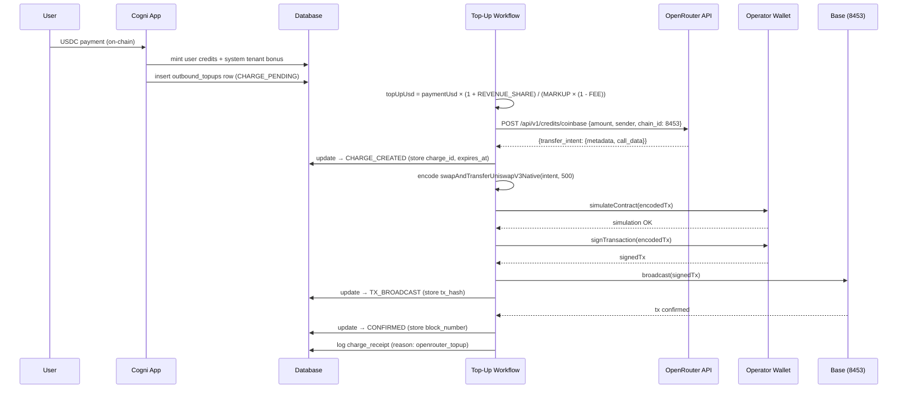

# Web3 → OpenRouter Credit Top-Up

> When a user pays the DAO for credits, the system automatically provisions OpenRouter with the exact provider cost — derived from existing billing constants, never hardcoded.

### Key References

|              |                                                                                                             |                                         |
| ------------ | ----------------------------------------------------------------------------------------------------------- | --------------------------------------- |
| **Project**  | [proj.ai-operator-wallet](../../work/projects/proj.ai-operator-wallet.md)                                   | Roadmap, key management, wallet design  |
| **Research** | [AI Operator Wallet](../research/ai-operator-wallet-budgeted-spending.md)                                   | Custody options evaluation              |
| **Spec**     | [Payments Design](./payments-design.md)                                                                     | Inbound USDC payment flow               |
| **Spec**     | [Billing Evolution](./billing-evolution.md)                                                                 | Credit unit standard, markup            |
| **Spec**     | [Operator Wallet](./operator-wallet.md)                                                                     | Wallet lifecycle, signing port, custody |
| **Spec**     | [DAO Enforcement](./dao-enforcement.md)                                                                     | Financial rails, repo-spec config       |
| **External** | [Coinbase Commerce Onchain Payment Protocol](https://github.com/coinbase/commerce-onchain-payment-protocol) | Contract source + deployed addresses    |
| **External** | [OpenRouter Crypto API](https://openrouter.ai/docs/guides/guides/crypto-api)                                | Charge creation + transfer_intent docs  |

## Design

### Economics

The OpenRouter top-up amount per dollar of user payment is derived from three existing constants — no standalone magic numbers.

```
Given:
  MARKUP           = USER_PRICE_MARKUP_FACTOR        (default 2.0)
  REVENUE_SHARE    = SYSTEM_TENANT_REVENUE_SHARE     (default 0.75)
  PROVIDER_FEE     = OPENROUTER_CRYPTO_FEE           (default 0.05 — 5%)

User pays $1.00 USDC to DAO.

User credits:    $1.00 worth  → consumes $0.50 of provider cost   (1 / MARKUP)
System credits:  $0.75 worth  → consumes $0.375 of provider cost  (REVENUE_SHARE / MARKUP)
                                ───────────────────────────────────
Net provider cost:    $0.875                                      (1 + REVENUE_SHARE) / MARKUP

OpenRouter takes 5% fee off every crypto top-up. To land $0.875 of actual credits:
Gross top-up sent:    $0.9211                                     net / (1 - PROVIDER_FEE)
                    = $0.875 / 0.95

After fee: $0.9211 × 0.95 = $0.875 ← exact provider cost covered ✓
DAO margin: $1.00 - $0.9211 = $0.0789 (7.9%)

Formula:
  openrouterTopUpUsd = paymentUsd × (1 + REVENUE_SHARE) / (MARKUP × (1 - PROVIDER_FEE))
```

The gross-up ensures OpenRouter always receives the exact provider cost after their fee. The DAO retains 7.9% margin at default constants. All three constants are env-configurable; the formula adapts automatically.

### Purchase → Provision Flow



### OpenRouter Charge → On-Chain Transaction

OpenRouter's `/api/v1/credits/coinbase` does **not** return ready-to-sign calldata. It returns a `transfer_intent` for the [Coinbase Commerce Onchain Payment Protocol](https://github.com/coinbase/commerce-onchain-payment-protocol). The workflow must:

1. **Create charge** → receives `transfer_intent` with `metadata.contract_address`, `call_data` (recipient, amounts, deadline, signature, etc.)
2. **Encode the contract call** → `swapAndTransferUniswapV3Native(intent, poolFeesTier=500)` on the Coinbase Transfers contract
3. **Set tx value** → ETH amount covering `recipient_amount + fee_amount` plus slippage buffer (excess auto-refunds)
4. **Simulate** → `publicClient.simulateContract()` before broadcast to prevent reverts
5. **Sign + broadcast** → via `WalletSignerPort`

```typescript
// Transfer intent shape from OpenRouter
interface TransferIntent {
  metadata: {
    chain_id: number;
    contract_address: string; // Coinbase Transfers contract
    sender: string; // must === operator wallet address
  };
  call_data: {
    recipient_amount: string; // wei
    deadline: string; // unix timestamp
    recipient: string; // OpenRouter's receiving address
    recipient_currency: string; // token address (or 0x0 for native)
    refund_destination: string;
    fee_amount: string; // wei — OpenRouter's 5% fee
    id: string; // bytes16 charge identifier
    operator: string;
    signature: string; // OpenRouter's authorization signature
    prefix: string;
  };
}

// Coinbase Transfers contract on Base mainnet
const TRANSFERS_CONTRACT = "0xeADE6bE02d043b3550bE19E960504dbA14A14971";
```

### Top-Up Amount Calculation

A single pure function computes the gross OpenRouter top-up amount from existing constants:

```typescript
/**
 * Calculate the gross OpenRouter top-up amount for a given user payment.
 * Accounts for provider fee so the net credited amount covers full provider cost.
 *
 * Formula: paymentUsd × (1 + revenueShare) / (markupFactor × (1 - providerFee))
 *
 * @param paymentUsd - USD value of the user's credit purchase
 * @param markupFactor - USER_PRICE_MARKUP_FACTOR (default 2.0)
 * @param revenueShare - SYSTEM_TENANT_REVENUE_SHARE (default 0.75)
 * @param providerFee - OPENROUTER_CRYPTO_FEE (default 0.05)
 * @returns USD amount to send to OpenRouter (gross, before their fee deduction)
 */
function calculateOpenRouterTopUp(
  paymentUsd: number,
  markupFactor: number,
  revenueShare: number,
  providerFee: number
): number {
  return (paymentUsd * (1 + revenueShare)) / (markupFactor * (1 - providerFee));
}
```

### Signing Gates

Top-up-specific signing constraints (wallet lifecycle and custody are in [operator-wallet spec](./operator-wallet.md)):

| Gate                     | Enforcement                                                                                                                                              |
| ------------------------ | -------------------------------------------------------------------------------------------------------------------------------------------------------- |
| **Chain lock**           | Only `chain_id` from `.cogni/repo-spec.yaml` (Base 8453). Enforced by existing DAO enforcement rails — see [dao-enforcement spec](./dao-enforcement.md). |
| **Contract allowlist**   | `to` MUST equal `TRANSFERS_CONTRACT` (Coinbase Commerce on Base). Reject any other destination.                                                          |
| **Sender match**         | `transfer_intent.metadata.sender` MUST equal the operator wallet address.                                                                                |
| **Simulate before send** | `publicClient.simulateContract()` MUST succeed before signing. Reverted simulations abort the top-up.                                                    |
| **Max value per tx**     | `OPERATOR_MAX_TOPUP_USD` env cap (e.g. $500). Reject charges exceeding this.                                                                             |

### Top-Up State Machine

Money movement requires durable state tracking beyond charge_receipts (which are audit-only, written once on success).

**States:** `CHARGE_PENDING` → `CHARGE_CREATED` → `TX_BROADCAST` → `CONFIRMED` (terminal: `FAILED`)

```
CHARGE_PENDING   → CHARGE_CREATED  (OpenRouter charge created, store charge_id + expires_at)
CHARGE_CREATED   → TX_BROADCAST    (tx signed + broadcast, store tx_hash)
TX_BROADCAST     → CONFIRMED       (tx confirmed on-chain, store block_number)

Any state       → FAILED          (unrecoverable error or charge expired)
CHARGE_CREATED  → CHARGE_PENDING   (charge expired, retry creates new charge)
```

**Retry semantics:**

- `CHARGE_PENDING`: safe to retry — creates a new OpenRouter charge
- `CHARGE_CREATED` with unexpired charge: reuse the same charge (same `charge_id`)
- `CHARGE_CREATED` with expired charge: transition back to `CHARGE_PENDING`, create new charge
- `TX_BROADCAST`: poll for confirmation, do NOT re-broadcast (would double-spend)
- `CONFIRMED` / `FAILED`: terminal, no retry

### Circuit Breaker

Credits mint immediately on user payment (TOPUP_AFTER_CREDIT). If top-ups fail persistently, credits exist off-chain but OpenRouter balance drains.

**Guardrails:**

| Check                          | Action                                                                      |
| ------------------------------ | --------------------------------------------------------------------------- |
| `FAILED` count > N in window   | Pause new credit issuance, alert operator                                   |
| OpenRouter balance < threshold | Pause AI runs for system tenant (not user-facing — user credits still work) |
| Operator wallet ETH < min      | Alert operator, pause top-ups until refilled                                |

The circuit breaker reads OpenRouter balance via `GET /api/v1/credits` (cached up to 60s). It does NOT block user credit minting retroactively — it prevents new purchases from completing until the top-up pipeline is healthy.

## Goal

Close the financial loop: every user credit purchase automatically provisions the corresponding provider cost on OpenRouter via an on-chain ETH payment from the DAO's operator wallet — so the platform never runs out of LLM credits while the DAO retains its margin.

## Non-Goals

- Automated balance monitoring / low-balance top-ups (P2 — see proj.ai-operator-wallet Run phase)
- USDC → ETH swaps (OpenRouter accepts native ETH on Base; swap is deferred)
- DAO governance approval per top-up (P1 — P0 uses pre-funded operator wallet)
- Multi-provider top-up routing (OpenRouter only)
- Refunds or reversal flows

## Invariants

| Rule                      | Constraint                                                                                                                    |
| ------------------------- | ----------------------------------------------------------------------------------------------------------------------------- |
| TOPUP_FROM_CONSTANTS      | Top-up amount MUST be computed as `paymentUsd × (1 + REVENUE_SHARE) / (MARKUP × (1 - PROVIDER_FEE))`. No hardcoded ratio.     |
| TOPUP_AFTER_CREDIT        | Top-up workflow MUST dispatch only after both user and system tenant credits are committed to the ledger.                     |
| TOPUP_IDEMPOTENT          | Each top-up is keyed by `clientPaymentId`. Replay of the same payment reference MUST NOT create a second OpenRouter charge.   |
| TOPUP_STATE_DURABLE       | Every top-up MUST have a persistent state record. Transitions are append-only (state + timestamp). No in-memory-only top-ups. |
| TOPUP_RECEIPT_LOGGED      | Every CONFIRMED top-up MUST produce a `charge_receipt` with `charge_reason = 'openrouter_topup'` and the on-chain `tx_hash`.  |
| SIMULATE_BEFORE_BROADCAST | Every transaction MUST pass `simulateContract()` before signing. Simulation failure aborts the top-up (→ FAILED).             |
| CONTRACT_ALLOWLIST        | `WalletSignerPort` MUST reject any transaction where `to` is not the Coinbase Transfers contract on the repo-spec chain.      |
| SENDER_MATCH              | `transfer_intent.metadata.sender` MUST equal the operator wallet address. Mismatch aborts the top-up.                         |
| MAX_TOPUP_CAP             | Single top-up MUST NOT exceed `OPERATOR_MAX_TOPUP_USD`. Charges above this cap are rejected before OpenRouter API call.       |
| NO_REBROADCAST            | A top-up in `TX_BROADCAST` state MUST NOT be re-broadcast. Only poll for confirmation or fail after timeout.                  |
| MARGIN_PRESERVED          | `(1 + REVENUE_SHARE) / (MARKUP × (1 - PROVIDER_FEE)) < 1` MUST hold. Application MUST fail fast at startup if violated.       |
| CIRCUIT_BREAKER           | If top-up failure count exceeds threshold in a time window, new credit purchases MUST be paused until operator intervenes.    |

### Margin Safety Check

`MARGIN_PRESERVED` requires: `(1 + REVENUE_SHARE) / (MARKUP × (1 - PROVIDER_FEE)) < 1`, i.e., `MARKUP × (1 - PROVIDER_FEE) > 1 + REVENUE_SHARE`.

With defaults: `2.0 × 0.95 = 1.9 > 1.75` — DAO margin is 7.9% per dollar. The application MUST validate this inequality at startup and fail fast if violated.

### Schema

**Table:** `outbound_topups` (new)

| Column              | Type        | Constraints                   | Description                                                         |
| ------------------- | ----------- | ----------------------------- | ------------------------------------------------------------------- |
| `id`                | UUID        | PK, default gen_random_uuid() | topup record id                                                     |
| `client_payment_id` | TEXT        | NOT NULL, UNIQUE              | Links to originating user payment (idempotency key)                 |
| `amount_usd`        | DECIMAL     | NOT NULL                      | Top-up USD amount (computed from constants)                         |
| `status`            | TEXT        | NOT NULL                      | CHARGE_PENDING / CHARGE_CREATED / TX_BROADCAST / CONFIRMED / FAILED |
| `charge_id`         | TEXT        | nullable                      | OpenRouter charge id                                                |
| `charge_expires_at` | TIMESTAMPTZ | nullable                      | OpenRouter charge expiry (1 hour)                                   |
| `tx_hash`           | TEXT        | nullable                      | On-chain tx hash                                                    |
| `block_number`      | BIGINT      | nullable                      | Confirmation block                                                  |
| `error_code`        | TEXT        | nullable                      | Last error (for retry logic)                                        |
| `retry_count`       | INTEGER     | NOT NULL, default 0           | Number of retry attempts                                            |
| `created_at`        | TIMESTAMPTZ | NOT NULL, default now()       |                                                                     |
| `updated_at`        | TIMESTAMPTZ | NOT NULL, default now()       |                                                                     |

**Indexes:**

- `outbound_topups_client_payment_unique` — UNIQUE on `client_payment_id`
- `outbound_topups_status_idx` — `(status, created_at)` for retry polling

**Table:** `charge_receipts` (existing — new `charge_reason` value)

| charge_reason      | source_system | source_reference                      | Description                     |
| ------------------ | ------------- | ------------------------------------- | ------------------------------- |
| `openrouter_topup` | `openrouter`  | `openrouter_topup/${clientPaymentId}` | ETH → OpenRouter credits top-up |

### File Pointers

| File                                               | Purpose                                                                                                      |
| -------------------------------------------------- | ------------------------------------------------------------------------------------------------------------ |
| `src/core/billing/pricing.ts`                      | `calculateOpenRouterTopUp()` — pure top-up math                                                              |
| `src/core/billing/pricing.ts`                      | `calculateRevenueShareBonus()` — existing                                                                    |
| `src/shared/env/server-env.ts`                     | `USER_PRICE_MARKUP_FACTOR`, `SYSTEM_TENANT_REVENUE_SHARE`, `OPENROUTER_CRYPTO_FEE`, `OPERATOR_MAX_TOPUP_USD` |
| `src/ports/wallet-signer.port.ts`                  | `WalletSignerPort` interface — see [operator-wallet spec](./operator-wallet.md)                              |
| `src/features/payments/services/creditsConfirm.ts` | Dispatch point — after credit settlement                                                                     |
| `src/shared/web3/coinbase-transfers.ts`            | Contract ABI, address, tx encoding (new)                                                                     |
| `.cogni/repo-spec.yaml`                            | `providers.openrouter` config                                                                                |

## Open Questions

- [ ] Should the top-up workflow be a Temporal workflow (durable, retryable) or a simple async function with DB-backed retry polling? Temporal aligns with existing scheduler infra but adds coupling.
- [ ] What is the minimum top-up amount? OpenRouter may have a floor. Should small payments be batched into a single charge when they individually fall below the floor?
- [ ] Circuit breaker thresholds: what failure count / time window / OpenRouter balance floor? Needs operational data.
- [ ] Should the operator wallet address be added to `.cogni/repo-spec.yaml` (governance-in-git, like `receiving_address`) or remain env-only?

## Related

- [Payments Design](./payments-design.md) — Inbound USDC payment state machine
- [Billing Evolution](./billing-evolution.md) — Credit unit standard, markup factor
- [DAO Enforcement](./dao-enforcement.md) — Financial rails, repo-spec
- [Operator Wallet](./operator-wallet.md) — Wallet lifecycle, signing port, custody
- [proj.ai-operator-wallet](../../work/projects/proj.ai-operator-wallet.md) — Project roadmap
