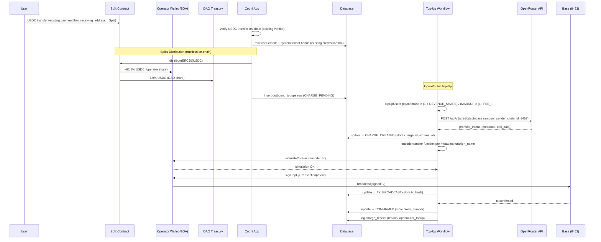

# Web3 → OpenRouter Credit Top-Up

> When a user pays for credits, the system automatically provisions OpenRouter with the exact provider cost — derived from existing billing constants, never hardcoded.

### Key References

|              |                                                                                                             |                                         |
| ------------ | ----------------------------------------------------------------------------------------------------------- | --------------------------------------- |
| **Project**  | [proj.ai-operator-wallet](../../work/projects/proj.ai-operator-wallet.md)                                   | Roadmap, key management, wallet design  |
| **Research** | [AI Operator Wallet](../research/ai-operator-wallet-budgeted-spending.md)                                   | Custody options evaluation              |
| **Spec**     | [Payments Design](./payments-design.md)                                                                     | Inbound USDC payment flow               |
| **Spec**     | [Billing Evolution](./billing-evolution.md)                                                                 | Credit unit standard, markup            |
| **Spec**     | [Operator Wallet](./operator-wallet.md)                                                                     | Wallet lifecycle, signing port, custody |
| **Spec**     | [DAO Enforcement](./dao-enforcement.md)                                                                     | Financial rails, repo-spec config       |
| **External** | [Coinbase Commerce Onchain Payment Protocol](https://github.com/coinbase/commerce-onchain-payment-protocol) | Contract source + deployed addresses    |
| **External** | [OpenRouter Crypto API](https://openrouter.ai/docs/guides/guides/crypto-api)                                | Charge creation + transfer_intent docs  |

## Design

### Economics

The OpenRouter top-up amount per dollar of user payment is derived from three existing constants — no standalone magic numbers.

```
Given:
  MARKUP           = USER_PRICE_MARKUP_FACTOR        (default 2.0)
  REVENUE_SHARE    = SYSTEM_TENANT_REVENUE_SHARE     (default 0.75)
  PROVIDER_FEE     = OPENROUTER_CRYPTO_FEE           (default 0.05 — 5%)

User pays $1.00 USDC to Split contract.
Split distributes: ~92.1% → operator wallet, ~7.9% → DAO treasury.

User credits:    $1.00 worth  → consumes $0.50 of provider cost   (1 / MARKUP)
System credits:  $0.75 worth  → consumes $0.375 of provider cost  (REVENUE_SHARE / MARKUP)
                                ───────────────────────────────────
Net provider cost:    $0.875                                      (1 + REVENUE_SHARE) / MARKUP

OpenRouter takes 5% fee off every crypto top-up. To land $0.875 of actual credits:
Gross top-up sent:    $0.9211                                     net / (1 - PROVIDER_FEE)
                    = $0.875 / 0.95

After fee: $0.9211 × 0.95 = $0.875 ← exact provider cost covered ✓
DAO share: $1.00 - $0.9211 = $0.0789 (7.9% margin, routed by Split to treasury on-chain)

Formula:
  openrouterTopUpUsd = paymentUsd × (1 + REVENUE_SHARE) / (MARKUP × (1 - PROVIDER_FEE))
  daoShareUsd        = paymentUsd - openrouterTopUpUsd
```

The gross-up ensures OpenRouter always receives the exact provider cost after their fee. The DAO retains 7.9% margin at default constants. All three constants are env-configurable; the formula adapts automatically.

### Purchase → Provision Flow


```mermaid
sequenceDiagram
    participant User
    participant Split as Split Contract
    participant Wallet as Operator Wallet (EOA)
    participant Treasury as DAO Treasury
    participant App as Cogni App
    participant DB as Database
    participant Workflow as Top-Up Workflow
    participant OR as OpenRouter API
    participant Chain as Base (8453)

    User->>Split: USDC transfer (existing payment flow, receiving_address = Split)
    App->>App: verify USDC transfer on-chain (existing verifier)
    App->>DB: mint user credits + system tenant bonus (existing creditsConfirm)

    Note over App,Split: Splits Distribution (trustless on-chain)
    App->>Split: distributeERC20(USDC)
    Split->>Wallet: ~92.1% USDC (operator share)
    Split->>Treasury: ~7.9% USDC (DAO share)

    Note over Workflow: OpenRouter Top-Up
    App->>DB: insert outbound_topups row (CHARGE_PENDING)
    Workflow->>Workflow: topUpUsd = paymentUsd × (1 + REVENUE_SHARE) / (MARKUP × (1 - FEE))
    Workflow->>OR: POST /api/v1/credits/coinbase {amount, sender, chain_id: 8453}
    OR-->>Workflow: {transfer_intent: {metadata, call_data}}
    Workflow->>DB: update → CHARGE_CREATED (store charge_id, expires_at)

    Workflow->>Workflow: encode transfer function per metadata.function_name
    Workflow->>Wallet: simulateContract(encodedTx)
    Wallet-->>Workflow: simulation OK
    Workflow->>Wallet: signTopUpTransaction(intent)
    Wallet->>Chain: broadcast(signedTx)
    Workflow->>DB: update → TX_BROADCAST (store tx_hash)

    Chain-->>Workflow: tx confirmed
    Workflow->>DB: update → CONFIRMED (store block_number)
    Workflow->>DB: log charge_receipt (reason: openrouter_topup)
```

### OpenRouter Charge → On-Chain Transaction

OpenRouter's `/api/v1/credits/coinbase` does **not** return ready-to-sign calldata. It returns a `transfer_intent` for the [Coinbase Commerce Onchain Payment Protocol](https://github.com/coinbase/commerce-onchain-payment-protocol). The API does **not** return a `function_name` field — the caller determines the function from the intent shape.

> **Resolved by spike.0090 (2026-03-09):** The correct function is `transferTokenPreApproved` (USDC input via direct ERC-20 `transferFrom`). The contract address returned by OpenRouter is `0x03059433BCdB6144624cC2443159D9445C32b7a8` — a newer Coinbase Commerce Transfers contract, NOT the original `0xeADE6...` from the protocol repo. ERC-20 approval must go to the **Transfers contract itself** — the contract calls `erc20.allowance(msg.sender, address(this))` then `safeTransferFrom`. Permit2 is NOT involved. The operator wallet needs only USDC (from Split distribution) + trace ETH for gas. No ETH funding strategy required. Full chain validated end-to-end: USDC → Split → operator wallet → OpenRouter credits (23.6s, 247k total gas).

The workflow:

1. **Create charge** → `POST /api/v1/credits/coinbase` with `{ amount, sender, chain_id: 8453 }` (`chain_id` must be a number, not string). Receives `transfer_intent` with `metadata.contract_address`, `call_data` (recipient, amounts, deadline, signature, etc.)
2. **Approve USDC to Transfers contract** → ERC-20 `approve(TRANSFERS_CONTRACT, recipientAmount + feeAmount)`. The contract uses direct `safeTransferFrom`, not Permit2.
3. **Encode the contract call** → `transferTokenPreApproved(intent)` on `metadata.contract_address`. Note: `call_data.deadline` is an ISO 8601 string (e.g. `"2026-03-11T08:30:49Z"`), must be converted to unix timestamp for the contract.
4. **Simulate** → `publicClient.simulateContract()` before broadcast to prevent reverts
5. **Sign + broadcast** → via `OperatorWalletPort.fundOpenRouterTopUp(intent)`

```typescript
// Transfer intent shape from OpenRouter (spike.0090 verified 2026-03-09)
interface TransferIntent {
  metadata: {
    chain_id: number;
    contract_address: string; // Coinbase Transfers contract (see below)
    sender: string; // must === operator wallet address
  };
  call_data: {
    recipient_amount: string; // USDC atomic units (6 decimals), e.g. "1039500" = 1.0395 USDC
    deadline: string; // ISO 8601 string (e.g. "2026-03-11T08:30:49Z") — convert to unix timestamp for contract
    recipient: string; // OpenRouter's receiving address
    recipient_currency: string; // 0x833589fCD6eDb6E08f4c7C32D4f71b54bdA02913 (Base USDC)
    refund_destination: string;
    fee_amount: string; // USDC atomic units — OpenRouter's 5% fee (e.g. "10500" = 0.0105 USDC)
    id: string; // bytes16 charge identifier
    operator: string;
    signature: string; // OpenRouter's authorization signature
    prefix: string;
  };
}

// Coinbase Transfers contract on Base mainnet
// spike.0090: OpenRouter returns 0x0305..., NOT the old 0xeADE6... from the protocol repo.
// The allowlist MUST include the address OpenRouter returns in metadata.contract_address.
const TRANSFERS_CONTRACT = "0x03059433BCdB6144624cC2443159D9445C32b7a8";

// ERC-20 approval target: the Transfers contract itself (NOT Permit2).
// Source: Transfers.sol checks erc20.allowance(msg.sender, address(this)) then safeTransferFrom.
```

### Top-Up Amount Calculation

A single pure function computes the gross OpenRouter top-up amount from existing constants:

```typescript
/**
 * Calculate the gross OpenRouter top-up amount for a given user payment.
 * Accounts for provider fee so the net credited amount covers full provider cost.
 *
 * Formula: paymentUsd × (1 + revenueShare) / (markupFactor × (1 - providerFee))
 */
function calculateOpenRouterTopUp(
  paymentUsd: number,
  markupFactor: number,
  revenueShare: number,
  providerFee: number
): number {
  return (paymentUsd * (1 + revenueShare)) / (markupFactor * (1 - providerFee));
}

// calculateDaoShare is NOT needed — the Splits contract handles DAO share
// routing on-chain. The Split percentages are derived from the same constants:
//   operatorPct ≈ (1 + REVENUE_SHARE) / (MARKUP × (1 - PROVIDER_FEE))
//   daoPct      ≈ 1 - operatorPct
```

### Signing Gates

Top-up-specific signing constraints (wallet lifecycle and custody are in [operator-wallet spec](./operator-wallet.md)):

| Gate                     | Enforcement                                                                                                                                                                                             |
| ------------------------ | ------------------------------------------------------------------------------------------------------------------------------------------------------------------------------------------------------- |
| **Chain lock**           | Only `chain_id` from `.cogni/repo-spec.yaml` (Base 8453). Enforced by existing DAO enforcement rails — see [dao-enforcement spec](./dao-enforcement.md).                                                |
| **Contract allowlist**   | `to` MUST equal `TRANSFERS_CONTRACT` (`0x0305...` — Coinbase Commerce on Base). Reject any other destination. ERC-20 approval also targets the Transfers contract (direct `transferFrom`, not Permit2). |
| **Sender match**         | `transfer_intent.metadata.sender` MUST equal the operator wallet address.                                                                                                                               |
| **Simulate before send** | `publicClient.simulateContract()` MUST succeed before signing. Reverted simulations abort the top-up.                                                                                                   |
| **Max value per tx**     | `OPERATOR_MAX_TOPUP_USD` env cap (e.g. $500). Reject charges exceeding this.                                                                                                                            |

### Top-Up State Machine

Money movement requires durable state tracking beyond charge_receipts (which are audit-only, written once on success).

**States:** `CHARGE_PENDING` → `CHARGE_CREATED` → `TX_BROADCAST` → `CONFIRMED` (terminal: `FAILED`)

```
CHARGE_PENDING   → CHARGE_CREATED  (OpenRouter charge created, store charge_id + expires_at)
CHARGE_CREATED   → TX_BROADCAST    (tx signed + broadcast, store tx_hash)
TX_BROADCAST     → CONFIRMED       (tx confirmed on-chain, store block_number)

Any state       → FAILED          (unrecoverable error or charge expired)
CHARGE_CREATED  → CHARGE_PENDING   (charge expired, retry creates new charge)
```

**Retry semantics:**

- `CHARGE_PENDING`: safe to retry — creates a new OpenRouter charge
- `CHARGE_CREATED` with unexpired charge: reuse the same charge (same `charge_id`)
- `CHARGE_CREATED` with expired charge: transition back to `CHARGE_PENDING`, create new charge
- `TX_BROADCAST`: poll for confirmation, do NOT re-broadcast (would double-spend)
- `CONFIRMED` / `FAILED`: terminal, no retry

### DAO Treasury Share (handled by Splits — no app logic)

The DAO's ~7.9% share is routed trustlessly by the [Splits](https://splits.org/) contract. After credit mint, the app calls `distributeERC20(USDC)` on the Split contract — the Split sends the DAO's share to treasury and the operator's share to the operator wallet. No `outbound_transfers` table, no app-level sweep logic, no retry infrastructure.

See [proj.ai-operator-wallet](../../work/projects/proj.ai-operator-wallet.md) PR 2 for Split deployment details.

## Goal

Close the financial loop: every user credit purchase automatically provisions the corresponding provider cost on OpenRouter via the operator wallet — while forwarding the DAO's margin to the treasury. No manual transfers, no custom smart contracts.

## Non-Goals

- Custom smart contracts (PaymentRouter) — app handles routing
- Atomic on-chain split — two separate transactions (treasury forward + top-up) are acceptable
- Automated balance monitoring / low-balance top-ups (P1)
- DAO governance approval per top-up (operator wallet is pre-authorized)
- Multi-provider top-up routing (OpenRouter only)
- Refunds or reversal flows
- Circuit breaker (P1 — log failures for now)

## Invariants

| Rule                      | Constraint                                                                                                                    |
| ------------------------- | ----------------------------------------------------------------------------------------------------------------------------- |
| TOPUP_FROM_CONSTANTS      | Top-up amount MUST be computed as `paymentUsd × (1 + REVENUE_SHARE) / (MARKUP × (1 - PROVIDER_FEE))`. No hardcoded ratio.     |
| TOPUP_AFTER_CREDIT        | Top-up workflow MUST dispatch only after both user and system tenant credits are committed to the ledger.                     |
| TOPUP_IDEMPOTENT          | Each top-up is keyed by `clientPaymentId`. Replay of the same payment reference MUST NOT create a second OpenRouter charge.   |
| TOPUP_STATE_DURABLE       | Every top-up MUST have a persistent state record. Transitions are append-only (state + timestamp). No in-memory-only top-ups. |
| TOPUP_RECEIPT_LOGGED      | Every CONFIRMED top-up MUST produce a `charge_receipt` with `charge_reason = 'openrouter_topup'` and the on-chain `tx_hash`.  |
| SIMULATE_BEFORE_BROADCAST | Every transaction MUST pass `simulateContract()` before signing. Simulation failure aborts the top-up (→ FAILED).             |
| CONTRACT_ALLOWLIST        | `WalletSignerPort` MUST reject any transaction where `to` is not in the destination allowlist.                                |
| SENDER_MATCH              | `transfer_intent.metadata.sender` MUST equal the operator wallet address. Mismatch aborts the top-up.                         |
| MAX_TOPUP_CAP             | Single top-up MUST NOT exceed `OPERATOR_MAX_TOPUP_USD`. Charges above this cap are rejected before OpenRouter API call.       |
| NO_REBROADCAST            | A top-up in `TX_BROADCAST` state MUST NOT be re-broadcast. Only poll for confirmation or fail after timeout.                  |
| MARGIN_PRESERVED          | `(1 + REVENUE_SHARE) / (MARKUP × (1 - PROVIDER_FEE)) < 1` MUST hold. Application MUST fail fast at startup if violated.       |
| DAO_SHARE_VIA_SPLIT       | Every settled payment MUST trigger `distributeERC20()` on the Split contract. DAO share is routed on-chain, not by app logic. |

### Margin Safety Check

`MARGIN_PRESERVED` requires: `(1 + REVENUE_SHARE) / (MARKUP × (1 - PROVIDER_FEE)) < 1`, i.e., `MARKUP × (1 - PROVIDER_FEE) > 1 + REVENUE_SHARE`.

With defaults: `2.0 × 0.95 = 1.9 > 1.75` — DAO margin is 7.9% per dollar. The application MUST validate this inequality at startup and fail fast if violated.

### Schema

**Table:** `outbound_topups` (new)

| Column              | Type        | Constraints                   | Description                                                         |
| ------------------- | ----------- | ----------------------------- | ------------------------------------------------------------------- |
| `id`                | UUID        | PK, default gen_random_uuid() | topup record id                                                     |
| `client_payment_id` | TEXT        | NOT NULL, UNIQUE              | Links to originating user payment (idempotency key)                 |
| `amount_usd`        | DECIMAL     | NOT NULL                      | Top-up USD amount (computed from constants)                         |
| `status`            | TEXT        | NOT NULL                      | CHARGE_PENDING / CHARGE_CREATED / TX_BROADCAST / CONFIRMED / FAILED |
| `charge_id`         | TEXT        | nullable                      | OpenRouter charge id                                                |
| `charge_expires_at` | TIMESTAMPTZ | nullable                      | OpenRouter charge expiry (1 hour)                                   |
| `tx_hash`           | TEXT        | nullable                      | On-chain tx hash                                                    |
| `block_number`      | BIGINT      | nullable                      | Confirmation block                                                  |
| `error_code`        | TEXT        | nullable                      | Last error (for retry logic)                                        |
| `retry_count`       | INTEGER     | NOT NULL, default 0           | Number of retry attempts                                            |
| `created_at`        | TIMESTAMPTZ | NOT NULL, default now()       |                                                                     |
| `updated_at`        | TIMESTAMPTZ | NOT NULL, default now()       |                                                                     |

**Indexes:**

- `outbound_topups_client_payment_unique` — UNIQUE on `client_payment_id`
- `outbound_topups_status_idx` — `(status, created_at)` for retry polling

**Table:** `charge_receipts` (existing — new `charge_reason` values)

| charge_reason      | source_system | source_reference                      | Description                               |
| ------------------ | ------------- | ------------------------------------- | ----------------------------------------- |
| `openrouter_topup` | `openrouter`  | `openrouter_topup/${clientPaymentId}` | Operator wallet → OpenRouter credits      |
| `split_distribute` | `splits`      | `split_dist/${clientPaymentId}`       | Split contract distributed USDC to shares |

### File Pointers

| File                                               | Purpose                                                                                                      |
| -------------------------------------------------- | ------------------------------------------------------------------------------------------------------------ |
| `src/core/billing/pricing.ts`                      | `calculateOpenRouterTopUp()` — pure top-up math (DAO share handled by Splits on-chain)                       |
| `src/core/billing/pricing.ts`                      | `calculateRevenueShareBonus()` — existing                                                                    |
| `src/shared/env/server-env.ts`                     | `USER_PRICE_MARKUP_FACTOR`, `SYSTEM_TENANT_REVENUE_SHARE`, `OPENROUTER_CRYPTO_FEE`, `OPERATOR_MAX_TOPUP_USD` |
| `src/ports/wallet-signer.port.ts`                  | `WalletSignerPort` interface — see [operator-wallet spec](./operator-wallet.md)                              |
| `src/features/payments/services/creditsConfirm.ts` | Dispatch point — after credit settlement, trigger outbound flows                                             |
| `.cogni/repo-spec.yaml`                            | `providers.openrouter` config, `operator_wallet.address`                                                     |

## Open Questions

- [x] What is the minimum top-up amount? **$1 minimum, $100K maximum** (spike.0090 confirmed $1 works; API error says "between 1 and 100000"). Small payments below $1 should be batched.
- [x] ~~Should the two outbound transactions (treasury forward + top-up) be dispatched sequentially or in parallel?~~ Treasury forward is now handled by Splits `distribute()` — only one app-initiated outbound tx (the top-up).
- [x] ~~Which `metadata.function_name` does OpenRouter return?~~ **API does not return `function_name`.** Correct function is `transferTokenPreApproved` (USDC input via direct ERC-20 `transferFrom` — NOT Permit2). Contract source: `erc20.allowance(msg.sender, address(this))` then `safeTransferFrom`. No ETH swap needed. (spike.0090, 2026-03-09)
- [x] ~~Does `metadata.contract_address` match the confirmed Coinbase Transfers address (`0xeADE6...`)?~~ **No.** OpenRouter returns `0x03059433BCdB6144624cC2443159D9445C32b7a8` — a newer contract. The old `0xeADE6...` from the protocol repo is stale. Allowlist updated. (spike.0090, 2026-03-09)

## Related

- [Payments Design](./payments-design.md) — Inbound USDC payment state machine
- [Billing Evolution](./billing-evolution.md) — Credit unit standard, markup factor
- [DAO Enforcement](./dao-enforcement.md) — Financial rails, repo-spec
- [Operator Wallet](./operator-wallet.md) — Wallet lifecycle, signing port, custody
- [proj.ai-operator-wallet](../../work/projects/proj.ai-operator-wallet.md) — Project roadmap
