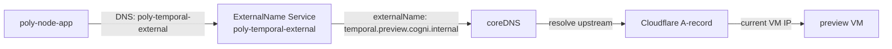

# VM IPs in git — drift → outages

## Problem

`provision-test-vm.sh` writes real VM IPs into `env-state.yaml` on deploy branches (`deploy/candidate-a`, `deploy/preview`, `deploy/production`). main's seed copies of the same files carry IPs too. **Git is the wrong place to hold VM IPs** — it makes silent drift possible on every VM lifecycle event, and today proved it.

**Not a security fix.** VM IPs remain publicly resolvable after this change (they move from a public git tree to public Cloudflare DNS under `*.cognidao.org`). That's by design for now; the operational drift problem is the entire reason this bug is P0. A follow-up (private-zone / split-horizon DNS) is worth filing only if public-DNS discoverability becomes a real problem.

## 2026-04-20 outage — the full chain

1. **2026-04-05**: preview VM reprovisioned from `84.32.109.222` → `84.32.110.92`. `.local/preview-vm-ip` updated locally. Main's overlay kept `.109.222` in inline EndpointSlice patches. Nobody noticed.
2. Running pods limped along on cached Temporal connections + in-cluster DNS for Service routing. Two weeks of latent drift.
3. **2026-04-19**: PR #943 (bug.0334) refactors — inline IP patches → per-overlay `env-state.yaml` ConfigMap + kustomize `replacements:`. Main's env-state.yaml faithfully ports the stale `.109.222`. Workflow rsync switches from base-only to authoritative full-`infra/k8s/` sync, with `--ignore-existing` protecting env-state.yaml as "provision-owned truth."
4. First promote-and-deploy after #943 rewrites deploy/preview overlays strictly from env-state.yaml. scheduler-worker boots fresh, tries Temporal at `.109.222`, `TransportError: Connection refused` crashloops.
5. Every user chat.completions submits a `GraphRunWorkflow` → scheduler-worker can't consume it → client awaits forever → 60-second edge cut.
6. Six hours of debugging ensued. Unblocked by direct commit `214ef15` to deploy/preview env-state.yaml × 4 with the correct IP (`known-hack`, not the real fix). bug.0334 / PR #943 did not cause the drift; it exposed it.

Full narrative: [`work/handoffs/task.0311.followup.md`](../handoffs/task.0311.followup.md)

## Why this keeps biting

Every path that writes a VM IP to git is a drift vector:

| Writer                      | Destination                                              | Propagation                |
| --------------------------- | -------------------------------------------------------- | -------------------------- |
| main's seed env-state.yaml  | new deploy branches (first promote, `--ignore-existing`) | seed only                  |
| `provision-test-vm.sh`      | deploy-branch env-state.yaml directly                    | authoritative for that env |
| direct commits to deploy/\* | deploy-branch env-state.yaml                             | corrections, manual        |

Three writers, one destination, no version comparison, no authority ordering. Drift compounds with every VM event that doesn't trigger a reprovision run.

Cogni's scaling vision makes this strictly worse: AI contributors spinning up candidate slots on demand, multiple concurrent flights. Every piece of environment-coupled state in git becomes a merge conflict, a drift bug, a "why did my flight fail" debugging session.

## Design

### Recommendation: ExternalName Service + DNS (option A)

Replace EndpointSlice IP patches with **ExternalName Services** whose `spec.externalName` is a stable hostname like `preview.vm.cogni.internal`. Cloudflare (or equivalent) holds the A-record. Pods resolve via cluster DNS → upstream DNS → VM IP. Provisioning updates the A-record. **Zero git commits on reprovision.**

### Options considered

| Option                                   | Approach                                                                                      | Pros                                                                                  | Cons                                                                             |
| ---------------------------------------- | --------------------------------------------------------------------------------------------- | ------------------------------------------------------------------------------------- | -------------------------------------------------------------------------------- |
| **A. ExternalName + DNS** (recommended)  | k8s ExternalName Services + Cloudflare A-record; provisioning updates DNS                     | Standard pattern; zero git state; fits existing Cloudflare infra for public hostnames | Requires DNS write creds at provision-time                                       |
| B. Name-based env vars, no EndpointSlice | Deployments reference `host:port` in env; drop EndpointSlices entirely                        | Simpler Wiring                                                                        | Hostname duplicated in every deployment env; loses kubectl-level discoverability |
| C. k3s Node annotation + downward API    | Provision annotates Node with `cogni.dev/vm-public-ip`; init-container emits /etc/hosts entry | Zero external deps                                                                    | Init-container boilerplate; annotation becomes the new drift surface             |
| D. Argo values substitution              | Store VM IP in Argo cluster secret annotations; Argo substitutes at sync                      | Lives in Argo, not git                                                                | Adds templating to otherwise-pure kustomize                                      |

## Invariants

| Rule                          | Constraint                                                                                                                                                 |
| ----------------------------- | ---------------------------------------------------------------------------------------------------------------------------------------------------------- |
| NO_INFRA_RUNTIME_STATE_IN_GIT | No VM IP, endpoint address, or per-deploy runtime state in `infra/k8s/` on main or deploy branches. `env-state.yaml` removed (or reduced to non-IP state). |
| DNS_IS_THE_DISCOVERY_LAYER    | Cross-VM dependencies (Temporal, Postgres, LiteLLM, Redis, Doltgres) addressed by hostname, not IP. k8s Services or ExternalName resolve via cluster DNS.  |
| PROVISION_WRITES_DNS_NOT_GIT  | `provision-test-vm.sh` updates the DNS A-record (Cloudflare API or equivalent). It does not commit any file under `infra/k8s/` on any branch.              |
| FRESH_DEPLOY_IS_MAIN_MIRROR   | `deploy/<env>` under `infra/k8s/` is byte-identical to main at the promoted SHA. `--ignore-existing` seed logic removed.                                   |

## File pointers (expected changes)

| File                                                     | Change                                                                                                                                                                                 |
| -------------------------------------------------------- | -------------------------------------------------------------------------------------------------------------------------------------------------------------------------------------- |
| `infra/k8s/overlays/**/env-state.yaml` (16 files)        | **Deleted.** Every file today holds only `VM_IP`; no non-IP state to preserve                                                                                                          |
| `infra/k8s/overlays/**/kustomization.yaml` × 16          | Drop `replacements:` block; reference ExternalName Services                                                                                                                            |
| `infra/k8s/base/node-app/external-services.yaml`         | EndpointSlices → ExternalName Services; hostname points at env-specific DNS record (all five point to the same per-env VM hostname)                                                    |
| `infra/k8s/base/scheduler-worker/external-services.yaml` | Same: EndpointSlices → ExternalName Services                                                                                                                                           |
| `scripts/setup/provision-test-vm.sh`                     | Phase 4c: delete env-state.yaml writing. Phase 4b already writes A-records — extend to cover the new VM-hostname record. Document required pod restart on A-record change              |
| `.github/workflows/promote-and-deploy.yml`               | Collapse two-pass rsync (lines 197-201) to a single `rsync -a --delete app-src/infra/k8s/ deploy-branch/infra/k8s/`. Audit confirmed env-state.yaml is the only load-bearing exclusion |
| `docs/spec/ci-cd.md`                                     | Add `DNS_IS_THE_DISCOVERY_LAYER` invariant                                                                                                                                             |

## Migration

All five external services (Postgres, Temporal, LiteLLM, Redis, Doltgres) resolve to the **same VM IP per env**. One A-record per env suffices — every ExternalName Service in that env points to the same hostname (e.g. `preview.vm.cognidao.org`).

### Cutover order (per env, independently)

1. **Pre-step:** create DNS A-record for the env's VM hostname pointing at the current VM IP. Verify from a pod: `nslookup preview.vm.cognidao.org` returns the right IP.
2. **Single PR replaces EndpointSlices with ExternalName Services in `base/**/external-services.yaml`.** Overlays drop `replacements:`and`env-state.yaml`. Merged to main, promoted one env at a time.
3. **Rollout:** `kubectl rollout restart` all deployments in the env after the overlay lands (required — see caching note below). Watch `scheduler-worker` + node-app pods boot clean. Exercise chat.completions end-to-end.
4. **Repeat per env.** `preview` first (already on a known-hack unblock, lowest risk), then `candidate-a`, then `production`. Do not batch.
5. **Revert `deploy/preview` commit `214ef15`** once preview cut over cleanly.

### DNS caching / pod restart contract

`ExternalName` resolves via CoreDNS → upstream → Cloudflare. Long-lived pooled connections (node-postgres, Go Temporal SDK) cache the resolved IP for the life of the pool. **On VM reprovision (new IP), pods MUST be restarted after the A-record update.** No reconnect-on-error logic in application code — not worth the scope. Provision script documents this as a required final step; the trade-off is a ~30s restart vs. the elimination of every git-based drift vector.

## Validation

- [ ] `git grep -E '([0-9]{1,3}\.){3}[0-9]{1,3}' infra/k8s/` on main returns zero non-comment matches
- [ ] No `env-state.yaml` files remain under `infra/k8s/overlays/**/`
- [ ] Preview + candidate-a + production continue to function end-to-end (brain V2 on poly: `core__knowledge_write` + `core__knowledge_search`)
- [ ] VM reprovision simulation: update the DNS A-record + `kubectl rollout restart`; pods pick up new address with zero git commits
- [ ] `promote-and-deploy.yml` rsync block is a single `rsync -a --delete` (env-state.yaml confirmed as only prior load-bearing exclusion)
- [ ] `deploy/preview` commit `214ef15` (known-hack) is reverted as part of the cleanup

## Blocked by / prerequisites

- **Zone decision:** hostname pattern for VM records. Proposed: `<env>.vm.cognidao.org` (e.g. `preview.vm.cognidao.org`, `candidate-a.vm.cognidao.org`), public zone, reuses existing Cloudflare integration. Confirm before `/implement`.
- Cloudflare A-record write is **already wired** in `provision-test-vm.sh:377-387` (`CLOUDFLARE_API_TOKEN` + `CLOUDFLARE_ZONE_ID`); no new credentials needed — extension of existing Phase 4b.

## Related

- Predecessor: PR #943 / bug.0334 (`INFRA_K8S_MAIN_DERIVED`) — correct structural fix, wrong substrate for the IP value
- Predecessor: PR #939 / bug.0333 — moved envs-identical ConfigMap values to base; this completes the pattern
- Known-hack commit: `214ef15` on deploy/preview — unblocked preview chat today; must be reverted once this lands
- Narrative: [task.0311 followup handoff](../handoffs/task.0311.followup.md)
